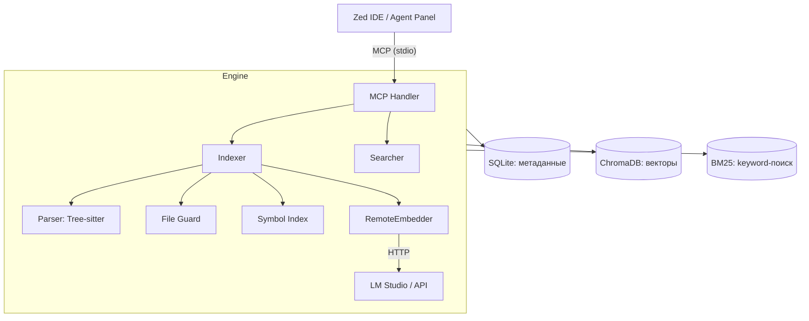

# MSCodebase Intelligence

🧠 **Семантический поиск по кодовой базе для Zed IDE.**

MSCodebase Intelligence подключается к Zed через протокол MCP (Model Context Protocol) и позволяет AI-ассистенту «видеть» весь проект целиком — не только открытые файлы. Векторизация кода выполняется через LM Studio (или другой OpenAI-совместимый API), всё работает локально.

---

## ✨ Возможности

- 🔍 **Гибридный поиск** (`search_code`) — векторный поиск + BM25 через Reciprocal Rank Fusion
- 🧠 **Умный контекст** (`get_context`) — как `@codebase` в Cursor: AI сам определяет, какие файлы нужны
- 🔬 **Поиск символов** (`get_symbol_info`) — навигация по функциям и классам между файлами
- ⚡ **Инкрементальная индексация** — только изменённые файлы (SHA256), без перестроения всего индекса
- 🖥️ **LM Studio / Ollama / OpenAI** — векторизация через внешний API, без скачивания тяжёлых ONNX-моделей
- 🛡️ **FileGuard** — защита от бинарников, минифицированного кода, `node_modules` и `.gitignore`
- 🔄 **Атомарные операции** — ChromaDB + SQLite с WAL-режимом для надёжности
- 🔒 **Оркестратор потоков** — фоновый воркер с мьютексом, защита от повторного запуска индексации

---

## 🚀 Быстрая установка

### 0. Подготовка: запустите LM Studio

Расширение использует внешний сервер эмбеддингов для векторизации кода. **Перед установкой и каждым использованием** убедитесь, что запущен LM Studio (или аналогичный OpenAI-совместимый сервер):

1. Откройте **LM Studio**
2. Загрузите модель эмбеддингов (рекомендуется `text-embedding-bge-m3`)
3. Нажмите **Start Server** — сервер должен слушать порт `1234`
4. Убедитесь, что в логе горит зелёная точка "Server is running"

Без работающего сервера эмбеддингов установка завершится, но поиск будет возвращать пустые результаты.

### Требования

- **Python 3.10+**
- **LM Studio** с запущенным сервером эмбеддингов на порту 1234

### Windows

```powershell
git clone https://github.com/ManSio/mscodebase-intelligence.git
cd mscodebase-intelligence
install.bat
```

### macOS / Linux

```bash
git clone https://github.com/ManSio/mscodebase-intelligence.git
cd mscodebase-intelligence
chmod +x installers/install.sh
./installers/install.sh
```

После установки **перезапустите Zed IDE**.

---

## 📖 Использование

1. Откройте проект в **Zed IDE**.
2. Откройте Agent Panel: `Ctrl+Shift+P` → `Agent Panel: Toggle Focus`.
3. Задайте вопрос агенту.

Примеры запросов:

- _"Найди файлы, отвечающие за маршрутизацию"_
- _"Где обрабатываются ошибки в этом проекте?"_
- _"Покажи все функции, работающие с графами"_
- _"Как устроен класс Indexer?"_
- _"запусти инструмент index_status"_
- _"запусти инструмент reindex_all"_

### Доступные MCP-инструменты

| Инструмент | Описание |
|---|---|
| `index_status()` | Статистика индексации (файлы/чанки) + статус фонового воркера |
| `reindex_all(project_path)` | Полная переиндексация в фоновом потоке. Путь можно указать явно |

---

## ⚙️ Как это работает



### Компоненты

| Модуль | Файл | Назначение |
|---|---|---|
| **MCP Handler** | `src/mcp/handler.py` | Оркестратор: регистрирует инструменты, управляет фоновыми потоками |
| **RemoteEmbedder** | `src/core/remote_embedder.py` | Клиент для LM Studio / Ollama / OpenAI API (HTTP, port 1234) |
| **Indexer** | `src/core/indexer.py` | Инкрементальная индексация, ChromaDB + SQLite + Symbol Index |
| **Parser** | `src/core/parser.py` | Tree-sitter AST → семантические чанки (функции/классы/методы) |
| **Searcher** | `src/core/searcher.py` | Гибридный поиск: vector + BM25 + RRF |
| **File Guard** | `src/core/file_guard.py` | Фильтрация файлов (расширения, .gitignore, размер, бинарность) |
| **Symbol Index** | `src/core/symbol_index.py` | Cross-file навигация по функциям и классам |
| **Context Engine** | `src/core/context_engine.py` | Умный сбор контекста под вопрос AI |
| **Watcher** | `src/core/watcher.py` | Watchdog (live) + Polling (fallback) |
| **Model Server** | `src/core/model_server.py` | Отдельный HTTP-сервер эмбеддингов (для model_server) |
| **Zed Config** | `src/utils/zed_config.py` | Автоустановка MCP-сервера в настройки Zed |
| **Safe Paths** | `src/utils/paths.py` | Обработка не-ASCII и длинных путей |

---

## ⚙️ Конфигурация

Скопируйте `.env.example` в `.env` при необходимости. Основные настройки:

| Переменная | Дефолт | Описание |
|---|---|---|
| `EMBEDDING_PROVIDER` | `onnx` | `onnx` / `ollama` / `openai` (автоопределение LM Studio при старте) |
| `API_BASE_URL` | `http://localhost:1234/v1` | URL сервера эмбеддингов |
| `MODEL_NAME` | `BAAI/bge-m3` | Модель для эмбеддингов |
| `MODEL_DIR` | `.codebase_models` | Папка с ONNX-моделью (если используется) |
| `BATCH_SIZE` | `16` | Размер батча эмбеддингов |
| `CHROMA_BATCH_SIZE` | `100` | Размер батча upsert в ChromaDB |
| `WATCH_ENABLED` | `true` | Включить watchdog при старте |
| `AUTO_INDEX` | `true` | Автоиндексация при старте сервера |
| `LOG_LEVEL` | `INFO` | `DEBUG` / `INFO` / `WARNING` / `ERROR` |
| `PROJECT_PATH` | `$ZED_WORKTREE_ROOT` | Путь к проекту (передаётся Zed) |

---

## 🛠️ Для разработчиков

### Установка окружения

```bash
python -m venv venv

# Windows:
venv\Scripts\activate
# macOS / Linux:
source venv/bin/activate

pip install -r requirements.txt
```

### Запуск MCP-сервера

```bash
python -m src.main
```

Доступные аргументы:

| Аргумент | Назначение |
|---|---|
| `--install` | Установить MCP-сервер в `.zed/settings.json` (текущий проект) |
| `--install-global` | Установить глобально (для всех проектов) |
| `--remove` | Удалить MCP-сервер из глобальных настроек |

### Тестирование

```bash
pytest tests/
pytest tests/test_connection.py  # Проверка установки
```

### Сборка standalone

```bash
python installers/build.py
```

---

## 📁 Структура проекта

```
mscodebase-intelligence/
├── .github/workflows/ci.yml       # CI (тесты, линтинг)
├── installers/
│   ├── install.bat                # Инсталлятор Windows
│   ├── install.sh                 # Инсталлятор macOS/Linux
│   └── build.py                   # PyInstaller сборка
├── src/
│   ├── main.py                    # Точка входа (CLI + запуск MCP)
│   ├── core/
│   │   ├── context_engine.py      # Умный сбор контекста
│   │   ├── embedder.py            # Локальная ONNX-векторизация
│   │   ├── file_guard.py          # Фильтрация файлов
│   │   ├── indexer.py             # Инкрементальная индексация
│   │   ├── model_server.py        # HTTP-сервер эмбеддингов
│   │   ├── parser.py              # Tree-sitter парсинг
│   │   ├── remote_embedder.py     # Клиент LM Studio / API
│   │   ├── searcher.py            # Гибридный поиск
│   │   ├── symbol_index.py        # Индекс символов
│   │   └── watcher.py             # Watchdog / Polling
│   ├── mcp/
│   │   └── handler.py             # MCP-сервер (оркестратор)
│   └── utils/
│       ├── paths.py               # Безопасные пути
│       └── zed_config.py          # Настройка Zed IDE
├── tests/
│   ├── test_embedder.py
│   ├── test_integration.py
│   ├── test_parser.py
│   └── test_searcher.py
├── install.bat                    # Установка (Windows)
├── test_connection.py             # Проверка установки
├── requirements.txt
├── pyproject.toml
├── .env.example
├── .gitignore
└── README.md
```

---

## 📋 Системные требования

- **Python**: 3.10–3.14
- **RAM**: 4 ГБ (минимум), 8 ГБ (рекомендуется)
- **Диск**: 200 МБ (индекс + расширение)
- **ОС**: Windows 10/11, macOS 12+, Linux
- **LM Studio** (рекомендуется) с моделью эмбеддингов

---

## 🔧 Настройка прав доступа к инструментам

В `settings.json` Zed:

```json
{
  "agent": {
    "tool_permissions": {
      "default": "allow"
    }
  }
}
```

---

## 🐛 Известные ограничения

- Первая индексация крупных проектов (10k+ файлов) может занимать 5–15 минут.
- На системах с <4 ГБ RAM выключите `AUTO_INDEX` и `WATCH_ENABLED`.
- Требуется запущенный LM Studio (или другой API) для векторизации — без него сервер работает, но поиск возвращает пустые результаты.

---

## 📄 Лицензия

[MIT](LICENSE)