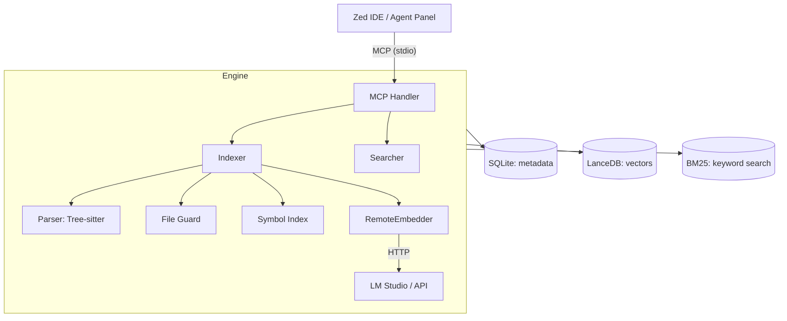

# MSCodebase Intelligence

<p align="center">
  <a href="https://github.com/ManSio/mscodebase-intelligence">
    
  </a>
  <a href="https://github.com/ManSio/mscodebase-intelligence/blob/main/LICENSE">
    
  </a>
  <a href="https://github.com/ManSio/mscodebase-intelligence/actions">
    
  </a>
  <a href="https://github.com/ManSio/mscodebase-intelligence/issues">
    
  </a>
</p>

<p align="center">
  <strong>🧠 Semantic Code Search for Zed IDE</strong>
</p>

<p align="center">
  MSCodebase Intelligence connects to Zed via the MCP (Model Context Protocol) and allows AI assistants to "see" the entire project — not just open files. Code vectorization is performed through LM Studio (or other OpenAI-compatible APIs), everything works locally.
</p>

<p align="center">
  <em>Available in:</em>
  <a href="#english">English</a> •
  <a href="#russian">Русский</a> •
  <a href="#chinese">中文</a> •
  <a href="#spanish">Español</a> •
  <a href="#french">Français</a> •
  <a href="#german">Deutsch</a>
</p>

---

## ✨ Key Features

| Feature | Description |
|---------|-------------|
| **🔍 Hybrid Search** | Vector + BM25 search via Reciprocal Rank Fusion |
| **🧠 Smart Context** | AI-powered context gathering (like Cursor @codebase) |
| **🔬 Symbol Search** | Navigate functions and classes across files |
| **⚡ Incremental Indexing** | Only modified files (SHA256), no full reindexing |
| **🖥️ LM Studio / Ollama / OpenAI** | External API vectorization, no heavy ONNX models |
| **🛡️ FileGuard** | Protection from binaries, minified code, node_modules, .gitignore |
| **🔄 Atomic Operations** | LanceDB + SQLite with WAL-mode for reliability |
| **🔒 Stream Orchestrator** | Background worker with mutex, protection from concurrent writes |
| **📊 Status & Monitoring** | Database state control (`get_index_status`) |
| **🗺️ Repository Map** | Directory structure + symbols for project understanding |

---

## 🚀 Quick Start

### Prerequisites

- **Python 3.10+**
- **LM Studio** with running embedding server on port 1234
- **Zed IDE**

### Installation

#### Windows

```powershell
git clone https://github.com/ManSio/mscodebase-intelligence.git
cd mscodebase-intelligence
install.bat
```

#### macOS / Linux

```bash
git clone https://github.com/ManSio/mscodebase-intelligence.git
cd mscodebase-intelligence
chmod +x installers/install.sh
./installers/install.sh
```

### Usage

1. Open your project in **Zed IDE**
2. Open Agent Panel: `Ctrl+Shift+P` → `Agent Panel: Toggle Focus`
3. Ask questions like:
   - _"Find files responsible for routing"_
   - _"Where are error handlers in this project?"_
   - _"Show all graph-related functions"_
   - _"How is the Indexer class structured?"_

---

## 🏗️ Architecture

### System Components

| Module | File | Purpose |
|--------|------|---------|
| **MCP Handler** | `src/mcp/handler.py` | Orchestrates tools, manages background streams |
| **RemoteEmbedder** | `src/core/remote_embedder.py` | LM Studio/Ollama/OpenAI API client (port 1234) |
| **Indexer** | `src/core/indexer.py` | Incremental indexing (LanceDB + SQLite + Symbol Index) |
| **Parser** | `src/core/parser.py` | Tree-sitter AST → semantic chunks |
| **Searcher** | `src/core/searcher.py` | Hybrid search: vector + BM25 + RRF |
| **File Guard** | `src/core/file_guard.py` | File filtering (extensions, .gitignore, size, binary) |
| **Symbol Index** | `src/core/symbol_index.py` | Cross-file function/class navigation |
| **Context Engine** | `src/core/context_engine.py` | Smart context gathering for AI |
| **Watcher** | `src/core/watcher.py` | Watchdog (live) + Polling (fallback) |
| **Model Server** | `src/core/model_server.py` | Separate HTTP embeddings server |
| **Zed Config** | `src/utils/zed_config.py` | Auto-install MCP server in Zed settings |
| **Safe Paths** | `src/utils/paths.py` | Non-ASCII and long path handling |

### Architecture Diagram



---

## ⚙️ Configuration

Copy `.env.example` to `.env` if needed. Key settings:

| Variable | Default | Description |
|----------|---------|-------------|
| `EMBEDDING_PROVIDER` | `onnx` | `onnx` / `ollama` / `openai` (auto-detects LM Studio) |
| `API_BASE_URL` | `http://localhost:1234/v1` | Embeddings server URL |
| `MODEL_NAME` | `BAAI/bge-m3` | Embeddings model |
| `MODEL_DIR` | `.codebase_models` | ONNX model directory |
| `BATCH_SIZE` | `16` | Embeddings batch size |
| `CHROMA_BATCH_SIZE` | `100` | LanceDB upsert batch size |
| `WATCH_ENABLED` | `true` | Enable watchdog at startup |
| `AUTO_INDEX` | `true` | Auto-index on startup |
| `LOG_LEVEL` | `INFO` | `DEBUG` / `INFO` / `WARNING` / `ERROR` |
| `PROJECT_PATH` | `$ZED_WORKTREE_ROOT` | Project path (from Zed) |

---

## 🛠️ Development

### Environment Setup

```bash
# Create virtual environment
python -m venv .venv

# Windows:
.venv\Scripts\activate
# macOS/Linux:
source .venv/bin/activate

# Install dependencies
pip install -r requirements.txt
```

### Running MCP Server

```bash
python -m src.main
```

### Testing

```bash
# Run all tests
pytest tests/

# Run specific test file
pytest tests/test_searcher.py

# Run with coverage
pytest --cov=src --cov-report=html
```

### Building Standalone

```bash
python installers/build.py
```

---

## 📁 Project Structure

```
mscodebase-intelligence/
├── .github/workflows/ci.yml              # CI (tests, linting)
├── installers/
│   ├── install.bat                       # Windows installer
│   ├── install.sh                        # macOS/Linux installer
│   └── build.py                          # PyInstaller build
├── src/
│   ├── main.py                           # Entry point (CLI + MCP)
│   ├── core/
│   │   ├── context_engine.py             # Smart context gathering
│   │   ├── embedder.py                   # Local ONNX vectorization
│   │   ├── file_guard.py                 # File filtering
│   │   ├── indexer.py                    # Incremental indexing
│   │   ├── model_server.py               # HTTP embeddings server
│   │   ├── parser.py                     # Tree-sitter parsing
│   │   ├── remote_embedder.py            # LM Studio/API client
│   │   ├── searcher.py                   # Hybrid search
│   │   ├── symbol_index.py               # Symbol indexing
│   │   └── watcher.py                    # File monitoring
│   ├── mcp/
│   │   └── handler.py                    # MCP server orchestrator
│   └── utils/
│       ├── paths.py                      # Safe path handling
│       └── zed_config.py                 # Zed IDE configuration
├── tests/
│   ├── test_embedder.py
│   ├── test_integration.py
│   ├── test_parser.py
│   └── test_searcher.py
├── install.bat                           # Windows installation
├── test_connection.py                    # Installation verification
├── requirements.txt
├── pyproject.toml
├── .env.example
├── .gitignore
├── README.md
└── LICENSE
```

---

## 📋 System Requirements

- **Python**: 3.10–3.14
- **RAM**: 4 GB (minimum), 8 GB (recommended)
- **Disk**: 200 MB (index + extension)
- **OS**: Windows 10/11, macOS 12+, Linux
- **LM Studio** (recommended) with embeddings model

---

## 🔧 Tool Permissions

In Zed `settings.json`:

```json
{
  "agent": {
    "tool_permissions": {
      "default": "allow"
    }
  }
}
```

---

## 🐛 Known Limitations

- First indexing of large projects (10k+ files) may take 5–15 minutes
- Systems with <4 GB RAM should disable `AUTO_INDEX` and `WATCH_ENABLED`
- Requires running LM Studio (or other API) for vectorization — server runs without it, but search returns empty results

---

## 📄 License

[MIT](LICENSE)

---

*Last updated: 2026-06-24*

<a id="russian"></a>

# MSCodebase Intelligence (Русский)

<p align="center">
  <strong>🧠 Семантический поиск по кодовой базе для Zed IDE</strong>
</p>

<p align="center">
  MSCodebase Intelligence подключается к Zed через протокол MCP (Model Context Protocol) и позволяет AI-ассистенту «видеть» весь проект целиком — не только открытые файлы. Векторизация кода выполняется через LM Studio (или другой OpenAI-совместимый API), всё работает локально.
</p>

---

## ✨ Возможности

| Возможность | Описание |
|-------------|-------------|
| **🔍 Гибридный поиск** | Векторный поиск + BM25 через Reciprocal Rank Fusion |
| **🧠 Умный контекст** | AI-сбор контекста (как @codebase в Cursor) |
| **🔬 Поиск символов** | Навигация по функциям и классам между файлами |
| **⚡ Инкрементальная индексация** | Только изменённые файлы (SHA256), без переиндексации |
| **🖥️ LM Studio / Ollama / OpenAI** | Векторизация через внешний API, без тяжёлых ONNX-моделей |
| **🛡️ FileGuard** | Защита от бинарников, минифицированного кода, node_modules, .gitignore |
| **🔄 Атомарные операции** | LanceDB + SQLite с WAL-режимом для надёжности |
| **🔒 Оркестратор потоков** | Фоновый воркер с мьютексом, защита от конкурентной записи |
| **📊 Статус и мониторинг** | Контроль состояния базы данных (`get_index_status`) |
| **🗺️ Карта репозитория** | Структура директорий + символы для понимания архитектуры |

---

## 🚀 Быстрая установка

### Требования

- **Python 3.10+**
- **LM Studio** с запущенным сервером эмбеддингов на порту 1234
- **Zed IDE**

### Установка

#### Windows

```powershell
git clone https://github.com/ManSio/mscodebase-intelligence.git
cd mscodebase-intelligence
install.bat
```

#### macOS / Linux

```bash
git clone https://github.com/ManSio/mscodebase-intelligence.git
cd mscodebase-intelligence
chmod +x installers/install.sh
./installers/install.sh
```

### Использование

1. Откройте проект в **Zed IDE**.
2. Откройте Agent Panel: `Ctrl+Shift+P` → `Agent Panel: Toggle Focus`.
3. Задайте вопрос агенту, например:
   - _"Найди файлы, отвечающие за маршрутизацию"_
   - _"Где обрабатываются ошибки в этом проекте?"_
   - _"Покажи все функции, работающие с графами"_
   - _"Как устроен класс Indexer?"_

---

## 🏗️ Архитектура

### Компоненты системы

| Модуль | Файл | Назначение |
|--------|------|---------|
| **MCP Handler** | `src/mcp/handler.py` | Оркестратор инструментов, управление фоновыми потоками |
| **RemoteEmbedder** | `src/core/remote_embedder.py` | Клиент LM Studio/Ollama/OpenAI API (порт 1234) |
| **Indexer** | `src/core/indexer.py` | Инкрементальная индексация (LanceDB + SQLite + Symbol Index) |
| **Parser** | `src/core/parser.py` | Tree-sitter AST → семантические чанки |
| **Searcher** | `src/core/searcher.py` | Гибридный поиск: vector + BM25 + RRF |
| **File Guard** | `src/core/file_guard.py` | Фильтрация файлов (расширения, .gitignore, размер, бинарность) |
| **Symbol Index** | `src/core/symbol_index.py` | Cross-file навигация по функциям и классам |
| **Context Engine** | `src/core/context_engine.py` | Умный сбор контекста под вопрос AI |
| **Watcher** | `src/core/watcher.py` | Watchdog (live) + Polling (fallback) |
| **Model Server** | `src/core/model_server.py` | Отдельный HTTP-сервер эмбеддингов |
| **Zed Config** | `src/utils/zed_config.py` | Автоустановка MCP-сервера в настройки Zed |
| **Safe Paths** | `src/utils/paths.py` | Обработка не-ASCII и длинных путей |

---

## ⚙️ Конфигурация

Скопируйте `.env.example` в `.env` при необходимости. Основные настройки:

| Переменная | Дефолт | Описание |
|----------|---------|-------------|
| `EMBEDDING_PROVIDER` | `onnx` | `onnx` / `ollama` / `openai` (автоопределение LM Studio) |
| `API_BASE_URL` | `http://localhost:1234/v1` | URL сервера эмбеддингов |
| `MODEL_NAME` | `BAAI/bge-m3` | Модель для эмбеддингов |
| `MODEL_DIR` | `.codebase_models` | Папка с ONNX-моделью |
| `BATCH_SIZE` | `16` | Размер батча эмбеддингов |
| `CHROMA_BATCH_SIZE` | `100` | Размер батча upsert в LanceDB |
| `WATCH_ENABLED` | `true` | Включить watchdog при старте |
| `AUTO_INDEX` | `true` | Автоиндексация при старте сервера |
| `LOG_LEVEL` | `INFO` | `DEBUG` / `INFO` / `WARNING` / `ERROR` |
| `PROJECT_PATH` | `$ZED_WORKTREE_ROOT` | Путь к проекту (от Zed) |

---

## 🛠️ Для разработчиков

### Установка окружения

```bash
python -m venv venv

# Windows:
venv\Scripts\activate
# macOS / Linux:
source venv/bin/activate

pip install -r requirements.txt
```

### Запуск MCP-сервера

```bash
python -m src.main
```

### Тестирование

```bash
pytest tests/
pytest tests/test_searcher.py
pytest --cov=src --cov-report=html
```

---

<a id="chinese"></a>

# MSCodebase Intelligence (中文)

<p align="center">
  <strong>🧠 Zed IDE 语义代码搜索</strong>
</p>

<p align="center">
  MSCodebase Intelligence 通过 MCP（模型上下文协议）连接到 Zed，允许 AI 助手“看到”整个项目，而不仅仅是打开的文件。代码向量化通过 LM Studio（或其他 OpenAI 兼容的 API）完成，所有操作都在本地进行。
</p>

---

## ✨ 功能

| 功能 | 描述 |
|------|------|
| **🔍 混合搜索** | 向量搜索 + BM25 通过 Reciprocal Rank Fusion 结合 |
| **🧠 智能上下文** | AI 驱动的上下文收集（类似 Cursor 的 @codebase） |
| **🔬 符号搜索** | 跨文件导航函数和类 |
| **⚡ 增量索引** | 仅索引修改的文件（SHA256），无需完全重新索引 |
| **🖥️ LM Studio / Ollama / OpenAI** | 通过外部 API 进行向量化，无需加载沉重的 ONNX 模型 |
| **🛡️ FileGuard** | 保护免受二进制文件、迷你化代码、node_modules 和 .gitignore 的影响 |
| **🔄 原子操作** | LanceDB + SQLite 带 WAL 模式，确保可靠性 |
| **🔒 流编排器** | 带互斥锁的后台工作线程，防止并发写入 |
| **📊 状态与监控** | 数据库状态控制（`get_index_status`） |
| **🗺️ 仓库地图** | 目录结构 + 符号，用于理解项目架构 |

---

## 🚀 快速开始

### 前提条件

- **Python 3.10+**
- **LM Studio** 带运行的嵌入服务器（端口 1234）
- **Zed IDE**

### 安装

#### Windows

```powershell
.git clone https://github.com/ManSio/mscodebase-intelligence.git
.cd mscodebase-intelligence
+install.bat
```

#### macOS / Linux

```bash
.git clone https://github.com/ManSio/mscodebase-intelligence.git
.cd mscodebase-intelligence
+chmod +x installers/install.sh
+./installers/install.sh
```

### 使用

1. 在 **Zed IDE** 中打开您的项目。
2. 打开 Agent Panel：`Ctrl+Shift+P` → `Agent Panel: Toggle Focus`。
3. 提出问题，例如：
   - _"查找负责路由的文件"_
   - _"这个项目中错误处理在哪里？"_
   - _"显示所有与图形相关的函数"_
   - _"Indexer 类是如何构建的？"_

---

## 🏗️ 架构

### 系统组件

| 模块 | 文件 | 目的 |
|------|------|------|
| **MCP Handler** | `src/mcp/handler.py` | 工具编排器，管理后台流 |
| **RemoteEmbedder** | `src/core/remote_embedder.py` | LM Studio/Ollama/OpenAI API 客户端（端口 1234） |
| **Indexer** | `src/core/indexer.py` | 增量索引（LanceDB + SQLite + Symbol Index） |
| **Parser** | `src/core/parser.py` | Tree-sitter AST → 语义块 |
| **Searcher** | `src/core/searcher.py` | 混合搜索：vector + BM25 + RRF |
| **File Guard** | `src/core/file_guard.py` | 文件过滤（扩展名、.gitignore、大小、二进制） |
| **Symbol Index** | `src/core/symbol_index.py` | 跨文件函数/类导航 |
| **Context Engine** | `src/core/context_engine.py` | AI 驱动的上下文收集 |
| **Watcher** | `src/core/watcher.py` | 监听器（实时）+ 轮询（备用） |
| **Model Server** | `src/core/model_server.py` | 独立的 HTTP 嵌入服务器 |
| **Zed Config** | `src/utils/zed_config.py` | 自动安装 MCP 服务器到 Zed 设置 |
| **Safe Paths** | `src/utils/paths.py` | 非 ASCII 和长路径处理 |

---

## ⚙️ 配置

如果需要，复制 `.env.example` 到 `.env`。主要设置：

| 变量 | 默认 | 描述 |
|----------|---------|------|
| `EMBEDDING_PROVIDER` | `onnx` | `onnx` / `ollama` / `openai`（自动检测 LM Studio） |
| `API_BASE_URL` | `http://localhost:1234/v1` | 嵌入服务器 URL |
| `MODEL_NAME` | `BAAI/bge-m3` | 嵌入模型 |
| `MODEL_DIR` | `.codebase_models` | ONNX 模型目录 |
| `BATCH_SIZE` | `16` | 嵌入批大小 |
| `CHROMA_BATCH_SIZE` | `100` | LanceDB upsert 批大小 |
| `WATCH_ENABLED` | `true` | 启动时启用监听器 |
| `AUTO_INDEX` | `true` | 启动时自动索引 |
| `LOG_LEVEL` | `INFO` | `DEBUG` / `INFO` / `WARNING` / `ERROR` |
| `PROJECT_PATH` | `$ZED_WORKTREE_ROOT` | 项目路径（来自 Zed） |

---

## 🛠️ 开发

### 环境设置

```bash
# 创建虚拟环境
python -m venv .venv

# Windows:
.venv\Scripts\activate
# macOS/Linux:
source .venv/bin/activate

# 安装依赖
pip install -r requirements.txt
```

### 运行 MCP 服务器

```bash
python -m src.main
```

### 测试

```bash
# 运行所有测试
pytest tests/

# 运行特定测试文件
pytest tests/test_searcher.py

# 运行带覆盖率
pytest --cov=src --cov-report=html
```

---

<a id="spanish"></a>

# MSCodebase Intelligence (Español)

<p align="center">
  <strong>🧠 Búsqueda Semántica de Código para Zed IDE</strong>
</p>

<p align="center">
  MSCodebase Intelligence se conecta a Zed a través del protocolo MCP (Model Context Protocol) y permite a los asistentes de IA "ver" todo el proyecto, no solo los archivos abiertos. La vectorización del código se realiza a través de LM Studio (o cualquier otro API compatible con OpenAI), todo funciona localmente.
</p>

---

## ✨ Características

| Característica | Descripción |
|---------------|-------------|
| **🔍 Búsqueda Híbrida** | Búsqueda vectorial + BM25 a través de Reciprocal Rank Fusion |
| **🧠 Contexto Inteligente** | Recopilación de contexto impulsada por IA (como @codebase en Cursor) |
| **🔬 Búsqueda de Símbolos** | Navegación entre funciones y clases en diferentes archivos |
| **⚡ Indexación Incremental** | Solo archivos modificados (SHA256), sin reindexación completa |
| **🖥️ LM Studio / Ollama / OpenAI** | Vectorización a través de API externa, sin cargar modelos ONNX pesados |
| **🛡️ FileGuard** | Protección contra archivos binarios, código minificado, node_modules y .gitignore |
| **🔄 Operaciones Atómicas** | LanceDB + SQLite con modo WAL para confiabilidad |
| **🔒 Orquestador de Flujos** | Trabajador en segundo plano con mutex, protección contra escritura concurrente |
| **📊 Estado y Monitoreo** | Control de estado de la base de datos (get_index_status) |
| **🗺️ Mapa del Repositorio** | Estructura de directorios + símbolos para entender la arquitectura del proyecto |

---

## 🚀 Inicio Rápido

### Requisitos Previos

- **Python 3.10+**
- **LM Studio** con servidor de embeddings corriendo en puerto 1234
- **Zed IDE**

### Instalación

#### Windows

```powershell
git clone https://github.com/ManSio/mscodebase-intelligence.git
cd mscodebase-intelligence
install.bat
```

#### macOS / Linux

```bash
git clone https://github.com/ManSio/mscodebase-intelligence.git
cd mscodebase-intelligence
chmod +x installers/install.sh
./installers/install.sh
```

### Uso

1. Abra su proyecto en **Zed IDE**.
2. Abra el Panel de Agentes: `Ctrl+Shift+P` → `Agent Panel: Toggle Focus`.
3. Haga preguntas como:
   - _"Encuentra archivos responsables de la enrutación"_
   - _"¿Dónde se manejan los errores en este proyecto?"_
   - _"Muestra todas las funciones que trabajan con gráficos"_
   - _"¿Cómo está estructurada la clase Indexer?"_

---

## 🏗️ Arquitectura

### Componentes del Sistema

| Módulo | Archivo | Propósito |
|--------|------|---------|
| **MCP Handler** | `src/mcp/handler.py` | Orquestador de herramientas, gestiona flujos en segundo plano |
| **RemoteEmbedder** | `src/core/remote_embedder.py` | Cliente LM Studio/Ollama/OpenAI API (puerto 1234) |
| **Indexer** | `src/core/indexer.py` | Indexación incremental (LanceDB + SQLite + Symbol Index) |
| **Parser** | `src/core/parser.py` | Tree-sitter AST → chunks semánticos |
| **Searcher** | `src/core/searcher.py` | Búsqueda híbrida: vector + BM25 + RRF |
| **File Guard** | `src/core/file_guard.py` | Filtrado de archivos (extensiones, .gitignore, tamaño, binario) |
| **Symbol Index** | `src/core/symbol_index.py` | Navegación cross-file de funciones y clases |
| **Context Engine** | `src/core/context_engine.py` | Recopilación inteligente de contexto para IA |
| **Watcher** | `src/core/watcher.py` | Watchdog (en vivo) + Polling (respaldo) |
| **Model Server** | `src/core/model_server.py` | Servidor HTTP separado de embeddings |
| **Zed Config** | `src/utils/zed_config.py` | Auto-instalación de MCP server en settings de Zed |
| **Safe Paths** | `src/utils/paths.py` | Manejo de rutas no-ASCII y largas |

---

## ⚙️ Configuración

Copie `.env.example` a `.env` si es necesario. Configuraciones clave:

| Variable | Default | Descripción |
|----------|---------|-------------|
| `EMBEDDING_PROVIDER` | `onnx` | `onnx` / `ollama` / `openai` (auto-detecta LM Studio) |
| `API_BASE_URL` | `http://localhost:1234/v1` | URL del servidor de embeddings |
| `MODEL_NAME` | `BAAI/bge-m3` | Modelo de embeddings |
| `MODEL_DIR` | `.codebase_models` | Directorio del modelo ONNX |
| `BATCH_SIZE` | `16` | Tamaño del lote de embeddings |
| `CHROMA_BATCH_SIZE` | `100` | Tamaño del lote de upsert en LanceDB |
| `WATCH_ENABLED` | `true` | Habilitar watchdog al inicio |
| `AUTO_INDEX` | `true` | Auto-indexar al inicio |
| `LOG_LEVEL` | `INFO` | `DEBUG` / `INFO` / `WARNING` / `ERROR` |
| `PROJECT_PATH` | `$ZED_WORKTREE_ROOT` | Ruta del proyecto (de Zed) |

---

## 🛠️ Para Desarrolladores

### Configuración del Entorno

```bash
# Crear entorno virtual
python -m venv venv

# Windows:
venv\Scripts\activate
# macOS/Linux:
source venv/bin/activate

# Instalar dependencias
pip install -r requirements.txt
```

### Ejecutar Servidor MCP

```bash
python -m src.main
```

### Pruebas

```bash
# Ejecutar todas las pruebas
pytest tests/

# Ejecutar archivo de prueba específico
pytest tests/test_searcher.py

# Ejecutar con cobertura
pytest --cov=src --cov-report=html
```

---

<a id="french"></a>

# MSCodebase Intelligence (Français)

<p align="center">
  <strong>🧠 Recherche sémantique de code pour Zed IDE</strong>
</p>

<p align="center">
  MSCodebase Intelligence se connecte à Zed via le protocole MCP (Model Context Protocol) et permet aux assistants IA de "voir" l'ensemble du projet, et pas seulement les fichiers ouverts. La vectorisation du code est effectuée via LM Studio (ou tout autre API compatible avec OpenAI), tout fonctionne localement.
</p>

---

## ✨ Fonctionnalités

| Fonctionnalité | Description |
|---------------|-------------|
| **🔍 Recherche Hybride** | Recherche vectorielle + BM25 via Reciprocal Rank Fusion |
| **🧠 Contexte Intelligent** | Collecte de contexte pilotée par IA (comme @codebase dans Cursor) |
| **🔬 Recherche de Symboles** | Navigation entre fonctions et classes dans différents fichiers |
| **⚡ Indexation Incrémentale** | Seulement les fichiers modifiés (SHA256), sans réindexation complète |
| **🖥️ LM Studio / Ollama / OpenAI** | Vectorisation via API externe, sans charger de lourds modèles ONNX |
| **🛡️ FileGuard** | Protection contre les fichiers binaires, le code minifié, node_modules et .gitignore |
| **🔄 Opérations Atomiques** | LanceDB + SQLite avec mode WAL pour une fiabilité accrue |
| **🔒 Orchestrateur de Flux** | Travailleur en arrière-plan avec mutex, protection contre l'écriture concurrente |
| **📊 État et Surveillance** | Contrôle de l'état de la base de données (get_index_status) |
| **🗺️ Carte du Dépôt** | Structure de répertoires + symboles pour comprendre l'architecture du projet |

---

## 🚀 Démarrage Rapide

### Prérequis

- **Python 3.10+**
- **LM Studio** avec serveur d'embeddings en cours d'exécution sur le port 1234
- **Zed IDE**

### Installation

#### Windows

```powershell
git clone https://github.com/ManSio/mscodebase-intelligence.git
cd mscodebase-intelligence
install.bat
```

#### macOS / Linux

```bash
git clone https://github.com/ManSio/mscodebase-intelligence.git
cd mscodebase-intelligence
chmod +x installers/install.sh
./installers/install.sh
```

### Utilisation

1. Ouvrez votre projet dans **Zed IDE**.
2. Ouvrez le Panneau Agent : `Ctrl+Shift+P` → `Agent Panel: Toggle Focus`.
3. Posez des questions comme :
   - _"Trouvez les fichiers responsables de la routage"_
   - _"Où sont les gestionnaires d'erreurs dans ce projet ?"_
   - _"Montrez toutes les fonctions qui travaillent avec les graphiques"_
   - _"Comment la classe Indexer est-elle structurée ?"_

---

## 🏗️ Architecture

### Composants du Système

| Module | Fichier | Objectif |
|--------|------|---------|
| **MCP Handler** | `src/mcp/handler.py` | Orchestre les outils, gère les flux en arrière-plan |
| **RemoteEmbedder** | `src/core/remote_embedder.py` | Client LM Studio/Ollama/OpenAI API (port 1234) |
| **Indexer** | `src/core/indexer.py` | Indexation incrémentale (LanceDB + SQLite + Symbol Index) |
| **Parser** | `src/core/parser.py` | Tree-sitter AST → chunks sémantiques |
| **Searcher** | `src/core/searcher.py` | Recherche hybride : vectorielle + BM25 + RRF |
| **File Guard** | `src/core/file_guard.py` | Filtrage de fichiers (extensions, .gitignore, taille, binaire) |
| **Symbol Index** | `src/core/symbol_index.py` | Navigation cross-file de fonctions et classes |
| **Context Engine** | `src/core/context_engine.py` | Collecte intelligente de contexte pour IA |
| **Watcher** | `src/core/watcher.py` | Watchdog (en direct) + Polling (fallback) |
| **Model Server** | `src/core/model_server.py` | Serveur HTTP séparé d'embeddings |
| **Zed Config** | `src/utils/zed_config.py` | Auto-installation de MCP server dans les settings de Zed |
| **Safe Paths** | `src/utils/paths.py` | Gestion des chemins non-ASCII et longs |

---

## ⚙️ Configuration

Copiez `.env.example` dans `.env` si nécessaire. Paramètres principaux :

| Variable | Valeur par défaut | Description |
|----------|----------------|-------------|
| `EMBEDDING_PROVIDER` | `onnx` | `onnx` / `ollama` / `openai` (détecte automatiquement LM Studio) |
| `API_BASE_URL` | `http://localhost:1234/v1` | URL du serveur d'embeddings |
| `MODEL_NAME` | `BAAI/bge-m3` | Modèle d'embeddings |
| `MODEL_DIR` | `.codebase_models` | Répertoire du modèle ONNX |
| `BATCH_SIZE` | `16` | Taille du lot d'embeddings |
| `CHROMA_BATCH_SIZE` | `100` | Taille du lot d'upsert dans LanceDB |
| `WATCH_ENABLED` | `true` | Activer watchdog au démarrage |
| `AUTO_INDEX` | `true` | Auto-indexer au démarrage |
| `LOG_LEVEL` | `INFO` | `DEBUG` / `INFO` / `WARNING` / `ERROR` |
| `PROJECT_PATH` | `$ZED_WORKTREE_ROOT` | Chemin du projet (depuis Zed) |

---

## 🛠️ Pour les Développeurs

### Configuration de l'Environnement

```bash
# Créer un environnement virtuel
python -m venv .venv

# Windows:
.venv\Scripts\activate
# macOS/Linux:
source .venv/bin/activate

# Installer les dépendances
pip install -r requirements.txt
```

### Exécuter le Serveur MCP

```bash
python -m src.main
```

### Tests

```bash
# Exécuter tous les tests
pytest tests/

# Exécuter un fichier de test spécifique
pytest tests/test_searcher.py

# Exécuter avec couverture
pytest --cov=src --cov-report=html
```

---

<a id="german"></a>

# MSCodebase Intelligence (Deutsch)

<p align="center">
  <strong>🧠 Semantische Code-Suche für Zed IDE</strong>
</p>

<p align="center">
  MSCodebase Intelligence verbindet sich mit Zed über das MCP-Protokoll (Model Context Protocol) und ermöglicht es KI-Assistenten, das gesamte Projekt zu „sehen“ – nicht nur die geöffneten Dateien. Die Code-Vektorisierung erfolgt über LM Studio (oder ein anderes OpenAI-kompatibles API), alles läuft lokal.
</p>

---

## ✨ Funktionen

| Funktion | Beschreibung |
|---------------|-------------|
| **🔍 Hybrid-Suche** | Vektor-Suche + BM25 über Reciprocal Rank Fusion |
| **🧠 Smart-Kontext** | KI-gestützte Kontextsammlung (wie @codebase in Cursor) |
| **🔬 Symbol-Suche** | Navigation zwischen Funktionen und Klassen über Dateien hinweg |
| **⚡ Inkrementelle Indizierung** | Nur geänderte Dateien (SHA256), keine vollständige Reindizierung |
| **🖥️ LM Studio / Ollama / OpenAI** | Vektorisierung über externes API, keine schweren ONNX-Modelle |
| **🛡️ FileGuard** | Schutz vor Binärdateien, minimiertem Code, node_modules und .gitignore |
| **🔄 Atomare Operationen** | LanceDB + SQLite mit WAL-Modus für Zuverlässigkeit |
| **🔒 Stream-Orchestrator** | Hintergrund-Worker mit Mutex, Schutz vor konkurrierter Schreibzugriffen |
| **📊 Status & Überwachung** | Datenbankzustandssteuerung (get_index_status) |
| **🗺️ Repository-Karte** | Verzeichnisstruktur + Symbole zur Projektarchitektur-Verständnis |

---

## 🚀 Schnelleinstieg

### Voraussetzungen

- **Python 3.10+**
- **LM Studio** mit laufendem Embedding-Server auf Port 1234
- **Zed IDE**

### Installation

#### Windows

```powershell
git clone https://github.com/ManSio/mscodebase-intelligence.git
cd mscodebase-intelligence
install.bat
```

#### macOS / Linux

```bash
git clone https://github.com/ManSio/mscodebase-intelligence.git
cd mscodebase-intelligence
chmod +x installers/install.sh
./installers/install.sh
```

### Verwendung

1. Öffnen Sie Ihr Projekt in **Zed IDE**.
2. Öffnen Sie das Agent Panel: `Ctrl+Shift+P` → `Agent Panel: Toggle Focus`.
3. Stellen Sie Fragen wie:
   - _"Finden Sie Dateien, die für die Routenverwaltung verantwortlich sind"_
   - _"Wo werden Fehler in diesem Projekt verarbeitet?"_
   - _"Zeigen Sie alle Funktionen an, die mit Grafiken arbeiten"_
   - _"Wie ist die Indexer-Klasse strukturiert?"_

---

## 🏗️ Architektur

### Systemkomponenten

| Modul | Datei | Zweck |
|--------|------|---------|
| **MCP Handler** | `src/mcp/handler.py` | Orchestriert Tools, verwaltet Hintergrundströme |
| **RemoteEmbedder** | `src/core/remote_embedder.py` | LM Studio/Ollama/OpenAI API-Client (Port 1234) |
| **Indexer** | `src/core/indexer.py` | Inkrementelle Indizierung (LanceDB + SQLite + Symbol Index) |
| **Parser** | `src/core/parser.py` | Tree-sitter AST → semantische Chunks |
| **Searcher** | `src/core/searcher.py` | Hybrid-Suche: Vektor + BM25 + RRF |
| **File Guard** | `src/core/file_guard.py` | Dateifilterung (Erweiterungen, .gitignore, Größe, Binär) |
| **Symbol Index** | `src/core/symbol_index.py` | Cross-File-Navigation von Funktionen und Klassen |
| **Context Engine** | `src/core/context_engine.py` | Intelligente Kontextsammlung für KI |
| **Watcher** | `src/core/watcher.py` | Watchdog (live) + Polling (Fallback) |
| **Model Server** | `src/core/model_server.py` | Separater HTTP-Embedding-Server |
| **Zed Config** | `src/utils/zed_config.py` | Auto-Installation von MCP-Server in Zed-Einstellungen |
| **Safe Paths** | `src/utils/paths.py` | Behandlung von nicht-ASCII- und langen Pfaden |

---

## ⚙️ Konfiguration

Kopieren Sie `.env.example` nach `.env`, falls nötig. Wichtige Einstellungen:

| Variable | Standard | Beschreibung |
|----------|---------|-------------|
| `EMBEDDING_PROVIDER` | `onnx` | `onnx` / `ollama` / `openai` (erkennt LM Studio automatisch) |
| `API_BASE_URL` | `http://localhost:1234/v1` | URL des Embedding-Servers |
| `MODEL_NAME` | `BAAI/bge-m3` | Embedding-Modell |
| `MODEL_DIR` | `.codebase_models` | ONNX-Modellverzeichnis |
| `BATCH_SIZE` | `16` | Embedding-Batchgröße |
| `CHROMA_BATCH_SIZE` | `100` | LanceDB-Upsert-Batchgröße |
| `WATCH_ENABLED` | `true` | Watchdog beim Start aktivieren |
| `AUTO_INDEX` | `true` | Beim Start auto-indizieren |
| `LOG_LEVEL` | `INFO` | `DEBUG` / `INFO` / `WARNING` / `ERROR` |
| `PROJECT_PATH` | `$ZED_WORKTREE_ROOT` | Projektpfad (von Zed) |

---

## 🛠️ Für Entwickler

### Umgebung einrichten

```bash
# Virtuelle Umgebung erstellen
python -m venv .venv

# Windows:
.venv\Scripts\activate
# macOS/Linux:
source .venv/bin/activate

# Abhängigkeiten installieren
pip install -r requirements.txt
```

### MCP-Server starten

```bash
python -m src.main
```

### Tests ausführen

```bash
# Alle Tests ausführen
pytest tests/

# Bestimmte Testdatei ausführen
pytest tests/test_searcher.py

# Mit Abdeckung ausführen
pytest --cov=src --cov-report=html
```

---

## 📄 Lizenz

[MIT](LICENSE)

---

*Zuletzt aktualisiert: 2026-06-24*