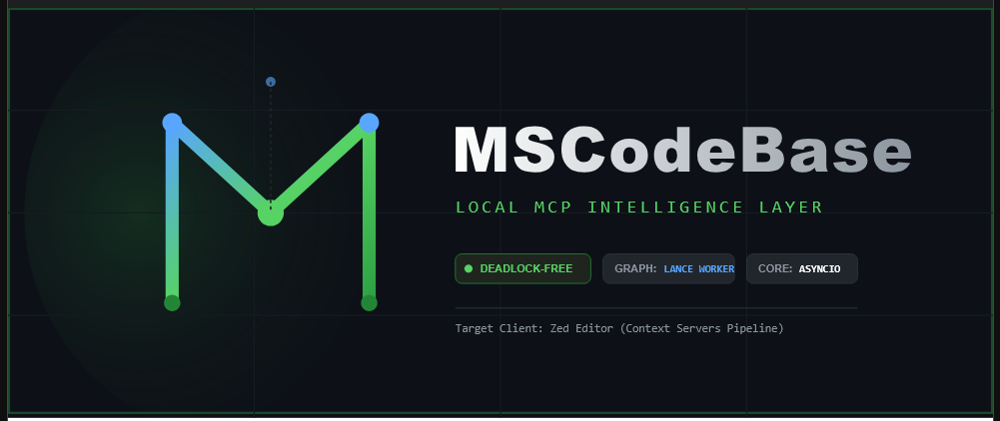

<div align="center">



[🇬🇧 English](README.md) • [🇷🇺 Русский](docs/ru/README.md) • [🇨🇳 中文](docs/zh/README.md)

# MSCodebase Intelligence

**AI-powered semantic code search for Zed IDE**

[](https://www.python.org/downloads/)
[](https://opensource.org/licenses/MIT)
[](https://modelcontextprotocol.io/)
[](https://zed.dev/)
[](tests/)

[Features](#-features) • [Quick Start](#-quick-start) • [Tools](#-mcp-tools-43-total) • [Documentation](#-documentation-map) • [Installation](docs/en/INSTALL.md) • [Architecture](docs/en/ARCHITECTURE.md) • [Contributing](CONTRIBUTING.md) • [Security](SECURITY.md)

*Last updated: 2026-07-07*

</div>

---

## ✨ Features

| Feature | Description |
|---------|-------------|
| 🔍 **Unified Search** | `search_code(query, mode, intent_hint)` — single tool: fast/quality/deep/context/ask/auto |
| 🧠 **Intelligence Layer** | 10 high-level `intel_*` tools: self-diagnostics, topology, error prediction |
| 🗃️ **Project Memory** | ADR, known issues, tech debt — automatically persisted between sessions |
| 🌐 **Cross-repo Search** | Search across multiple projects with `@mention` syntax |
| 🌳 **Call Graph** | Full call graph: definition + callers + callees + impact analysis |
| 🏗 **Structural Search** | 13 AST patterns (class_inheritance, async_function, decorator, etc.) |
| 🔎 **Context Search** | Find similar code — paste a fragment, get semantic duplicates |
| 🪣 **Multi-Bucket RAG** | Code/docs buckets, soft weighting, intent_hint (code/docs/auto) |
| 🤖 **mode=ask** | RAG-генерация ответа через phi-4 (server profile) |
| 💾 **LanceDB v2** | Vector DB with per-project isolation (incremental BM25 reindex) |
| 🛡 **Rate Limiting** | DebounceBatch + CircuitBreaker — protection against VFS loops |
| 🏥 **Self-Diagnosis** | `get_health_report` + `index_health` — full check and recovery |
| 🧪 **Clean Architecture** | DI Container (15 services), 43 tools (33 class-based + 10 intel), 391+ tests |
| 🪟 **Multi-Window** | `ProjectIndexerRegistry` — isolated Indexer per project, LRU 5, ResourceMonitor throttle |
| ⚙️ **SYSTEM_PROFILE** | `light` (sync) / `server` (async with phi-4) |

---

## 🚀 Quick Start

> Full installation guide: **[docs/en/INSTALL.md](docs/en/INSTALL.md)**

```bash
git clone https://github.com/ManSio/mscodebase-intelligence.git
cd mscodebase-intelligence
python install.py
```

**After installation:** File → Quit → reopen project → wait for indexing.

**Verify:** in Agent Panel (`Ctrl+Shift+P` → `Agent Panel: Toggle`) run:
```
get_index_status()
```

> **Windows:** Windows has specifics (Restricted Mode, project resolves via SQLite).
> Read **[docs/en/ZED_WINDOWS_QUIRKS.md](docs/en/ZED_WINDOWS_QUIRKS.md)**
> before installation.
>
> **LM Studio:** Recommended for vector search. Install, run on port 1234 —
> MCP connects automatically.

---

## 📚 Documentation Map

| Document | Description | Audience | Languages |
|----------|-------------|----------|-----------|
| **[docs/en/INSTALL.md](docs/en/INSTALL.md)** | Installation, setup, uninstall | Users | 🇬🇧 🇷🇺 🇨🇳 |
| **[docs/en/ARCHITECTURE.md](docs/en/ARCHITECTURE.md)** | Clean Architecture, Layers, DI | Developers | 🇬🇧 🇷🇺 🇨🇳 |
| **[docs/en/ARCHITECTURE_DEEP.md](docs/en/ARCHITECTURE_DEEP.md)** | Deep architecture: pipeline, lifecycle, comparison | Architects | 🇬🇧 🇷🇺 🇨🇳 |
| **[docs/en/ARCHITECTURE_LAYERS.md](docs/en/ARCHITECTURE_LAYERS.md)** | 10 runtime layers | Architects | 🇬🇧 🇷🇺 🇨🇳 |
| **[docs/en/FAQ.md](docs/en/FAQ.md)** | Frequently Asked Questions | All | 🇬🇧 🇷🇺 🇨🇳 |
| **[docs/en/TELEMETRY.md](docs/en/TELEMETRY.md)** | Metrics, ETA, data collection | DevOps | 🇬🇧 🇷🇺 🇨🇳 |
| **[docs/en/investigations/LSP_WONTFIX.md](docs/en/investigations/LSP_WONTFIX.md)** | LSP on Windows investigation (WONTFIX) | Support | 🇬🇧 🇨🇳 |
| **[docs/en/ZED_WINDOWS_QUIRKS.md](docs/en/ZED_WINDOWS_QUIRKS.md)** | Windows specifics, Restricted Mode | Windows users | 🇬🇧 🇷🇺 🇨🇳 |
| **[docs/en/CHANGELOG.md](docs/en/CHANGELOG.md)** | Version history | All | 🇬🇧 🇷🇺 🇨🇳 |
| **[docs/en/CONTRIBUTING.md](docs/en/CONTRIBUTING.md)** | How to contribute, PRs | Contributors | 🇬🇧 🇷🇺 🇨🇳 |
| **[docs/en/SECURITY.md](docs/en/SECURITY.md)** | Security policy, vulnerabilities | Security | 🇬🇧 🇷🇺 🇨🇳 |
| **[AGENTS.md](AGENTS.md)** | AI Agent system rules | AI Agent | 🇬🇧 |
| **[SECURITY.md](SECURITY.md)** | Security policy, reporting vulnerabilities | Security | 🇬🇧 |
| **[CODE_OF_CONDUCT.md](CODE_OF_CONDUCT.md)** | Community standards | Contributors | 🇬🇧 |

All documents are cross-referenced.

---

## 🔧 MCP Tools (43 total)

### Core Search

| Tool | When to Use |
|------|-------------|
| `search_code(query, mode, filter_layer, intent_hint)` | **Main search tool.** `mode="auto"` / `"fast"` / `"quality"` / `"deep"` / `"context"` / `"ask"`. `intent_hint="code"` / `"docs"` / `"auto"` — soft bucket weighting. `filter_layer="core"` — search within specific architecture layer |
| `structural_search(pattern)` | AST search: `class_inheritance`, `async_function`, `function_with_decorator` and more |
| `cross_repo_search(query @repo)` | Search across multiple projects (mono-repo) |
| `cross_project_deps(action)` | Cross-project dependency graph: `graph` / `deps` / `cycles` / `impact` |
| `get_symbol_info(query)` | Call Graph: callers, callees, impact files |
| `impact_analysis(symbol)` | Symbol change impact analysis (risk score, depth) |

### Index Management

| Tool | When to Use |
|------|-------------|
| `get_index_status()` | Index status: chunks, files, symbols |
| `get_index_progress()` | Indexing progress (phase, percent) |
| `index_project_dir(path)` | Start full project indexing |
| `get_index_timeline()` | Indexing history by date |
| `index_health(project_root)` | Index diagnostics and self-recovery |
| `notify_change(file_path)` | Force index update for a file (via DebounceBatch) |
| `generate_chunk_summaries(root)` | LLM-generated descriptions for code chunks |
| `scan_changes(project_root)` | Architectural diff — analyze changes since last baseline |

### System & Diagnostics

| Tool | When to Use |
|------|-------------|
| `get_health_report()` | **Full self-diagnosis:** index, embedder, logs, synchronization |
| `watcher_status()` | Component status: embedder mode (LM Studio / Ollama / ONNX) |
| `get_logs(project_root)` | Latest errors and warnings from project logs |
| `get_repo_map(project_root)` | Project map: file tree + key symbols |
| `read_live_file(path)` | Read file from LSP memory (including unsaved changes) |

### Analytics

| Tool | When to Use |
|------|-------------|
| `get_hotspots(project_root)` | Hotspots — files with high bug rate |
| `get_repo_rank(project_root, top_k)` | Symbol importance ranking (PageRank on call graph) |
| `get_bug_correlation(project_root)` | Bug-change correlation analysis |
| `get_related_files(project_root, path)` | Files related via co-change / bug correlation |
| `graph_query(query_type, target)` | Knowledge graph queries: `impact` / `feature` / `deps` / `tests` |
| `find_similar_bugs(error)` | Find similar bugs from history by error text |

### Git & History

| Tool | When to Use |
|------|-------------|
| `get_commit_history(root, limit)` | Semantic commit history |
| `get_file_history(root, path)` | Change history for a specific file |
| `get_branch_info(project_root)` | Branch info + index status |

### Lifecycle & Verification

| Tool | When to Use |
|------|-------------|
| `submit_background_task(type, root)` | Run long tasks: `bug_correlation` / `build_knowledge_graph` / `full_analysis` |
| `get_task_status(task_id)` | Background task status |
| `verify_action(action_type)` | Verification: `file_write` / `git_commit` / `git_push` / `index_sync` |
| `predict_eta(operation)` | Operation time prediction |
| `run_health_check()` | Full project health check (tests + git) |

### Intelligence Layer (intel_*) — 10 High-Level Tools

| Tool | What it does |
|------|-------------|
| `intel_get_runtime_status()` | Aggregated health status: embedder, index, resource usage |
| `intel_trigger_reindex()` | Fire-and-forget reindexing (does not block Zed) |
| `intel_get_job_status(job_id)` | Background task progress |
| `intel_code_topology(symbol)` | Call graph + module topology (< 2 sec) |
| `intel_get_project_memory()` | Project memory map: ADR, known_issues, tech_debt |
| `intel_log_incident(...)` | Log an incident to project history |
| `intel_analyze_incident(error)` | Find similar incidents + ready-made solutions |
| `intel_add_memory_node(section, data)` | Add a record to project memory |
| `intel_get_hotspots()` | Top-5 files with highest bug load |
| `intel_predict_root_cause(error)` | Predict root cause from logs + history |

---

## 🏗️ Architecture

### Clean Architecture with DI Container

```
┌──────────────────────────────────────────────────────────────────┐
│                   MCP Server (~220 lines)                        │
│            src/mcp/server.py — только регистрация                 │
│                                                                  │
│  ┌──────────────────────────────────────────────────────────┐   │
│  │              DI Container (15 services)                   │   │
│  │  src/core/di_container.py — ServiceCollection              │   │
│  │                                                           │   │
│  │  ┌──────────┐  ┌────────────┐  ┌──────────────────────┐  │   │
│  │  │ Indexer  │  │  Searcher  │  │  DebounceBatch       │  │   │
│  │  │ Embedder │  │  SymbolIdx │  │  CircuitBreaker      │  │   │
│  │  │ Parser   │  │  FileGuard │  │  RateLimiter         │  │   │
│  │  └──────────┘  └────────────┘  └──────────────────────┘  │   │
│  └──────────────────────────────────────────────────────────┘   │
│                           │                                       │
│              ┌────────────┴────────────┐                         │
│              ▼                          ▼                         │
│  ┌────────────────────┐  ┌────────────────────────────────────┐  │
│  │  33 Tool Classes   │  │  10 intel_* tools                  │  │
│  │  src/mcp/tools/*.py │  │  src/core/intelligence_layer.py    │  │
│  │  Каждый инструмент  │  │  error_boundary decorator          │  │
│  │  — отдельный класс │  │  JSON status/message/detail        │  │
│  │  Constructor Inj.   │  │  asyncio.wait_for(timeout)        │  │
│  └────────────────────┘  └────────────────────────────────────┘  │
└──────────────────────────────────────────────────────────────────┘
         │
         ▼
┌─────────────────┐     ┌───────────────────┐
│  RemoteEmbedder  │     │  LanceDB v2       │
│  (LM Studio /    │     │  (Векторная БД)    │
│   Ollama / ONNX) │     │  BM25 + Vector    │
└─────────────────┘     └───────────────────┘
```

---

## ⚡ Performance

| Mode | Latency | Best For |
|:-----|:--------|:---------|
| `search_code(query, mode="fast")` | ~300ms | Simple keyword / exact name |
| `search_code(query, mode="quality")` | ~1200ms | Semantic search with reranker |
| `search_code(query, mode="deep")` | ~2-5s | Complex research across modules |
| `search_code(query, mode="context")` | ~500ms | Find similar code by fragment |
| `cross_repo_search(query @repo)` | ~500ms-2s | Cross-project search |

### Environment Variables

| Variable | Default | Description |
|----------|---------|-------------|
| `LM_STUDIO_URL` | `http://localhost:1234/v1` | LM Studio API endpoint |
| `LM_STUDIO_PORT` | `1234` | LM Studio port |
| `OLLAMA_URL` | `http://localhost:11434` | Ollama API endpoint |
| `LOG_LEVEL` | `INFO` | Уровень логирования |
| `ZED_WINDOWS_QUIRKS.md` | *(см. файл)* | Инструкции для Windows |

---

## 🔧 Troubleshooting

### MCP Server Not Responding

**Symptoms:** инструменты не отвечают, таймаут.

**Checklist:**
1. **File → Quit** → открой проект заново
2. Запустите `python install.py` для перенастройки
3. Проверьте логи: `%LOCALAPPDATA%\Zed\extensions\mscodebase-intelligence\.codebase_indices\logs\`

### Index Empty (0 chunks)

В Agent Panel выполните:
```
intel_trigger_reindex()
```

После проверьте: `get_index_status()`

### LM Studio Connection Issues

```bash
# Проверьте, что сервер отвечает:
python -c "import urllib.request; print(urllib.request.urlopen('http://localhost:1234/v1/health').read())"
```

Должен быть ответ `{"status":"ok"}`.

---

## 📁 Project Structure

```
mscodebase-intelligence/
├── src/
│   ├── main.py                   # MCP server entry point (~220 lines)
│   ├── lsp_main.py               # LSP server (DI-based, for didSave indexing)
│   ├── mcp/
│   │   ├── server.py             # DI routing — only imports + registration
│   │   └── tools/                 # 10 files, 33 class-based + 10 intel = 43 total
│   │       ├── search_tools.py   # search_code, get_symbol_info, impact_analysis
│   │       ├── indexing_tools.py # notify_change, index_project_dir, index_health
│   │       ├── git_tools.py      # get_branch_info, get_commit_history
│   │       ├── system_tools.py   # get_index_status, watcher_status, read_live_file
│   │       ├── analysis_tools.py # structural_search, get_repo_map, scan_changes
│   │       ├── graph_tools.py    # cross_repo_search, graph_query, get_related_files
│   │       ├── investigation_tools.py  # get_bug_correlation, get_hotspots
│   │       └── lifecycle_tools.py      # submit_background_task, verify_action
│   ├── core/
│   │   ├── di_container.py       # ★ DI Container (15 services, ServiceCollection)
│   │   ├── error_handler.py      # ★ error_boundary + ToolError
│   │   ├── rate_limiter.py       # ★ SlidingWindowRateLimiter + DebounceBatch + CircuitBreaker
│   │   ├── indexer.py            # LanceDB vector storage
│   │   ├── searcher.py           # Hybrid search (BM25 + Dense + RRF)
│   │   ├── symbol_index.py       # Call Graph (BFS, impact analysis)
│   │   ├── intelligence_layer.py # intel_* tools (10 high-level)
│   │   ├── remote_embedder.py    # LM Studio / Ollama client
│   │   ├── reranker.py           # Multi-Provider Reranker
│   │   ├── parser.py             # Tree-sitter AST
│   │   ├── health_report.py      # Self-diagnosis engine
│   │   └── ...
│   └── utils/
│       ├── paths.py              # SafePathManager, to_win_long_path
│       └── zed_config.py         # Auto-configure Zed settings
├── docs/
│   ├── en/               # English docs
│   ├── ru/               # Russian docs
│   └── zh/               # Chinese docs
├── tests/                        # 396 tests (pytest)
├── .agents/skills/               # Skills for AI agent
├── install.py                    # Installer
└── README.md
```

---

## 🛠️ Development

See [docs/en/CONTRIBUTING.md](docs/en/CONTRIBUTING.md) for:
- How to add new MCP tools
- Test structure and CI pipeline
- Commit message conventions

### Quick Start for Devs

```bash
# Setup
python -m venv .venv
.venv\Scripts\activate
pip install -r requirements.txt

# Run MCP server directly (test)
python -m src.main

# Run tests
pytest tests/ -m "not integration and not benchmark"
```

---

## 📄 License

MIT License — see [LICENSE](LICENSE) for details.

---

## 🙏 Acknowledgments

- [Zed IDE](https://zed.dev/) — code editor
- [LM Studio](https://lmstudio.ai/) — local LLM inference
- [LanceDB](https://lancedb.github.io/) — vector database
- [Model Context Protocol](https://modelcontextprotocol.io/) — MCP standard
