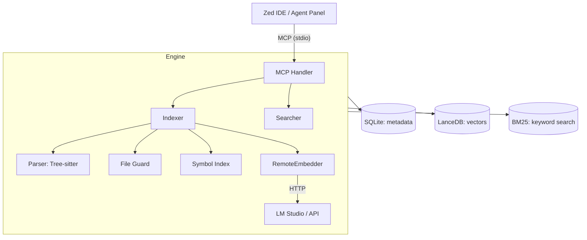

# MSCodebase Intelligence

<p align="center">
  <a href="https://github.com/ManSio/mscodebase-intelligence">
    
  </a>
  <a href="https://github.com/ManSio/mscodebase-intelligence/blob/main/LICENSE">
    
  </a>
  <a href="https://github.com/ManSio/mscodebase-intelligence/actions">
    
  </a>
  <a href="https://github.com/ManSio/mscodebase-intelligence/issues">
    
  </a>
</p>

<p align="center">
  <strong>🧠 Семантический поиск по кодовой базе для Zed IDE</strong>
</p>

<p align="center">
  MSCodebase Intelligence подключается к Zed через протокол MCP (Model Context Protocol) и позволяет AI-ассистенту «видеть» весь проект целиком — не только открытые файлы. Векторизация кода выполняется через LM Studio (или другой OpenAI-совместимый API), всё работает локально.
</p>

---

## ✨ Key Features

| Feature | Description |
|---------|-------------|
| **🔍 Hybrid Search** | Vector + BM25 search via Reciprocal Rank Fusion |
| **🧠 Smart Context** | AI-powered context gathering (like Cursor @codebase) |
| **🔬 Symbol Search** | Navigate functions and classes across files |
| **⚡ Incremental Indexing** | Only modified files (SHA256), no full reindexing |
| **🖥️ LM Studio / Ollama / OpenAI** | External API vectorization, no heavy ONNX models |
| **🛡️ FileGuard** | Protection from binaries, minified code, node_modules, .gitignore |
| **🔄 Atomic Operations** | LanceDB + SQLite with WAL-mode for reliability |
| **🔒 Stream Orchestrator** | Background worker with mutex, protection from concurrent writes |
| **📊 Status & Monitoring** | Database state control (`get_index_status`) |
| **🗺️ Repository Map** | Directory structure + symbols for project understanding |

---

## 🚀 Quick Start

### Prerequisites

- **Python 3.10+**
- **LM Studio** with running embedding server on port 1234
- **Zed IDE**

### Installation

#### Windows

```powershell
git clone https://github.com/ManSio/mscodebase-intelligence.git
cd mscodebase-intelligence
install.bat
```

#### macOS / Linux

```bash
git clone https://github.com/ManSio/mscodebase-intelligence.git
cd mscodebase-intelligence
chmod +x installers/install.sh
./installers/install.sh
```

### Usage

1. Open your project in **Zed IDE**
2. Open Agent Panel: `Ctrl+Shift+P` → `Agent Panel: Toggle Focus`
3. Ask questions like:
   - _"Find files responsible for routing"_
   - _"Where are error handlers in this project?"_
   - _"Show all graph-related functions"_
   - _"How is the Indexer class structured?"_

---

## 🏗️ Architecture

### System Components

| Module | File | Purpose |
|--------|------|---------|
| **MCP Handler** | `src/mcp/handler.py` | Orchestrates tools, manages background streams |
| **RemoteEmbedder** | `src/core/remote_embedder.py` | LM Studio/Ollama/OpenAI API client (port 1234) |
| **Indexer** | `src/core/indexer.py` | Incremental indexing (LanceDB + SQLite + Symbol Index) |
| **Parser** | `src/core/parser.py` | Tree-sitter AST → semantic chunks |
| **Searcher** | `src/core/searcher.py` | Hybrid search: vector + BM25 + RRF |
| **File Guard** | `src/core/file_guard.py` | File filtering (extensions, .gitignore, size, binary) |
| **Symbol Index** | `src/core/symbol_index.py` | Cross-file function/class navigation |
| **Context Engine** | `src/core/context_engine.py` | Smart context gathering for AI |
| **Watcher** | `src/core/watcher.py` | Watchdog (live) + Polling (fallback) |
| **Model Server** | `src/core/model_server.py` | Separate HTTP embeddings server |
| **Zed Config** | `src/utils/zed_config.py` | Auto-install MCP server in Zed settings |
| **Safe Paths** | `src/utils/paths.py` | Non-ASCII and long path handling |

### Architecture Diagram



---

## ⚙️ Configuration

Copy `.env.example` to `.env` if needed. Key settings:

| Variable | Default | Description |
|----------|---------|-------------|
| `EMBEDDING_PROVIDER` | `onnx` | `onnx` / `ollama` / `openai` (auto-detects LM Studio) |
| `API_BASE_URL` | `http://localhost:1234/v1` | Embeddings server URL |
| `MODEL_NAME` | `BAAI/bge-m3` | Embeddings model |
| `MODEL_DIR` | `.codebase_models` | ONNX model directory |
| `BATCH_SIZE` | `16` | Embeddings batch size |
| `CHROMA_BATCH_SIZE` | `100` | LanceDB upsert batch size |
| `WATCH_ENABLED` | `true` | Enable watchdog at startup |
| `AUTO_INDEX` | `true` | Auto-index on startup |
| `LOG_LEVEL` | `INFO` | `DEBUG` / `INFO` / `WARNING` / `ERROR` |
| `PROJECT_PATH` | `$ZED_WORKTREE_ROOT` | Project path (from Zed) |

---

## 🛠️ Development

### Environment Setup

```bash
# Create virtual environment
python -m venv .venv

# Windows:
.venv\Scripts\activate
# macOS/Linux:
source .venv/bin/activate

# Install dependencies
pip install -r requirements.txt
```

### Running MCP Server

```bash
python -m src.main
```

### Testing

```bash
# Run all tests
pytest tests/

# Run specific test file
pytest tests/test_searcher.py

# Run with coverage
pytest --cov=src --cov-report=html
```

### Building Standalone

```bash
python installers/build.py
```

---

## 📁 Project Structure

```
mscodebase-intelligence/
├── .github/workflows/ci.yml              # CI (tests, linting)
├── installers/
│   ├── install.bat                       # Windows installer
│   ├── install.sh                        # macOS/Linux installer
│   └── build.py                          # PyInstaller build
├── src/
│   ├── main.py                           # Entry point (CLI + MCP)
│   ├── core/
│   │   ├── context_engine.py             # Smart context gathering
│   │   ├── embedder.py                   # Local ONNX vectorization
│   │   ├── file_guard.py                 # File filtering
│   │   ├── indexer.py                    # Incremental indexing
│   │   ├── model_server.py               # HTTP embeddings server
│   │   ├── parser.py                     # Tree-sitter parsing
│   │   ├── remote_embedder.py            # LM Studio/API client
│   │   ├── searcher.py                   # Hybrid search
│   │   ├── symbol_index.py               # Symbol indexing
│   │   └── watcher.py                    # File monitoring
│   ├── mcp/
│   │   └── handler.py                    # MCP server orchestrator
│   └── utils/
│       ├── paths.py                      # Safe path handling
│       └── zed_config.py                 # Zed IDE configuration
├── tests/
│   ├── test_embedder.py
│   ├── test_integration.py
│   ├── test_parser.py
│   └── test_searcher.py
├── install.bat                           # Windows installation
├── test_connection.py                    # Installation verification
├── requirements.txt
├── pyproject.toml
├── .env.example
├── .gitignore
├── README.md
└── LICENSE
```

---

## 📋 System Requirements

- **Python**: 3.10–3.14
- **RAM**: 4 GB (minimum), 8 GB (recommended)
- **Disk**: 200 MB (index + extension)
- **OS**: Windows 10/11, macOS 12+, Linux
- **LM Studio** (recommended) with embeddings model

---

## 🔧 Tool Permissions

In Zed `settings.json`:

```json
{
  "agent": {
    "tool_permissions": {
      "default": "allow"
    }
  }
}
```

---

## 🐛 Known Limitations

- First indexing of large projects (10k+ files) may take 5–15 minutes
- Systems with <4 GB RAM should disable `AUTO_INDEX` and `WATCH_ENABLED`
- Requires running LM Studio (or other API) for vectorization — server runs without it, but search returns empty results

---

## 📄 License

[MIT](LICENSE)

---

*Last updated: 2026-06-24*