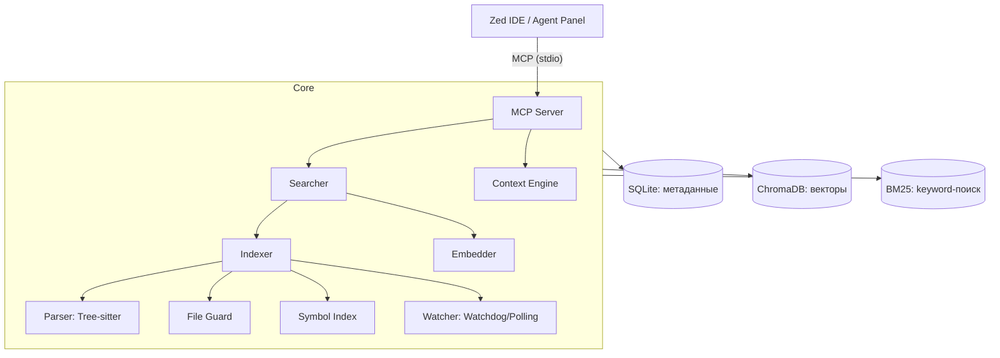

# MSCodebase Intelligence

🧠 **Семантический поиск по кодовой базе для Zed IDE.**

MSCodebase Intelligence подключается к Zed через протокол MCP (Model Context Protocol) и позволяет AI-ассистенту «видеть» весь проект целиком — не только открытые файлы. Система работает полностью локально: код остаётся на вашей машине.

---

## ✨ Возможности

- 🔍 **Семантический поиск** (`search_code`) — поиск по смыслу запроса, а не по точному совпадению
- 🧠 **Умный контекст** (`get_context`) — как `@codebase` в Cursor: AI сам определяет, какие файлы нужны для ответа на вопрос
- 🎯 **Гибридный поиск** — объединение векторного поиска и BM25 через Reciprocal Rank Fusion
- 🔬 **Поиск символов** (`get_symbol_info`) — навигация по функциям и классам между файлами
- ⚡ **Инкрементальная индексация** — обработка только изменённых файлов (SHA256)
- 🖥️ **Аппаратное ускорение** — CUDA, DirectML, CoreML, OpenVINO, CPU
- 🔄 **Watchdog + Polling** — live-обновление индекса при изменениях файлов
- 🛡️ **FileGuard** — защита от бинарников, минифицированного кода и `node_modules`
- 🌐 **Внешние API** — поддержка Ollama, LM Studio и OpenAI-совместимых провайдеров

---

## 🚀 Быстрая установка

### Windows

```powershell
git clone https://github.com/your-username/MSCodebase-Intelligence.git
cd MSCodebase-Intelligence
install.bat
```

### macOS / Linux

```bash
git clone https://github.com/your-username/MSCodebase-Intelligence.git
cd MSCodebase-Intelligence
chmod +x installers/install.sh
./installers/install.sh
```

Расширение устанавливается в `%LOCALAPPDATA%\Zed\extensions\mscodebase-intelligence`.

После установки **перезапустите Zed IDE**.

---

## 📖 Использование

1. Откройте проект в **Zed IDE**.
2. Откройте Agent Panel: `Ctrl+Shift+P` → `Agent Panel: Toggle Focus`.
3. Задайте вопрос агенту. Система сама решит, какие инструменты вызвать.

Примеры запросов:

- _"Найди файлы, отвечающие за маршрутизацию"_
- _"Где обрабатываются ошибки в этом проекте?"_
- _"Покажи все функции, работающие с графами"_
- _"Как устроен класс Indexer?"_

### Доступные MCP-инструменты

| Инструмент | Описание |
|---|---|
| `search_code(query, top_k=5)` | Семантический + BM25 поиск по коду |
| `get_context(question)` | Умный сбор контекста под вопрос AI (как `@codebase`) |
| `get_file_structure()` | Показать структуру проекта |
| `get_symbol_info(symbol_name)` | Где определён и где используется символ |
| `index_status()` | Статистика индексации (файлы/чанки/символы) |
| `reindex_all()` | Принудительная полная переиндексация |

---

## 🏗️ Архитектура



### Компоненты

| Модуль | Файл | Назначение |
|---|---|---|
| **MCP Server** | `src/mcp/handler.py` | Регистрирует инструменты MCP, управляет жизненным циклом |
| **Context Engine** | `src/core/context_engine.py` | Умный сбор контекста: keywords → semantic → symbol → diversity |
| **Embedder** | `src/core/embedder.py` | Векторизация кода (ONNX / Ollama / OpenAI API) |
| **Indexer** | `src/core/indexer.py` | Инкрементальная индексация, ChromaDB + SQLite |
| **Parser** | `src/core/parser.py` | Tree-sitter AST → семантические чанки (функции/методы) |
| **Searcher** | `src/core/searcher.py` | Гибридный поиск: vector + BM25 + RRF |
| **Symbol Index** | `src/core/symbol_index.py` | Cross-file навигация по символам |
| **File Guard** | `src/core/file_guard.py` | Фильтрация файлов (расширения, .gitignore, бинарники) |
| **Watcher** | `src/core/watcher.py` | Watchdog (live) + Polling (fallback) |
| **Zed Config** | `src/utils/zed_config.py` | Установка MCP-сервера в настройки Zed |
| **Safe Paths** | `src/utils/paths.py` | Обработка не-ASCII и длинных путей |

---

## ⚙️ Конфигурация

Скопируйте `.env.example` в `.env`:

```bash
cp .env.example .env
```

| Переменная | По умолчанию | Описание |
|---|---|---|
| `MODEL_NAME` | `BAAI/bge-m3` | Модель для эмбеддингов (русский + код, 1024dim) |
| `MODEL_DIR` | `.codebase_models` | Папка с файлами модели |
| `INDEX_DIR` | `.codebase_index` | Папка для ChromaDB и SQLite |
| `EMBEDDING_PROVIDER` | `onnx` | Провайдер: `onnx`, `ollama`, `openai` |
| `API_BASE_URL` | — | URL внешнего API (Ollama/LM Studio) |
| `API_KEY` | `sk-local` | Ключ для внешнего API |
| `BATCH_SIZE` | `16` | Размер батча эмбеддингов (для больших проектов — меньше, чтобы не OOM) |
| `CHROMA_BATCH_SIZE` | `100` | Размер батча upsert в ChromaDB (больше = быстрее bulk-insert) |
| `MAX_FILE_SIZE_MB` | `2` | Макс. размер файла для индексации |
| `WATCH_ENABLED` | `false` | Включить watchdog при старте (рекомендуется false для 200k+ строк) |
| `AUTO_INDEX` | `false` | Автоиндексация проекта при старте (рекомендуется false для больших проектов) |
| `POLL_INTERVAL` | `30` | Интервал polling-наблюдателя (сек) |
| `LOG_LEVEL` | `WARNING` | Уровень логирования (`DEBUG`, `INFO`, `WARNING`) |
| `IGNORE_PATTERNS` | `node_modules,dist,build,.git,.venv` | Паттерны для исключения из индексации (через запятую) |
| `PROJECT_PATH` | `.` | Путь к проекту |

---

## 🛠️ Для разработчиков

### Установка окружения

```bash
python -m venv venv

# Windows:
venv\Scripts\activate
# macOS / Linux:
source venv/bin/activate

pip install -r requirements.txt
```

### Запуск MCP-сервера

```bash
python -m src.main
```

Доступные аргументы:

| Аргумент | Назначение |
|---|---|
| `--install` | Установить MCP-сервер в `.zed/settings.json` (текущий проект) |
| `--install-global` | Установить глобально (для всех проектов) |
| `--remove` | Удалить MCP-сервер из глобальных настроек |
| `--help` | Показать справку |

### Тестирование

```bash
pytest tests/                    # Все тесты
pytest tests/ -m "not slow"      # Быстрые unit-тесты
pytest tests/ -m "slow"          # Интеграционные тесты
pytest tests/test_connection.py  # Проверка установки
```

### Сборка standalone-исполняемого файла

```bash
python installers/build.py
```

---

## 📁 Структура проекта

```
MSCodebase-Intelligence/
├── .github/workflows/ci.yml      # CI (тесты, линтинг, сборка)
├── installers/
│   ├── install.bat               # Инсталлятор Windows
│   ├── install.sh                # Инсталлятор macOS/Linux
│   └── build.py                  # PyInstaller сборка
├── src/
│   ├── main.py                   # Точка входа (CLI + MCP)
│   ├── core/
│   │   ├── context_engine.py     # Умный сбор контекста
│   │   ├── embedder.py           # Векторизация текста
│   │   ├── file_guard.py         # Фильтрация файлов
│   │   ├── indexer.py            # Инкрементальная индексация
│   │   ├── parser.py             # Tree-sitter парсинг
│   │   ├── searcher.py           # Гибридный поиск
│   │   ├── symbol_index.py       # Индекс символов
│   │   └── watcher.py            # Watchdog/Polling
│   ├── mcp/
│   │   └── handler.py            # MCP-сервер (инструменты)
│   └── utils/
│       ├── paths.py              # Безопасные пути
│       └── zed_config.py         # Настройка Zed IDE
├── tests/
│   ├── test_embedder.py
│   ├── test_integration.py
│   ├── test_parser.py
│   └── test_searcher.py
├── install.bat                   # Установка (alias для Windows)
├── instalzed.bat                 # Устарел (обратная совместимость)
├── test_connection.py            # Проверка установки
├── requirements.txt              # Зависимости
├── pyproject.toml                # Метаданные пакета
├── pytest.ini                    # Настройки pytest
├── .gitignore
└── README.md
```

---

## 📋 Системные требования

- **Python**: 3.10–3.12
- **RAM**: 4 ГБ (минимум), 8 ГБ (рекомендуется)
- **Диск**: 500 МБ (модель + векторный индекс)
- **ОС**: Windows 10/11, macOS 12+, Ubuntu 20.04+

---

## 🔧 Настройка прав доступа к инструментам

Начиная с Zed v0.224.0, поведение подтверждения вызова инструментов управляется настройкой `agent.tool_permissions.default`:

- `"confirm"` (по умолчанию) — спрашивать подтверждение перед каждым вызовом
- `"allow"` — авто-разрешение всех инструментов (рекомендуется для нашего расширения)
- `"deny"` — запретить все инструменты

Добавьте в `settings.json`:

```json
{
  "agent": {
    "tool_permissions": {
      "default": "allow"
    }
  }
}
```\nЕсли сервер запущен, в настройках Agent Panel (`agent: open settings`) горит зелёная точка "Server is active".

При краше сервера диагностика пишется в `crash_debug.log` рядом с расширением.

---

## 🐛 Известные ограничения

- ~~Модель `all-MiniLM-L6-v2` оптимизирована для английского кода; русскоязычные запросы могут работать хуже. Рекомендуется заменить модель через `MODEL_NAME` или использовать внешний API.~~
- ✅ По умолчанию используется **`BAAI/bge-m3`** — поддерживает русский, код и 100+ языков.
  Размерность 1024, SOTA-качество для retrieval. Система автоматически определяет размерность и префиксы под любую модель (BGE, E5, GTE, Jina и др.).
- Первая индексация крупных проектов (10k+ файлов) может занимать 5–15 минут.
- На системах с <4 ГБ RAM рекомендуется выключить `AUTO_INDEX` и `WATCH_ENABLED`.

---

## 📄 Лицензия

Распространяется по лицензии **MIT**. См. файл `LICENSE`.# mscodebase-intelligence

