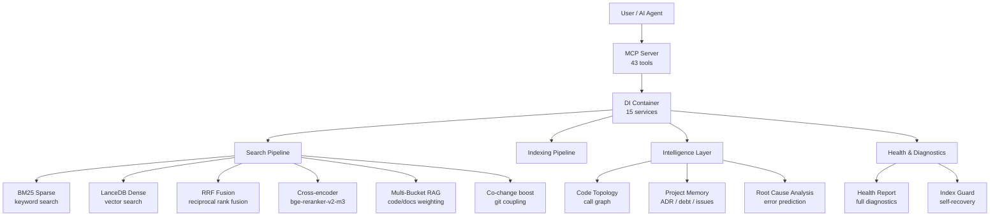
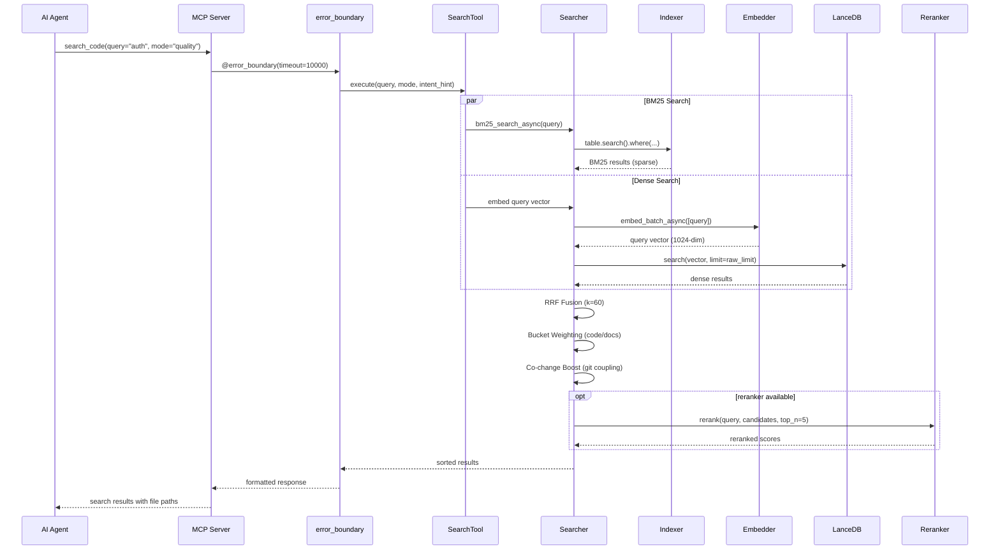
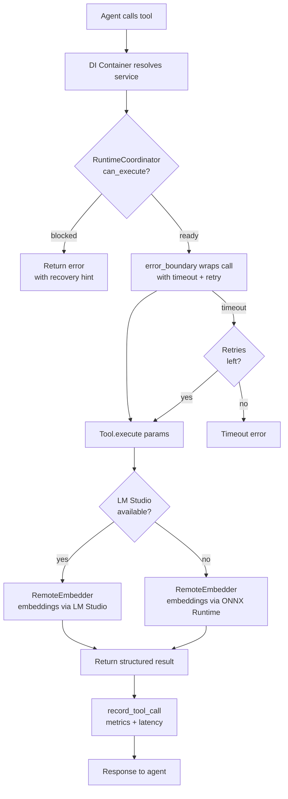
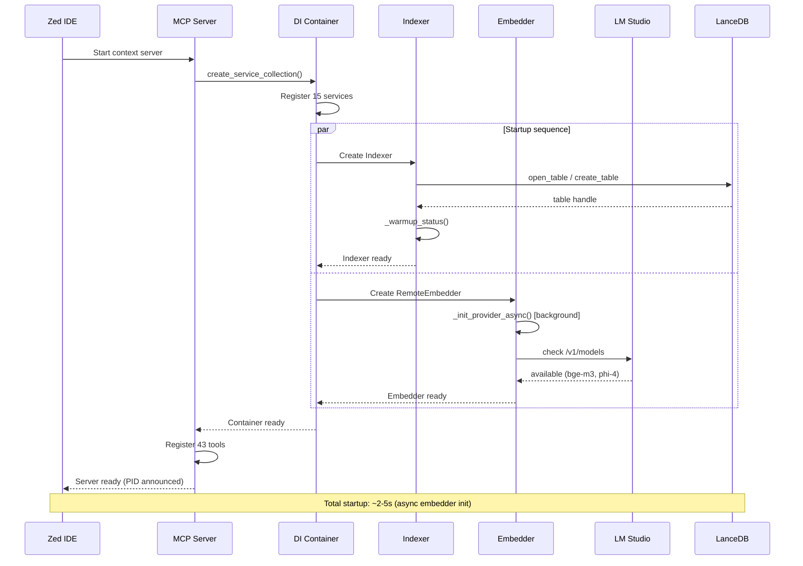
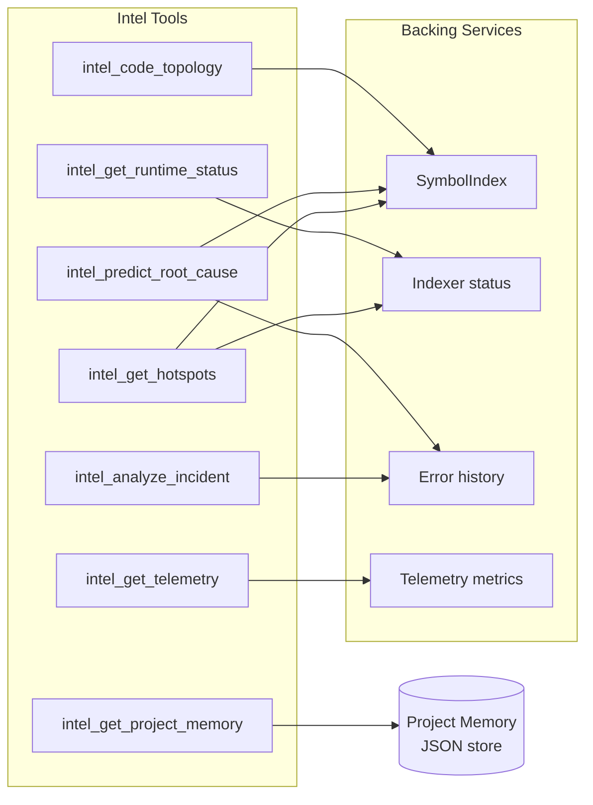
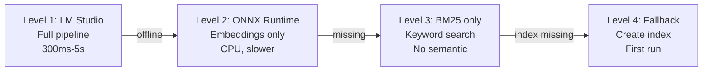

# MSCodeBase Intelligence — Deep Architecture Guide

> **Version:** v2.7.0+ | **Last updated:** 2026-07-07



---

## 1. Architecture Layers

The system is divided into 10 runtime layers, from lowest (infrastructure) to highest (user-facing tools).

```mermaid
flowchart LR
    subgraph "Layer 10 — MCP Tools"
        T1[search_code]
        T2[get_symbol_info]
        T3[impact_analysis]
        T4[intel_*]
    end
    subgraph "Layer 9 — Error Boundary"
        EB[@error_boundary\ntimeout + retry]
    end
    subgraph "Layer 8 — Intelligence"
        IL[intel_predict_root_cause\nintel_code_topology\nintel_get_project_memory]
    end
    subgraph "Layer 7 — Search"
        SH[hybrid_search_async\nRRF + reranker + buckets]
    end
    subgraph "Layer 6 — Index"
        IX[Indexer\nLanceDB + BM25 + SymbolIndex]
    end
    subgraph "Layer 5 — Embeddings"
        EM[RemoteEmbedder\nLM Studio / Ollama / ONNX]
    end
    subgraph "Layer 4 — Parsing"
        PS[Tree-sitter AST\nParser + SymbolIndex]
    end
    subgraph "Layer 3 — Storage"
        ST[LanceDB v2\nper-project isolation]
    end
    subgraph "Layer 2 — Rate Limiting"
        RL[CircuitBreaker\nDebounceBatch\nSlidingWindow]
    end
    subgraph "Layer 1 — DI Container"
        DI[ServiceCollection\n15 singletons + factories]
    end
    T1 --> EB --> IL --> SH --> IX --> EM --> PS --> ST --> RL --> DI
```

---

## 2. Search Pipeline — Complete Flow



### Mode Performance

| Mode | Pipeline | Latency | Use Case |
|------|----------|---------|----------|
| `fast` | BM25 only | ~300ms | Exact symbol lookup |
| `quality` | BM25 + Dense + RRF + Reranker | ~1200ms | Architecture questions |
| `deep` | Recursive graph expansion | 2-5s | Complex investigations |
| `context` | Code fragment similarity | ~500ms | Find similar code |
| `ask` | Search → phi-4 generation | 5-15s | RAG question answering |

---

## 3. Tool Lifecycle



---

## 4. Component Interaction — Startup Flow



---

## 5. Intelligence Layer Architecture



---

## 6. Data Model

```mermaid
erDiagram
    CHUNK ||--o{ METADATA : contains
    CHUNK {
        string id PK
        vector vector "1024-dim float"
        string text "compact chunk"
        string text_full "full function text"
        string file_path "relative path"
        string file_hash "MD5 for incremental"
        int chunk_index
        string source "lsp_vfs | filesystem"
        string indexed_at ISO8601
        string summary "LLM-generated"
        string callees "JSON array of callee names"
        float health_score "1-10"
        string health_band "healthy|warning|alert"
    }
    METADATA {
        string layer "core | mcp | tests"
        string module_name "core.searcher"
        string hierarchy_level "function | class | module"
        bool is_public
        string symbol_type "function_definition"
        string parent_id "hash for multi-granularity"
    }
    SYMBOL {
        string name
        string file_path
        int line
        string kind
        bool is_definition
    }
    SYMBOL ||--o{ SYMBOL : calls
```

---

## 7. Comparison: MSCodeBase vs Ecosystem

| Criterion | **MSCodeBase** | Qartez MCP | CodeGraph | SymDex |
|-----------|:--------------:|:----------:|:---------:|:------:|
| **Language** | Python + LanceDB (Rust-core) | Rust | TypeScript | - |
| **Search** | BM25 + Dense + RRF + Reranker | Static analysis | Knowledge Graph | Symbol lookup |
| **Tools** | **43** | 30+ | - | - |
| **Tests** | **396** | - | - | - |
| **Windows** | **Native** (UNC, MAX_PATH) | - | - | - |
| **Incremental index** | MD5 + DebounceBatch | - | - | - |
| **Self-recovery** | IndexGuard | - | - | - |
| **Project Memory** | ADR / debt / issues | - | - | - |
| **Reranker** | bge-reranker-v2-m3 | - | - | - |
| **Co-change** | Git coupling matrix | - | - | - |
| **Health** | Full diagnostics | - | - | - |
| **Docs** | **3 languages** | 1 | 1 | 1 |
| **License** | MIT | Dual | MIT | - |

---

## 8. System Profile Comparison

| Feature | `light` profile | `server` profile |
|---------|:---------------:|:----------------:|
| `mode=ask` (phi-4) | ❌ Blocked | ✅ Available |
| Async search | ✅ | ✅ |
| Reranker | ✅ | ✅ |
| RAM usage | ~150 MB | ~300 MB (with phi-4) |
| Startup time | ~1s | ~3s |
| Use case | Daily coding | Deep analysis |

---

## 9. Graceful Degradation Levels



**Auto-recovery:** The system continuously scans for LM Studio/Ollama availability.
When the higher level becomes available, it switches automatically — no restart needed.

---

## 10. Key Metrics

| Metric | Value |
|--------|-------|
| **Search modes** | 6 (fast, quality, deep, context, ask, auto) |
| **MCP tools** | 43 (33 core + 10 intel) |
| **Services in DI** | 15 |
| **Tests** | 396 |
| **Languages** | 3 (EN, RU, ZH) |
| **Schema fields** | 19 (chunk: 9 + metadata: 6 + v3.0: 4) |
| **Embedding dim** | 1024 (bge-m3) |
| **Reranker** | bge-reranker-v2-m3 |
| **LLM** | phi-4-mini-instruct |
| **Vector DB** | LanceDB v2 |
| **Parser** | Tree-sitter |
