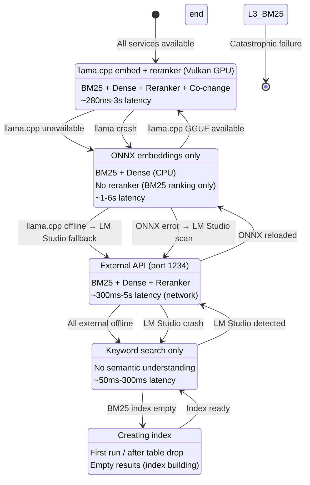
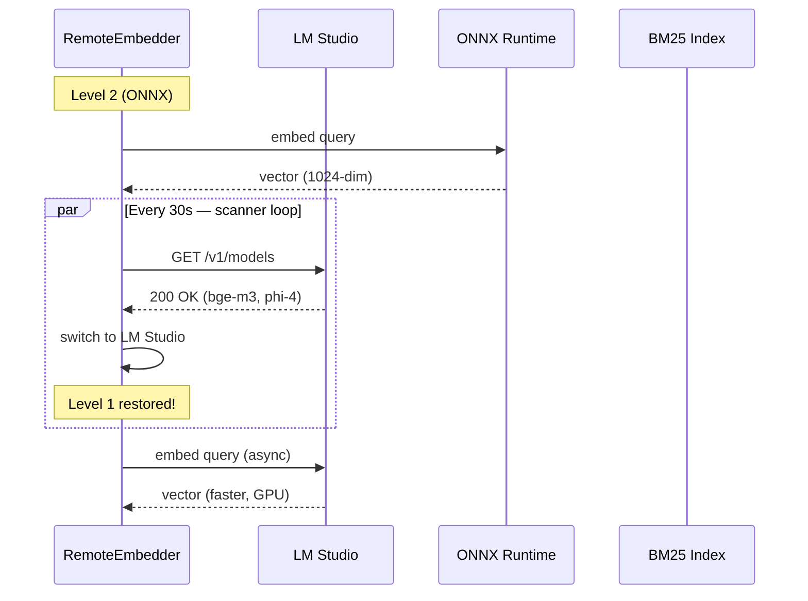
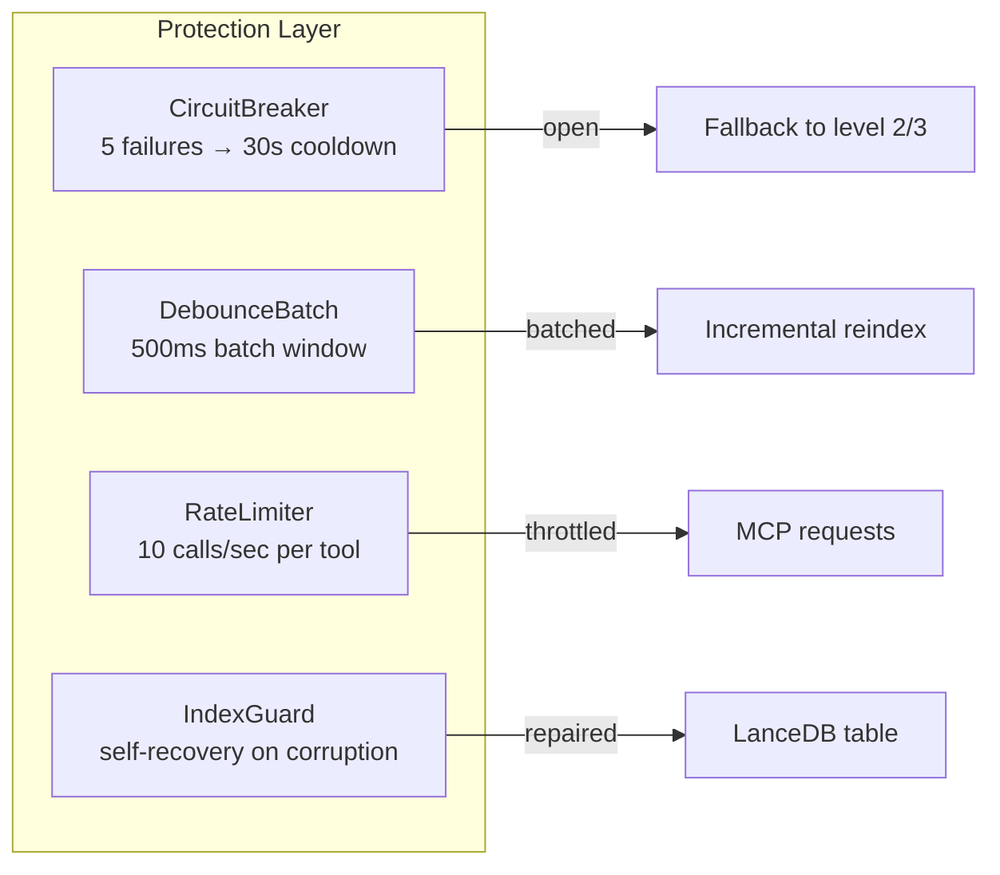

# Graceful Degradation — System Resilience Guide

> **Part of MSCodeBase Intelligence** | v2.7.0+

## Overview

MSCodeBase never crashes completely. Instead, it **degrades gracefully** through 5 levels,
maintaining basic functionality even when external services fail.



## Level Details

### Level 1: Full Pipeline (Production)

| Component | Status |
|-----------|:------:|
| LM Studio | ✅ Online |
| BM25 index | ✅ Built |
| Reranker | ✅ Available |
| mode=ask (phi-4) | ✅ Available |
| **Latency** | **300ms-5s** |
| **Quality** | **Best** |

**Trigger:** LM Studio responds on `127.0.0.1:1234/v1/models`

### Level 2: ONNX Runtime (Fallback)

```python
# Automatic fallback when LM Studio is unreachable
class RemoteEmbedder:
    def _check_lm_studio(self) -> bool:
        """Routes through CircuitBreaker to prevent cascade failures."""
        if self._breaker is not None:
            return bool(self._breaker.call(self._check_lm_studio_raw, fallback=True))
        return self._check_lm_studio_raw()
    
    def _init_onnx(self):
        """Loads ONNX model from .codebase_models/onnx/bge-m3/"""
        if not self.local_model_dir.exists():
            raise FileNotFoundError("Run: python scripts/download_model.py")
        self._onnx_session = ort.InferenceSession(str(self.local_model_dir / "model.onnx"))
```

| Component | Status |
|-----------|:------:|
| LM Studio | ❌ Offline |
| ONNX model | ✅ Available (438 MB) |
| Reranker | ❌ Unavailable |
| mode=ask | ❌ Unavailable |
| **Latency** | **1-6s** |
| **Quality** | **Good** (embedding only, no reranker) |

### Level 3: BM25 Only (Minimal)

```python
# Graceful degradation in BM25 builder
class Searcher:
    def _build_bm25_index(self) -> None:
        if self.indexer.table is None:
            self._bm25 = {}  # Empty BM25 = degraded mode
            return
        try:
            if self.indexer.table.count_rows() == 0:
                self._bm25 = {}
                return
        except Exception:
            self._bm25 = {}  # Table corrupted → degraded
            return
```

| Component | Status |
|-----------|:------:|
| LM Studio | ❌ Offline |
| ONNX model | ❌ Missing |
| BM25 index | ✅ Available |
| Reranker | ❌ Unavailable |
| mode=ask | ❌ Unavailable |
| **Latency** | **50ms-300ms** |
| **Quality** | **Basic** (keyword only) |

### Level 4: Fallback (First Run)

```python
# First run after table recreation
class Indexer:
    def _warmup_status(self) -> None:
        count = self.table.count_rows()
        self._cached_total_chunks = count
        if count == 0:
            logger.debug("🔥 Cold start — empty database")
```

| Component | Status |
|-----------|:------:|
| LM Studio | ❌ Offline |
| ONNX model | ❌ Unavailable |
| BM25 index | ❌ Empty |
| Reranker | ❌ Unavailable |
| mode=ask | ❌ Unavailable |
| **Latency** | N/A |
| **Quality** | **None** (awaiting index) |

## Auto-Recovery



**Key properties:**
- Scanner runs every 30s in background thread
- When higher level becomes available → **automatic switch**
- No restart needed
- CircuitBreaker prevents rapid on/off cycling

## Protection Mechanisms



| Protection | Mechanism | Recovery |
|-----------|-----------|----------|
| **CircuitBreaker** | 5 failures → OPEN (30s) → HALF_OPEN → CLOSED | Auto-recovery after cooldown |
| **DebounceBatch** | 500ms window, max 100 files | Triggers BM25 rebuild once |
| **RateLimiter** | Sliding window, 10 calls/s per tool | Drops excess with RateLimitError |
| **IndexGuard** | Count check + schema validation | Recreates table on corruption |
