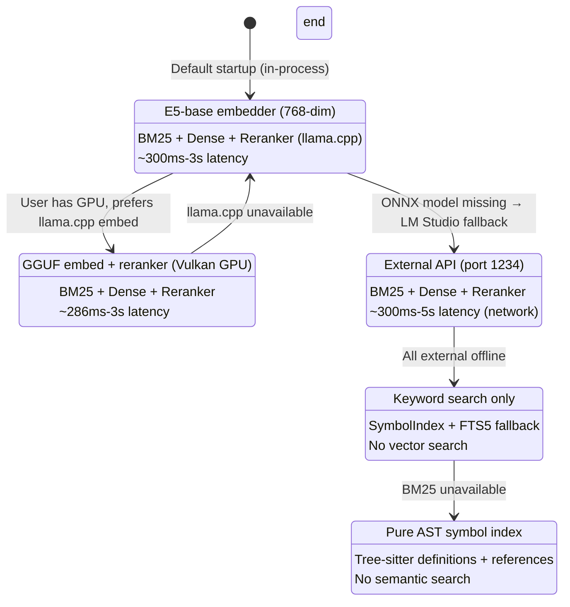
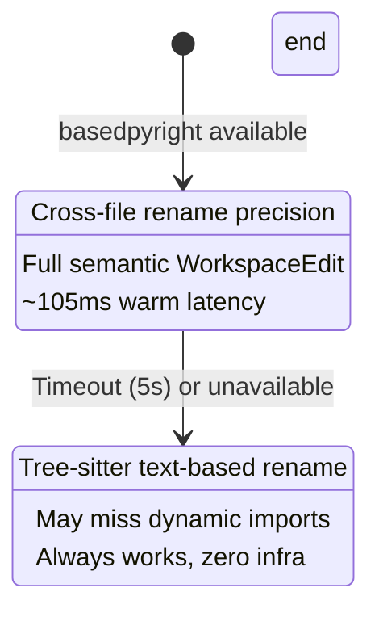
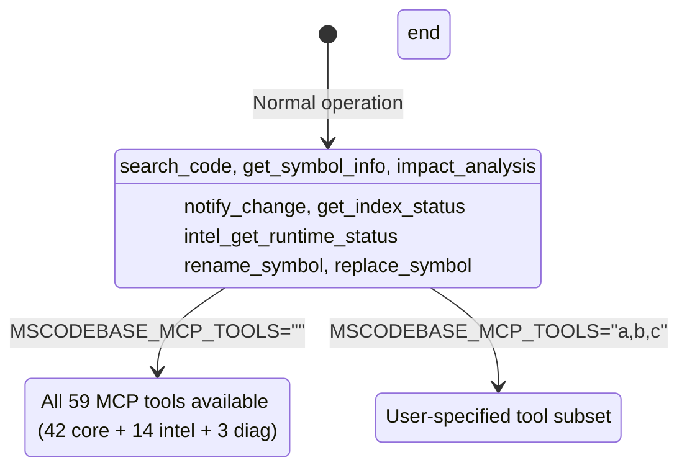
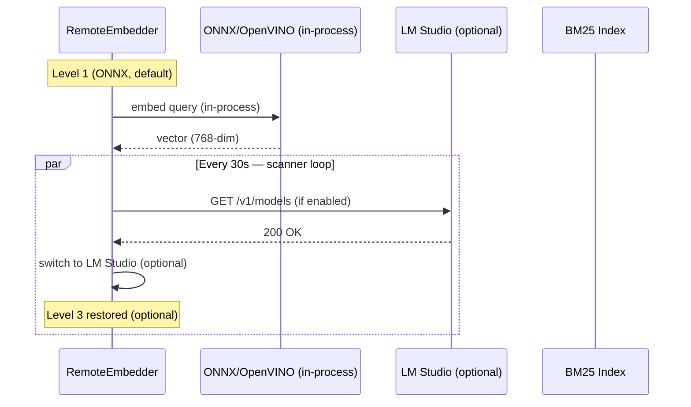

# Graceful Degradation — System Resilience Guide

> **Part of MSCodeBase Intelligence** | v3.2.1

## Overview

MSCodeBase never crashes completely. Instead, it **degrades gracefully** through 6 levels,
maintaining basic functionality even when external services fail.

> **Provider reality (2026-07-12):** The embedding provider runs **in-process** via
> **ONNX INT8 / OpenVINO INT8** (`intfloat/multilingual-e5-base`, 768-dim, ~350 ch/s on
> Windows CPU). This is the **default and primary** path — no external server required for
> semantic search. `LM Studio` is only an **optional fallback** if the local ONNX/OpenVINO
> model is unavailable. The **reranker** runs as a separate `llama-server.exe` process
> serving the `bge-reranker-v2-m3` GGUF model (port `:8081`).



### Cross-cutting layers (always available)

These are **independent** of the search level above:





## Level Details

### Level 1: ONNX/OpenVINO INT8 (Default, in-process)

```python
# Default provider path (EMBEDDING_PROVIDER=e5_onnx)
class RemoteEmbedder:
    def _init_provider_async(self):
        _provider = os.getenv("EMBEDDING_PROVIDER", "e5_onnx")
        if _provider in ("e5_onnx", "auto", ""):
            self._init_onnx()
            # OpenVINO INT8 has priority (~350 ch/s on Windows CPU)
            if getattr(self, "_ov_compiled", None) is not None:
                self.mode = "onnx"
```

| Component | Status |
|-----------|:------:|
| ONNX/OpenVINO E5-base | ✅ In-process (768-dim, INT8) |
| BM25 index | ✅ Built |
| Reranker (llama.cpp) | ✅ Available (`:8081`) |
| mode=ask | ⚠️ Optional (needs LLM profile) |
| **Latency** | **300ms-3s** |
| **Quality** | **Best** (no external dependency) |

**Trigger:** Default startup. No external server required.

### Level 2: llama.cpp GGUF (GPU, optional)

If the user has a Vulkan-capable GPU and prefers GGUF embedding, `llama-server.exe` can
serve the embedder. This is an acceleration path, not the default.

| Component | Status |
|-----------|:------:|
| llama.cpp embed (GPU) | ✅ Available |
| BM25 index | ✅ Built |
| Reranker | ✅ Available |
| mode=ask | ⚠️ Optional |
| **Latency** | **286ms-3s** |
| **Quality** | **Best** |

### Level 3: LM Studio (remote, optional fallback)

```python
# Only reached if the local ONNX/OpenVINO model is unavailable
class RemoteEmbedder:
    def _check_lm_studio(self) -> bool:
        """Routed through CircuitBreaker to prevent cascade failures."""
        if self._breaker is not None:
            return bool(self._breaker.call(self._check_lm_studio_raw, fallback=True))
        return self._check_lm_studio_raw()
```

| Component | Status |
|-----------|:------:|
| LM Studio | ✅ Online (if running) |
| ONNX model | ❌ Missing |
| Reranker | ✅ Available (via LM Studio) |
| mode=ask | ✅ Available |
| **Latency** | **300ms-5s** (network) |
| **Quality** | **Good** |

**Trigger:** `EMBEDDING_PROVIDER=lm_studio` or local ONNX model absent.

### Level 4: BM25 Only (Minimal)

```python
# Graceful degradation in BM25 builder
class Searcher:
    def _build_bm25_index(self) -> None:
        if self.indexer.table is None:
            self._bm25 = {}  # Empty BM25 = degraded mode
            return
        try:
            if self.indexer.table.count_rows() == 0:
                self._bm25 = {}
                return
        except Exception:
            self._bm25 = {}  # Table corrupted → degraded
            return
```

| Component | Status |
|-----------|:------:|
| ONNX model | ❌ Missing |
| LM Studio | ❌ Offline |
| BM25 index | ✅ Available |
| Reranker | ❌ Unavailable |
| mode=ask | ❌ Unavailable |
| **Latency** | **50ms-300ms** |
| **Quality** | **Basic** (keyword only) |

### Level 5: SymbolIndex Only (Last resort)

| Component | Status |
|-----------|:------:|
| ONNX model | ❌ Missing |
| BM25 index | ❌ Unavailable |
| SymbolIndex | ✅ Available |
| Reranker | ❌ Unavailable |
| mode=ask | ❌ Unavailable |
| **Latency** | **<50ms** |
| **Quality** | **AST symbols only** (no semantic search) |

### Level 6: Fallback (First Run)

| Component | Status |
|-----------|:------:|
| ONNX model | ❌ Unavailable |
| BM25 index | ❌ Empty |
| Reranker | ❌ Unavailable |
| mode=ask | ❌ Unavailable |
| **Latency** | N/A |
| **Quality** | **None** (awaiting index) |

## Auto-Recovery


