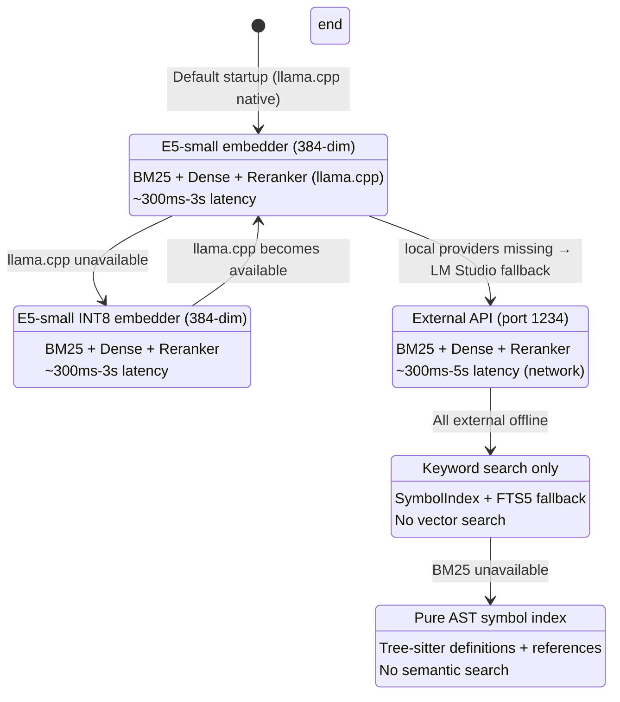
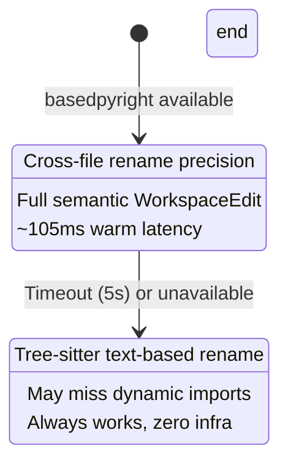
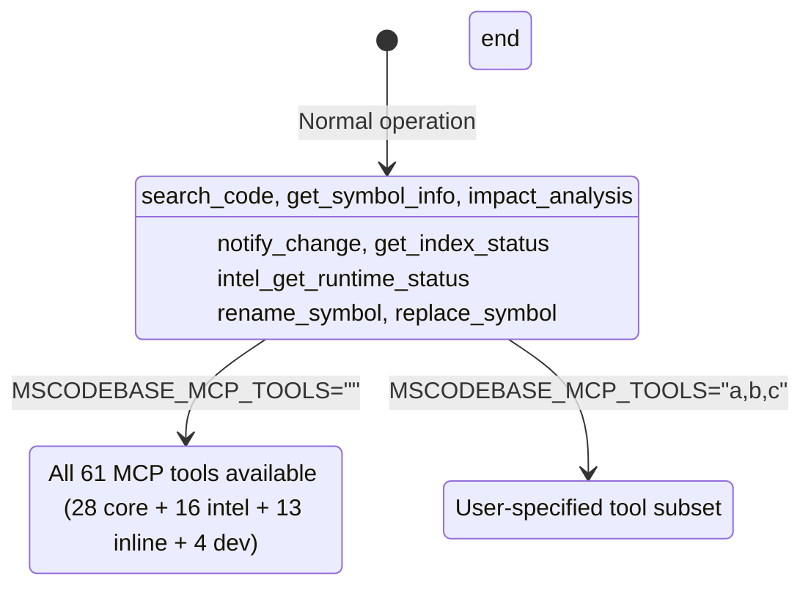
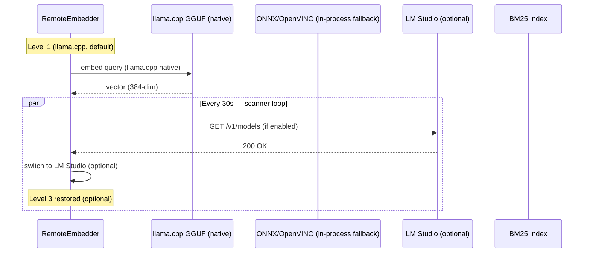

# Graceful Degradation — System Resilience Guide

> **Part of MSCodeBase Intelligence** | v3.4.0

## Overview

MSCodeBase never crashes completely. Instead, it **degrades gracefully** through 6 levels,
maintaining basic functionality even when external services fail.

> **Provider reality (2026-08-16):** The embedding provider runs via **llama.cpp GGUF**
> (`llama-server.exe`, native, preferred) — ONNX INT8 preload is canceled as soon as
> llama.cpp is detected, and the runtime scanner switches mode to `llama_cpp`.
> **ONNX INT8 / OpenVINO INT8** (`multilingual-e5-small-int8`, 384-dim) is the
> **in-process fallback** (startup path until llama.cpp is up). `LM Studio` is an
> **optional fallback** if neither local provider is available. The **reranker** runs
> as a separate `llama-server.exe` process serving the `bge-reranker-v2-m3` GGUF model
> (port `:8081`).


```mermaid
stateDiagram-v2
    [*] --> L1_GGUF: Default startup (llama.cpp native)

    state L1_GGUF[Level 1: llama.cpp GGUF (native)]
        L1_GGUF: E5-small embedder (384-dim)
        L1_GGUF: BM25 + Dense + Reranker (llama.cpp)
        L1_GGUF: ~300ms-3s latency
    end

    L1_GGUF --> L2_ONNX: llama.cpp unavailable
    L1_GGUF --> L3_LM: local providers missing → LM Studio fallback

    state L2_ONNX[Level 2: ONNX/OpenVINO INT8 (in-process fallback)]
        L2_ONNX: E5-small INT8 embedder (384-dim)
        L2_ONNX: BM25 + Dense + Reranker
        L2_ONNX: ~300ms-3s latency
    end

    L2_ONNX --> L1_GGUF: llama.cpp becomes available

    state L3_LM[Level 3: LM Studio (remote, optional)]
        L3_LM: External API (port 1234)
        L3_LM: BM25 + Dense + Reranker
        L3_LM: ~300ms-5s latency (network)
    end

    L3_LM --> L4_BM25: All external offline

    state L4_BM25[Level 4: BM25 Only]
        L4_BM25: Keyword search only
        L4_BM25: SymbolIndex + FTS5 fallback
        L4_BM25: No vector search
    end

    L4_BM25 --> L5_SYMBOL: BM25 unavailable

    state L5_SYMBOL[Level 5: SymbolIndex Only]
        L5_SYMBOL: Pure AST symbol index
        L5_SYMBOL: Tree-sitter definitions + references
        L5_SYMBOL: No semantic search
    end
```

### Cross-cutting layers (always available)

These are **independent** of the search level above:


```mermaid
stateDiagram-v2
    [*] --> LSP_ACTIVE: basedpyright available

    state LSP_ACTIVE[LSP: basedpyright]
        LSP_ACTIVE: Cross-file rename precision
        LSP_ACTIVE: Full semantic WorkspaceEdit
        LSP_ACTIVE: ~105ms warm latency
    end

    LSP_ACTIVE --> LSP_FALLBACK: Timeout (5s) or unavailable

    state LSP_FALLBACK[LSP: SymbolIndex]
        LSP_FALLBACK: Tree-sitter text-based rename
        LSP_FALLBACK: May miss dynamic imports
        LSP_FALLBACK: Always works, zero infra
    end
```


```mermaid
stateDiagram-v2
    [*] --> DEFAULT_TOOLS: Normal operation

    state DEFAULT_TOOLS[Visible: 12 tools]
        DEFAULT_TOOLS: search_code, get_symbol_info, impact_analysis
        DEFAULT_TOOLS: notify_change, get_index_status
        DEFAULT_TOOLS: intel_get_runtime_status
        DEFAULT_TOOLS: rename_symbol, replace_symbol
    end

    DEFAULT_TOOLS --> ALL_TOOLS: MSCODEBASE_MCP_TOOLS=""
    DEFAULT_TOOLS --> CUSTOM_TOOLS: MSCODEBASE_MCP_TOOLS="a,b,c"

    state ALL_TOOLS[Visible: 61 tools]
        ALL_TOOLS: All 61 MCP tools available (28 core + 16 intel + 13 inline + 4 dev)
    end

    state CUSTOM_TOOLS[Custom selection]
        CUSTOM_TOOLS: User-specified tool subset
    end
```

## Level Details

### Level 1: llama.cpp GGUF (native, default)

```python
# Preferred path: llama.cpp (Zed 1.10.0 native) — ONNX preload is canceled once it is up
class RemoteEmbedder:
    def _preload_onnx_delayed(self):
        if self._check_llama_cpp():
            self.mode = "llama_cpp"  # ONNX preload отменена — llama.cpp основной
```

| Component | Status |
|-----------|:------:|
| llama.cpp GGUF (e5-small) | ✅ Preferred (native llama-server, `:8080`) |
| BM25 index | ✅ Built |
| Reranker (llama.cpp) | ✅ Available (`:8081`) |
| mode=ask | ⚠️ Optional (needs LLM profile) |
| **Latency** | **300ms-3s** |
| **Quality** | **Best** (no external dependency) |

**Trigger:** llama.cpp available (default). Falls back to in-process ONNX when unavailable.

### Level 2: ONNX/OpenVINO INT8 (in-process fallback)

If the user has a Vulkan-capable GPU and prefers GGUF embedding, `llama-server.exe` can
serve the embedder. This is an acceleration path, not the default.

| Component | Status |
|-----------|:------:|
| llama.cpp embed (GPU) | ✅ Available |
| BM25 index | ✅ Built |
| Reranker | ✅ Available |
| mode=ask | ⚠️ Optional |
| **Latency** | **286ms-3s** |
| **Quality** | **Best** |

### Level 3: LM Studio (remote, optional fallback)

```python
# Only reached if the local ONNX/OpenVINO model is unavailable
class RemoteEmbedder:
    def _check_lm_studio(self) -> bool:
        """Routed through CircuitBreaker to prevent cascade failures."""
        if self._breaker is not None:
            return bool(self._breaker.call(self._check_lm_studio_raw, fallback=True))
        return self._check_lm_studio_raw()
```

| Component | Status |
|-----------|:------:|
| LM Studio | ✅ Online (if running) |
| ONNX model | ❌ Missing |
| Reranker | ✅ Available (via LM Studio) |
| mode=ask | ✅ Available |
| **Latency** | **300ms-5s** (network) |
| **Quality** | **Good** |

**Trigger:** `EMBEDDING_PROVIDER=lm_studio` or local ONNX model absent.

### Level 4: BM25 Only (Minimal)

```python
# Graceful degradation in BM25 builder
class Searcher:
    def _build_bm25_index(self) -> None:
        if self.indexer.table is None:
            self._bm25 = {}  # Empty BM25 = degraded mode
            return
        try:
            if self.indexer.table.count_rows() == 0:
                self._bm25 = {}
                return
        except Exception:
            self._bm25 = {}  # Table corrupted → degraded
            return
```

| Component | Status |
|-----------|:------:|
| ONNX model | ❌ Missing |
| LM Studio | ❌ Offline |
| BM25 index | ✅ Available |
| Reranker | ❌ Unavailable |
| mode=ask | ❌ Unavailable |
| **Latency** | **50ms-300ms** |
| **Quality** | **Basic** (keyword only) |

### Level 5: SymbolIndex Only (Last resort)

| Component | Status |
|-----------|:------:|
| ONNX model | ❌ Missing |
| BM25 index | ❌ Unavailable |
| SymbolIndex | ✅ Available |
| Reranker | ❌ Unavailable |
| mode=ask | ❌ Unavailable |
| **Latency** | **<50ms** |
| **Quality** | **AST symbols only** (no semantic search) |

### Level 6: Fallback (First Run)

| Component | Status |
|-----------|:------:|
| ONNX model | ❌ Unavailable |
| BM25 index | ❌ Empty |
| Reranker | ❌ Unavailable |
| mode=ask | ❌ Unavailable |
| **Latency** | N/A |
| **Quality** | **None** (awaiting index) |

## Auto-Recovery


```mermaid
sequenceDiagram
    participant EM as RemoteEmbedder
    participant LLAMA as llama.cpp GGUF (native)
    participant ONNX as ONNX/OpenVINO (in-process fallback)
    participant LM as LM Studio (optional)
    participant BM25 as BM25 Index

    Note over EM: Level 1 (llama.cpp, default)
    EM->>LLAMA: embed query (llama.cpp native)
    LLAMA-->>EM: vector (384-dim)

    par Every 30s — scanner loop
        EM->>LM: GET /v1/models (if enabled)
        LM-->>EM: 200 OK
        EM->>EM: switch to LM Studio (optional)
        Note over EM: Level 3 restored (optional)
    end
```
