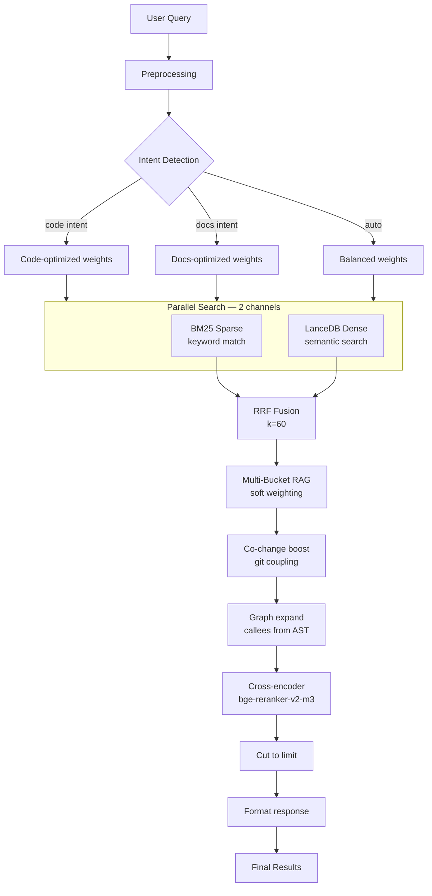
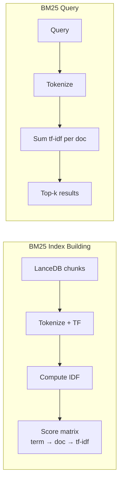
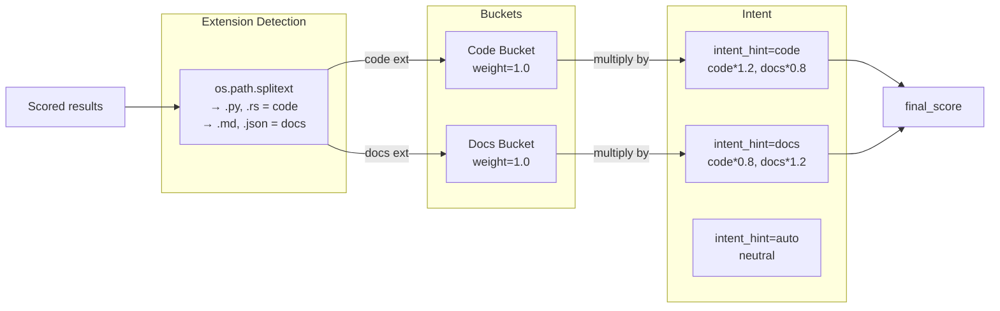
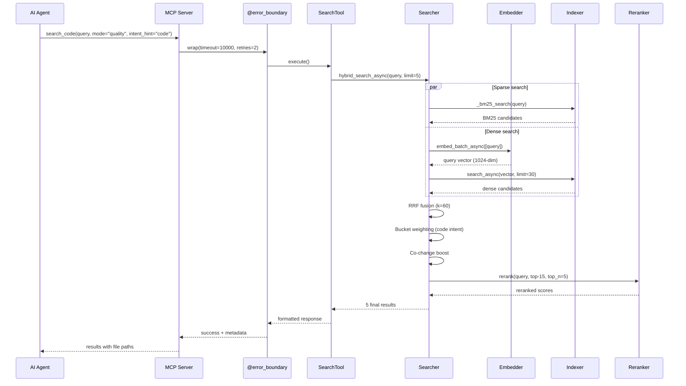

# Search Pipeline — Complete Technical Reference

> **Part of MSCodeBase Intelligence** | v2.7.0+

## Overview

The search pipeline is the core of MSCodeBase. It combines **4 retrieval stages** to find the most relevant code context.



## Stage Details

### 1. Query Expansion

```python
_EXPANSION_SYNONYMS = {
    "auth": ["authentication", "login", "authorize"],
    "error": ["exception", "failure", "bug"],
    "create": ["add", "insert", "new"],
    # ... 8 more groups
}

def expand_query(query: str, max_expansions: int = 3) -> list[str]:
    """Generate synonym variants. Each variant is searched independently."""
    variants = [query]
    words = query.lower().split()
    for word in words:
        synonyms = _EXPANSION_SYNONYMS.get(word, [])
        for syn in synonyms[:max_expansions - 1]:
            variant = query.replace(word, syn, 1)
            if variant not in variants:
                variants.append(variant)
    return variants
```

### 2. BM25 Search (Sparse)

- **Purpose:** Exact keyword matching — finds code containing specific terms
- **Index:** Incremental, built from LanceDB chunks, stored as `Dict[doc_id, Dict[term, tf-idf]]`
- **Update:** DebounceBatch (500ms) on file changes, full rebuild on reindex
- **Performance:** O(log N) per query



### 3. Dense Search (Vector, LanceDB)

- **Purpose:** Semantic similarity — finds conceptually related code
- **Model:** `text-embedding-bge-m3` (BAAI, 1024-dim)
- **Provider:** LM Studio / Ollama / ONNX Runtime (fallback)
- **Index:** LanceDB v2 with IVF-PQ quantization

```python
async def dense_search(query_vector: list, limit: int) -> list:
    table = await ensure_async_table()
    builder = await table.search(query_vector, vector_column_name="vector")
    df = await builder.limit(limit).to_pandas()
    return [{"text": row["text"], "metadata": {...}} for _, row in df.iterrows()]
```

### 4. RRF Fusion (Reciprocal Rank Fusion)

```python
def rrf_fusion(bm25: list, dense: list, k: int = 60) -> list:
    """Merge BM25 + dense results using RRF formula."""
    scores = {}
    for rank, doc in enumerate(bm25 + dense):
        key = f"{doc['metadata']['file']}:{doc['metadata']['chunk_index']}"
        if key not in scores:
            scores[key] = {
                "text": doc["text"],
                "metadata": doc["metadata"],
                "bm25_score": 0.0,
                "dense_score": 0.0,
                "final_score": 0.0,
            }
        # RRF: 1 / (k + rank)
        is_bm25 = rank < len(bm25)
        if is_bm25:
            scores[key]["bm25_score"] += 1.0 / (k + rank + 1)
        else:
            scores[key]["dense_score"] += 1.0 / (k + rank + 1 - len(bm25))
    
    for key in scores:
        scores[key]["final_score"] = scores[key]["bm25_score"] + scores[key]["dense_score"]
    
    return sorted(scores.values(), key=lambda x: x["final_score"], reverse=True)
```

### 5. Multi-Bucket RAG



### 6. Co-change Boost

Uses git history to boost files that historically change together:

```python
def apply_co_change_boost(chunks: list) -> list:
    """Boost files coupled with top-3 results via git history."""
    top_files = {c["metadata"]["file"] for c in chunks[:3]}
    matrix = commit_memory.compute_co_change_matrix()
    
    for chunk in chunks:
        file = chunk["metadata"]["file"]
        partners = matrix.get(file, {})
        if partners and any(tf in partners for tf in top_files):
            best = max(partners.get(tf, 0) for tf in top_files)
            chunk["final_score"] *= (1.0 + best * 0.3)
    return chunks
```

### 7. Cross-encoder Reranker

**Model:** `bge-reranker-v2-m3` (via LM Studio / Ollama)

> **Note:** The reranker visualization assumes LM Studio (GPU). With ONNX Runtime fallback, the reranker uses the same `bge-reranker-v2-m3` model via ONNX Runtime (CPU), with reduced throughput.

- Evaluates each (query, chunk) pair independently — **more accurate than vector cosine**
- Only reranks top-30 candidates (controlled by `MAX_RERANKER_INPUT`)
- Falls back gracefully if LM Studio is unavailable

```python
async def rerank(query: str, candidates: list, top_n: int = 5) -> list:
    """Single-stage reranker: query + chunk → relevance score."""
    if not candidates:
        return candidates
    scores = await multi_reranker.rerank(query, candidates)
    for i, chunk in enumerate(candidates):
        chunk["final_score"] = scores[i] if i < len(scores) else 0
    return sorted(candidates, key=lambda x: x["final_score"], reverse=True)[:top_n]
```

## Full Sequence Diagram



## Performance Benchmarks

| Stage | Time | Cumulative |
|-------|:----:|:----------:|
| Query expansion | <1ms | <1ms |
| BM25 search | ~150ms | ~150ms |
| Embed query | ~800ms | ~950ms |
| LanceDB ANN | ~400ms | ~1350ms |
| RRF fusion | <1ms | ~1350ms |
| Bucket weighting | <1ms | ~1350ms |
| Co-change boost | ~50ms | ~1400ms |
| Reranker (5 candidates) | ~1200ms | ~2600ms |
| **Total (quality mode)** | **~5600ms** | |
| **Total (fast mode, BM25 only)** | **~2300ms** | |
| **Total (deep mode, recursive)** | **2-5s** | |

> *Timings with ONNX Runtime (CPU). LM Studio (GPU) can be 3-5x faster.*

## Configuration

```ini
# .env search settings
DEFAULT_SEARCH_LIMIT=6
MAX_SEARCH_RESULTS=20
QUERY_SYNONYMS_ENABLED=true
MAX_QUERY_EXPANSIONS=3
OVERFETCH_FACTOR=3
RERANKER_PROVIDERS=ollama,lm_studio

# Bucket weights (1.0 = neutral)
CODE_BUCKET_WEIGHT=1.0
DOCS_BUCKET_WEIGHT=1.0
```
