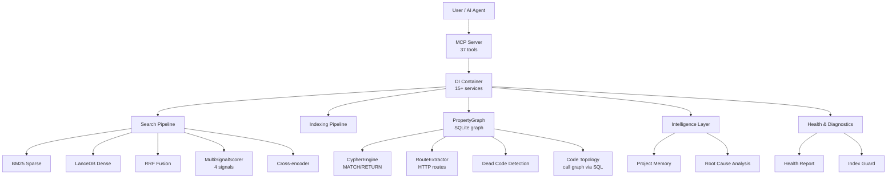
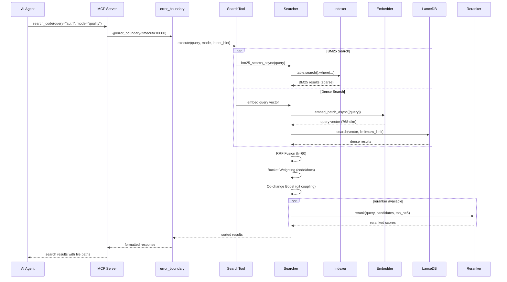
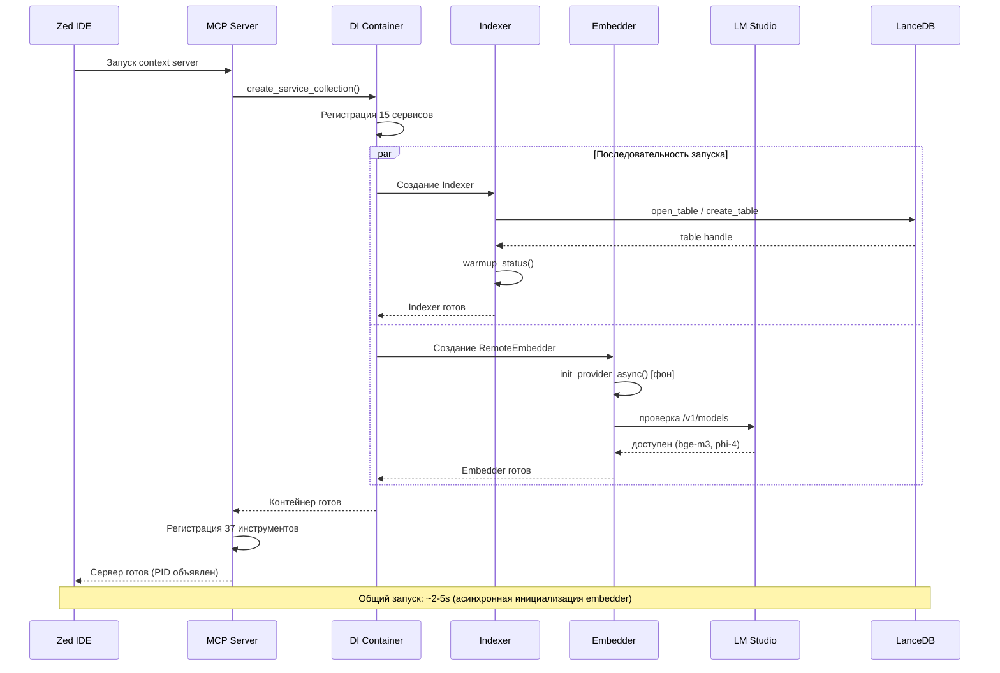
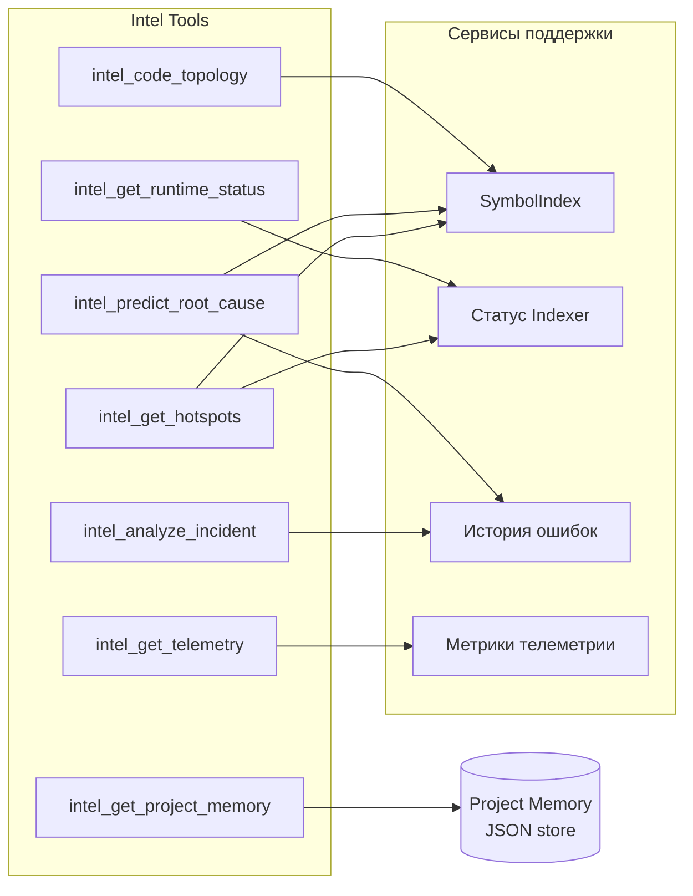
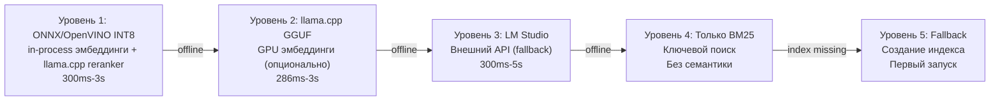

# MSCodeBase Intelligence — Руководство по глубокой архитектуре

[🇬🇧 English](../en/ARCHITECTURE_DEEP.md) • [🇷🇺 Русский](ARCHITECTURE_DEEP.md) • [🇨🇳 中文](../zh/ARCHITECTURE_DEEP.md)

> **Версия:** v3.2.0 | **Последнее обновление:** 2026-07-12



---

## 1. Архитектурные слои

Система разделена на 11 runtime-слоёв, от нижнего (инфраструктура) до верхнего (пользовательские инструменты).

```mermaid
flowchart LR
    subgraph "Layer 11 — MCP Tools"
        T1[search_code]
        T2[query_graph\nCypher]
        T3[impact_analysis]
        T4[intel_*]
    end
    subgraph "Layer 10 — Error Boundary"
        EB[@error_boundary]
    end
    subgraph "Layer 9 — Intelligence"
        IL[intel_predict_root_cause\nintel_code_topology]
    end
    subgraph "Layer 8 — Search + MultiSignal"
        SH[hybrid_search_async\nRRF + MultiSignalScorer]
    end
    subgraph "Layer 7 — Index"
        IX[Indexer\nLanceDB + BM25]
    end
    subgraph "Layer 6.5 — Data Flow (v3.2)"
        DF[ASSIGNED_FROM edges\nTree-sitter scope walk]
    end
    subgraph "Layer 6 — Graph (v3.0)"
        PG[PropertyGraph\nSQLite WAL + mmap]
        CY[CypherEngine\nMATCH→SQL]
        RE[RouteExtractor]
    end
    subgraph "Layer 5 — Embeddings"
        EM[RemoteEmbedder\nllama.cpp / LM Studio]
    end
    subgraph "Layer 4 — Parsing"
        PS[Tree-sitter AST\nParser + SymbolIndexAdapter]
    end
    subgraph "Layer 3 — Storage"
        ST[LanceDB v2 + SQLite\ngraph.db]
    end
    subgraph "Layer 2 — Rate Limiting"
        RL[CircuitBreaker\nDebounceBatch]
    end
    subgraph "Layer 1 — DI Container"
        DI[ServiceCollection\n18 services]
    end
    T1 --> EB --> IL --> SH --> IX --> PG --> EM --> PS --> ST --> RL --> DI
    PG --> CY
    PG --> RE
```

---

## 2. Поисковый пайплайн — полный поток



### Производительность режимов

| Режим | Пайплайн | Задержка | Сценарий использования |
|-------|----------|----------|----------------------|
| `fast` | Только BM25 | ~300ms | Поиск точного символа |
| `quality` | BM25 + Dense + RRF + Reranker | ~1200ms | Архитектурные вопросы |
| `deep` | Рекурсивное расширение графа | 2-5s | Сложные расследования |
| `context` | Поиск похожего кода по фрагменту | ~500ms | Найти похожий код |
| `ask` | Поиск → генерация phi-4 | 5-15s | RAG ответы на вопросы |

---

## 3. Жизненный цикл инструмента

```mermaid
flowchart TD
    Start[Agent вызывает инструмент] --> Resolve[DI Container разрешает сервис]
    Resolve --> Guard{RuntimeCoordinator\ncan_execute?}
    Guard -->|blocked| Error[Возврат ошибки\nс подсказкой по восстановлению]
    Guard -->|ready| Boundary[error_boundary оборачивает вызов\nс timeout + retry]
    
    Boundary --> Execute[Tool.execute params]
    Execute --> LMEnd{llama.cpp / LM Studio\nдоступен?}
    
    LMEnd -->|yes| LLAMA[RemoteEmbedder\nllama.cpp GGUF (GPU)]
    LMEnd -->|no| LM[RemoteEmbedder\nэмбеддинги через LM Studio]
    LMEnd -->|no| ONNX[RemoteEmbedder\nэмбеддинги через ONNX Runtime]
    
    LM --> Result[Возврат структурированного результата]
    LLAMA --> Result
    ONNX --> Result
    
    Result --> Telemetry[record_tool_call\nметрики + задержка]
    Telemetry --> Done[Ответ агенту]
    
    Boundary -->|timeout| Retry{Остались\nповторы?}
    Retry -->|yes| Execute
    Retry -->|no| Timeout[Ошибка таймаута]
```

---

## 4. Взаимодействие компонентов — поток запуска



---

## 5. Архитектура Intelligence Layer



---

## 6. Модель данных

```mermaid
erDiagram
    CHUNK ||--o{ METADATA : contains
    CHUNK {
        string id PK
        vector vector "768-dim float"
        string text "compact chunk"
        string text_full "полный текст функции"
        string file_path "относительный путь"
        string file_hash "MD5 для инкрементального"
        int chunk_index
        string source "lsp_vfs | filesystem"
        string indexed_at ISO8601
        string summary "LLM-сгенерированное"
        string callees "JSON-массив имён callee"
        float health_score "1-10"
        string health_band "healthy|warning|alert"
    }
    METADATA {
        string layer "core | mcp | tests"
        string module_name "core.searcher"
        string hierarchy_level "function | class | module"
        bool is_public
        string symbol_type "function_definition"
        string parent_id "хеш для multi-granularity"
    }
    SYMBOL {
        string name
        string file_path
        int line
        string kind
        bool is_definition
    }
    SYMBOL ||--o{ SYMBOL : calls
```

---

## 7. Сравнение: MSCodeBase vs Экосистема

| Критерий | **MSCodeBase** | Qartez MCP | CodeGraph | SymDex |
|----------|:--------------:|:----------:|:---------:|:------:|
| **Язык** | Python + LanceDB (Rust-core) | Rust | TypeScript | - |
| **Поиск** | BM25 + Dense + RRF + Reranker | Static analysis | Knowledge Graph | Symbol lookup |
| **Инструменты** | **43** | 30+ | - | - |
| **Тесты** | **396** | - | - | - |
| **Windows** | **Нативный** (UNC, MAX_PATH) | - | - | - |
| **Инкрементальный индекс** | MD5 + DebounceBatch | - | - | - |
| **Самовосстановление** | IndexGuard | - | - | - |
| **Проектная память** | ADR / debt / issues | - | - | - |
| **Реранкер** | bge-reranker-v2-m3 | - | - | - |
| **Co-change** | Матрица git coupling | - | - | - |
| **Здоровье** | Полная диагностика | - | - | - |
| **Документация** | **3 языка** | 1 | 1 | 1 |
| **Лицензия** | MIT | Dual | MIT | - |

---

## 8. Сравнение системных профилей

| Функция | `light` profile | `server` profile |
|---------|:---------------:|:----------------:|
| `mode=ask` (phi-4) | ❌ Заблокирован | ✅ Доступен |
| Асинхронный поиск | ✅ | ✅ |
| Реранкер | ✅ | ✅ |
| Использование RAM | ~150 MB | ~300 MB (с phi-4) |
| Время запуска | ~1s | ~3s |
| Сценарий | Ежедневная разработка | Глубокий анализ |

---

## 9. Уровни отказоустойчивости (graceful degradation)



**Автовосстановление:** Система по умолчанию запускает ONNX/OpenVINO E5-base in-process и непрерывно сканирует опциональный llama.cpp GGUF GPU-эмбеддер, затем LM Studio/Ollama как fallback. Когда более высокий уровень становится доступен, переключение происходит автоматически — без перезапуска.

---

## 10. Ключевые метрики

| Метрика | Значение |
|---------|---------|
| **Режимы поиска** | 6 (fast, quality, deep, context, ask, auto) |
| **MCP инструменты** | 37 (19 core + 12 intel + 6 diagnostic) |
| **Сервисы в DI** | 15 |
| **Тесты** | 396 |
| **Языки** | 3 (EN, RU, ZH) |
| **Поля схемы** | 19 (chunk: 9 + metadata: 6 + v3.0: 4) |
| **Размерность эмбеддинга** | 384 (E5-small INT8, in-process) |
| **Реранкер** | bge-reranker-v2-m3 |
| **LLM** | phi-4-mini-instruct (опционально, только mode=ask) |
| **Векторная БД** | LanceDB v2 |
| **Парсер** | Tree-sitter |
