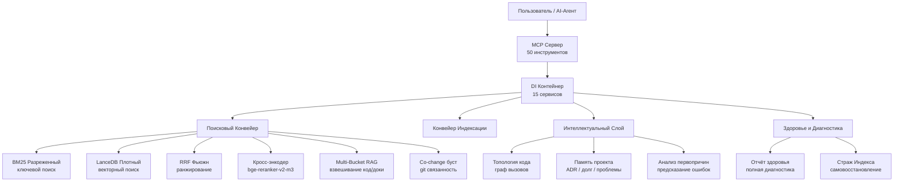
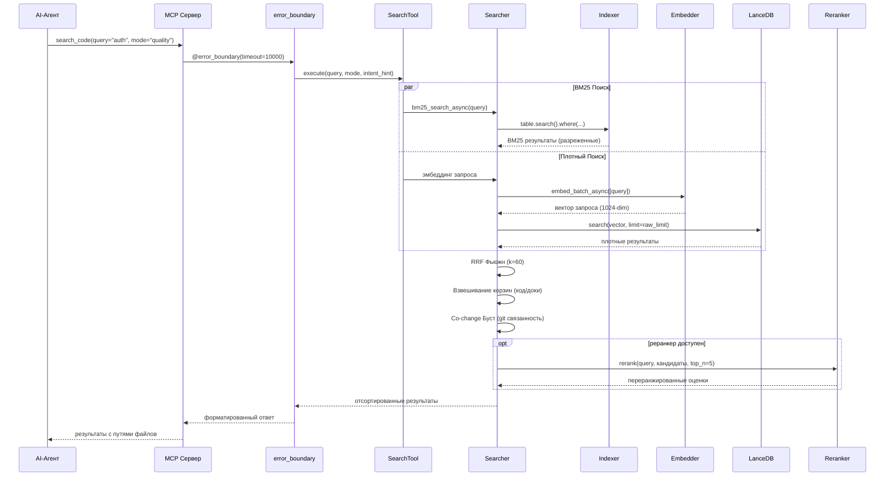
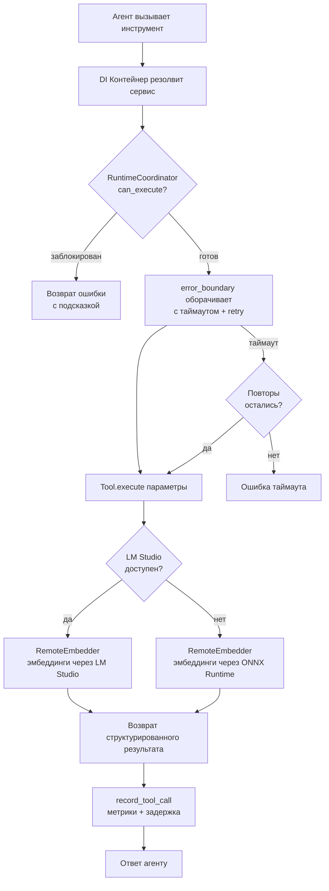
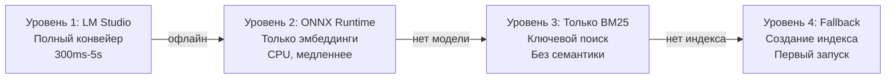

# MSCodeBase Intelligence — Глубокое Руководство по Архитектуре

[🇬🇧 English](../en/ARCHITECTURE_DEEP.md) • [🇷🇺 Русский](ARCHITECTURE_DEEP.md) • [🇨🇳 中文](../zh/ARCHITECTURE_DEEP.md)

> **Версия:** v2.7.0+ | **Последнее обновление:** 2026-07-07



---

## 1. Слои Архитектуры

Система разделена на 10 runtime-слоёв — от инфраструктурного (самый нижний) до пользовательского (самый верхний).

```mermaid
flowchart LR
    subgraph "Слой 10 — MCP Инструменты"
        T1[search_code]
        T2[get_symbol_info]
        T3[impact_analysis]
        T4[intel_*]
    end
    subgraph "Слой 9 — Error Boundary"
        EB[@error_boundary\nтаймаут + retry]
    end
    subgraph "Слой 8 — Интеллект"
        IL[intel_predict_root_cause\nintel_code_topology\nintel_get_project_memory]
    end
    subgraph "Слой 7 — Поиск"
        SH[hybrid_search_async\nRRF + реранкер + корзины]
    end
    subgraph "Слой 6 — Индекс"
        IX[Indexer\nLanceDB + BM25 + SymbolIndex]
    end
    subgraph "Слой 5 — Эмбеддинги"
        EM[RemoteEmbedder\nLM Studio / Ollama / ONNX]
    end
    subgraph "Слой 4 — Парсинг"
        PS[Tree-sitter AST\nParser + SymbolIndex]
    end
    subgraph "Слой 3 — Хранилище"
        ST[LanceDB v2\nизоляция проектов]
    end
    subgraph "Слой 2 — Rate Limiting"
        RL[CircuitBreaker\nDebounceBatch\nSlidingWindow]
    end
    subgraph "Слой 1 — DI Контейнер"
        DI[ServiceCollection\n15 синглтонов + фабрик]
    end
    T1 --> EB --> IL --> SH --> IX --> EM --> PS --> ST --> RL --> DI
```

---

## 2. Поисковый Конвейер — Полный Поток



### Производительность Режимов

| Режим | Конвейер | Задержка | Сценарий |
|-------|----------|---------|----------|
| `fast` | Только BM25 | ~300ms | Поиск символа |
| `quality` | BM25 + Dense + RRF + Реранкер | ~1200ms | Вопросы по архитектуре |
| `deep` | Рекурсивный граф | 2-5s | Сложные расследования |
| `context` | Поиск похожего кода | ~500ms | Найти похожий фрагмент |
| `ask` | Поиск → phi-4 генерация | 5-15s | RAG ответ на вопрос |

---

## 3. Жизненный Цикл Инструмента



---

## 4. Модель Данных

```mermaid
erDiagram
    CHUNK ||--o{ METADATA : содержит
    CHUNK {
        string id PK
        vector vector "1024-dim float"
        string text "компактный чанк"
        string text_full "полный код функции"
        string file_path "относительный путь"
        string file_hash "MD5 для инкремента"
        int chunk_index
        string source "lsp_vfs | filesystem"
        string indexed_at ISO8601
        string summary "LLM-описание"
        string callees "JSON массив callee"
        float health_score "1-10"
        string health_band "healthy|warning|alert"
    }
    METADATA {
        string layer "core | mcp | tests"
        string module_name "core.searcher"
        string hierarchy_level "function | class | module"
        bool is_public
        string symbol_type "function_definition"
        string parent_id "хеш для multi-granularity"
    }
    SYMBOL {
        string name
        string file_path
        int line
        string kind
        bool is_definition
    }
    SYMBOL ||--o{ SYMBOL : вызывает
```

---

## 5. Сравнение: MSCodeBase vs Экосистема

| Критерий | **MSCodeBase** | Qartez MCP | CodeGraph | SymDex |
|-----------|:--------------:|:----------:|:---------:|:------:|
| **Язык** | Python + LanceDB (Rust-core) | Rust | TypeScript | - |
| **Поиск** | BM25 + Dense + RRF + Реранкер | Статический анализ | Граф знаний | Поиск символов |
| **Инструментов** | **50** | 30+ | - | - |
| **Тестов** | **396** | - | - | - |
| **Windows** | **Нативно** (UNC, MAX_PATH) | - | - | - |
| **Инкр. индекс** | MD5 + DebounceBatch | - | - | - |
| **Само-восстановление** | IndexGuard | - | - | - |
| **Память проекта** | ADR / долг / проблемы | - | - | - |
| **Реранкер** | bge-reranker-v2-m3 | - | - | - |
| **Co-change** | Матрица git связанности | - | - | - |
| **Здоровье** | Полная диагностика | - | - | - |
| **Документация** | **3 языка** | 1 | 1 | 1 |
| **Лицензия** | MIT | Двойная | MIT | - |

---

## 6. Уровни Деградации



**Авто-восстановление:** Система непрерывно сканирует доступность LM Studio/Ollama.
При появлении более высокого уровня — переключается автоматически, без рестарта.

---

## 7. Ключевые Метрики

| Метрика | Значение |
|---------|----------|
| **Режимы поиска** | 6 (fast, quality, deep, context, ask, auto) |
| **MCP инструментов** | 50 (34 core + 14 intel) |
| **Сервисов в DI** | 15 |
| **Тестов** | 396 |
| **Языков** | 3 (EN, RU, ZH) |
| **Полей схемы** | 19 (чанк: 9 + мета: 6 + v3.0: 4) |
| **Размерность эмбеддинга** | 1024 (bge-m3) |
| **Реранкер** | bge-reranker-v2-m3 |
| **LLM** | phi-4-mini-instruct |
| **Векторная БД** | LanceDB v2 |
| **Парсер** | Tree-sitter |
