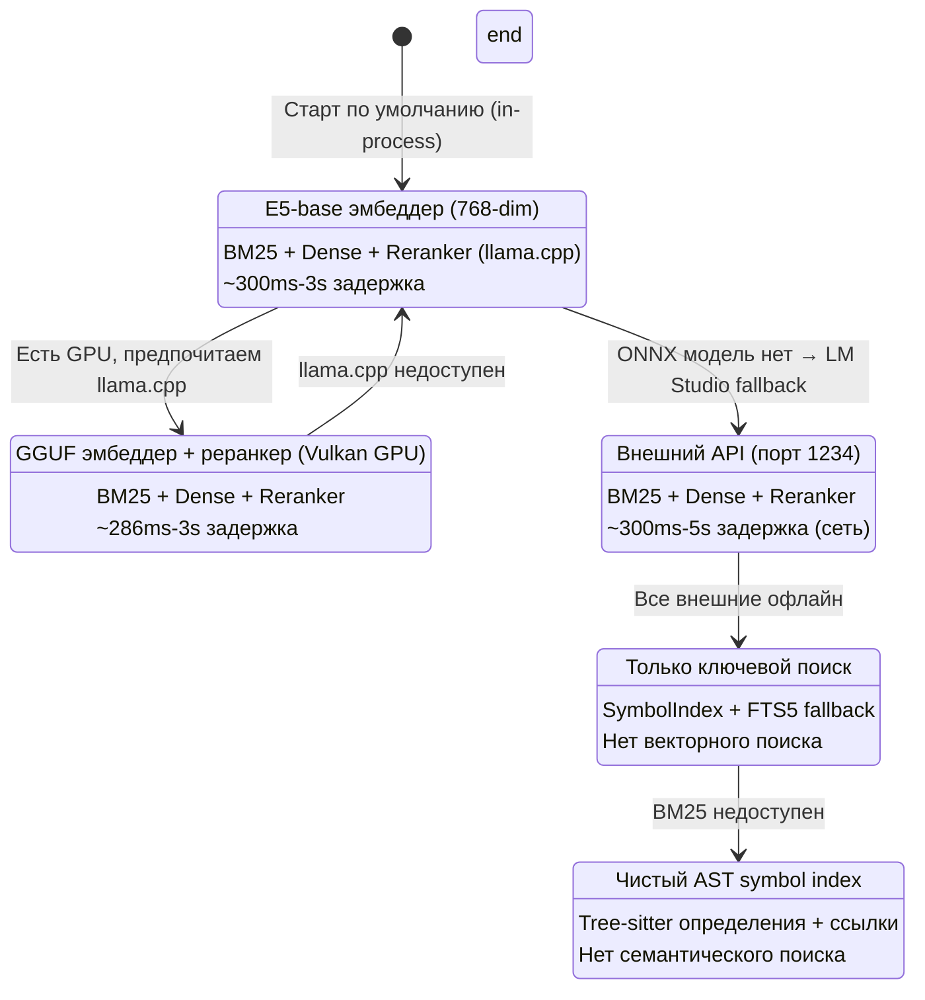
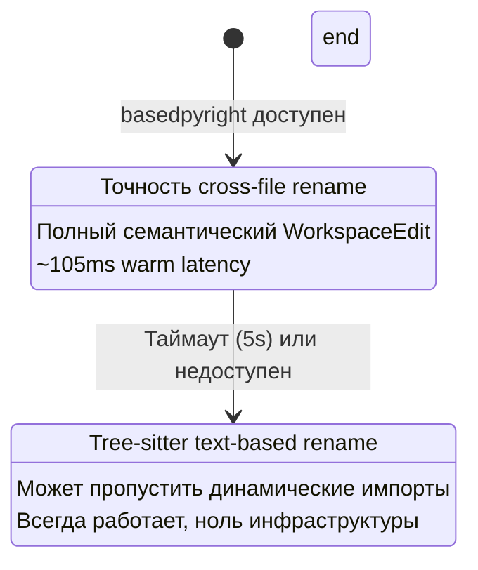
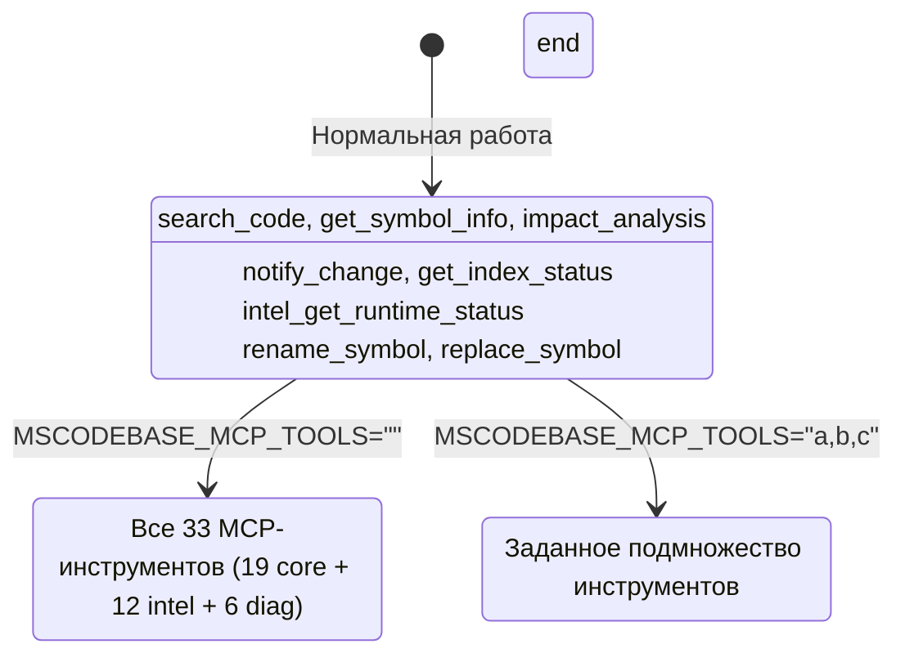
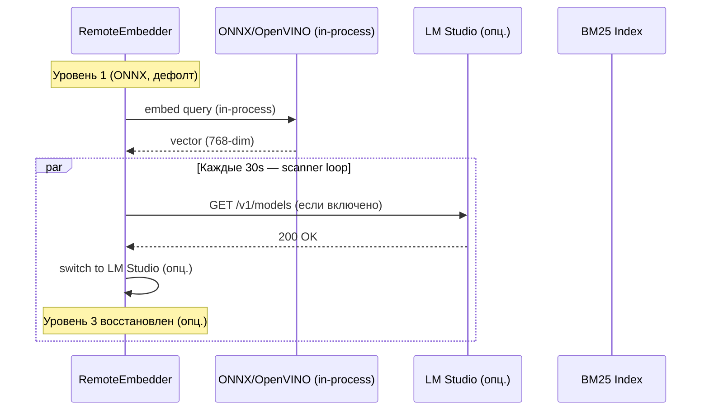

# Graceful Degradation — Руководство по отказоустойчивости

> **Часть MSCodeBase Intelligence** | v3.2.1

## Обзор

MSCodeBase никогда не падает полностью. Вместо этого он **деградирует graceful-образом** через 6 уровней,
сохраняя базовую функциональность даже при отказе внешних сервисов.

> **Реальность провайдеров (2026-07-12):** эмбеддер работает **in-process** через
> **ONNX INT8 / OpenVINO INT8** (`intfloat/multilingual-e5-base`, 768-dim, ~350 ch/s на
> Windows CPU). Это **основной и дефолтный** путь — внешний сервер для семантического поиска
> не требуется. `LM Studio` — лишь **опциональный fallback**, если локальная ONNX/OpenVINO
> модель недоступна. **Реренкер** работает как отдельный процесс `llama-server.exe`
> (модель `bge-reranker-v2-m3` GGUF, порт `:8081`).



### Cross-cutting слои (всегда доступны)





## Детали уровней

### Уровень 1: ONNX/OpenVINO INT8 (дефолт, in-process)

```python
# Дефолтный путь провайдера (EMBEDDING_PROVIDER=e5_onnx)
class RemoteEmbedder:
    def _init_provider_async(self):
        _provider = os.getenv("EMBEDDING_PROVIDER", "e5_onnx")
        if _provider in ("e5_onnx", "auto", ""):
            self._init_onnx()
            # OpenVINO INT8 имеет приоритет (~350 ch/s на Windows CPU)
            if getattr(self, "_ov_compiled", None) is not None:
                self.mode = "onnx"
```

| Компонент | Статус |
|-----------|:------:|
| ONNX/OpenVINO E5-base | ✅ In-process (768-dim, INT8) |
| BM25 index | ✅ Построен |
| Reranker (llama.cpp) | ✅ Доступен (`:8081`) |
| mode=ask | ⚠️ Опционально (нужен LLM profile) |
| **Задержка** | **300ms-3s** |
| **Качество** | **Лучшее** (без внешних зависимостей) |

**Триггер:** Старт по умолчанию. Внешний сервер не требуется.

### Уровень 2: llama.cpp GGUF (GPU, опционально)

Если у пользователя есть Vulkan-GPU и он предпочитает GGUF-эмбеддинг, `llama-server.exe`
может отдавать эмбеддинг. Это путь ускорения, не дефолт.

| Компонент | Статус |
|-----------|:------:|
| llama.cpp embed (GPU) | ✅ Доступен |
| BM25 index | ✅ Построен |
| Reranker | ✅ Доступен |
| mode=ask | ⚠️ Опционально |
| **Задержка** | **286ms-3s** |
| **Качество** | **Лучшее** |

### Уровень 3: LM Studio (remote, опциональный fallback)

```python
# Достигается только если локальная ONNX/OpenVINO модель недоступна
class RemoteEmbedder:
    def _check_lm_studio(self) -> bool:
        """Через CircuitBreaker для предотвращения каскадных сбоев."""
        if self._breaker is not None:
            return bool(self._breaker.call(self._check_lm_studio_raw, fallback=True))
        return self._check_lm_studio_raw()
```

| Компонент | Статус |
|-----------|:------:|
| LM Studio | ✅ Online (если запущен) |
| ONNX model | ❌ Отсутствует |
| Reranker | ✅ Доступен (через LM Studio) |
| mode=ask | ✅ Доступен |
| **Задержка** | **300ms-5s** (сеть) |
| **Качество** | **Хорошее** |

**Триггер:** `EMBEDDING_PROVIDER=lm_studio` или локальная ONNX модель отсутствует.

### Уровень 4: Только BM25 (минимальный)

```python
# Graceful degradation в BM25 builder
class Searcher:
    def _build_bm25_index(self) -> None:
        if self.indexer.table is None:
            self._bm25 = {}  # Empty BM25 = degraded mode
            return
        try:
            if self.indexer.table.count_rows() == 0:
                self._bm25 = {}
                return
        except Exception:
            self._bm25 = {}  # Table corrupted → degraded
            return
```

| Компонент | Статус |
|-----------|:------:|
| ONNX model | ❌ Отсутствует |
| LM Studio | ❌ Офлайн |
| BM25 index | ✅ Доступен |
| Reranker | ❌ Недоступен |
| mode=ask | ❌ Недоступен |
| **Задержка** | **50ms-300ms** |
| **Качество** | **Базовое** (только ключевые слова) |

### Уровень 5: Только SymbolIndex (последняя надежда)

| Компонент | Статус |
|-----------|:------:|
| ONNX model | ❌ Отсутствует |
| BM25 index | ❌ Недоступен |
| SymbolIndex | ✅ Доступен |
| Reranker | ❌ Недоступен |
| mode=ask | ❌ Недоступен |
| **Задержка** | **<50ms** |
| **Качество** | **Только AST-символы** (нет семантического поиска) |

### Уровень 6: Fallback (первый запуск)

| Компонент | Статус |
|-----------|:------:|
| ONNX model | ❌ Недоступен |
| BM25 index | ❌ Пуст |
| Reranker | ❌ Недоступен |
| mode=ask | ❌ Недоступен |
| **Задержка** | N/A |
| **Качество** | **Нет** (индекс строится) |

## Авто-восстановление


