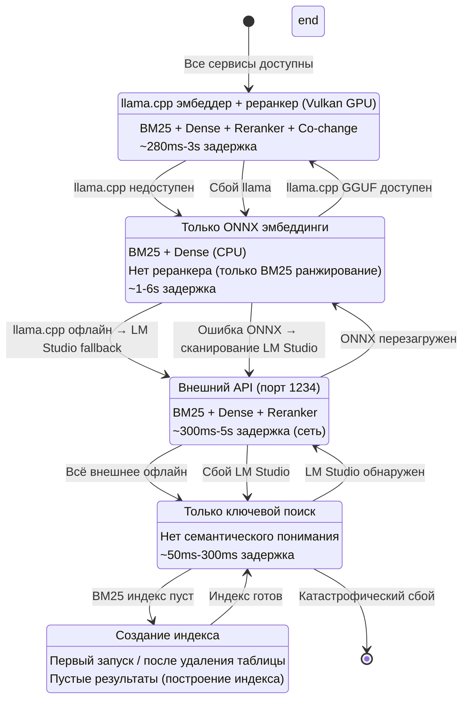
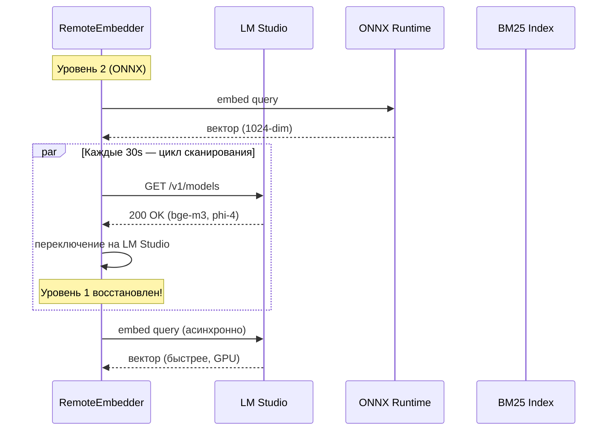
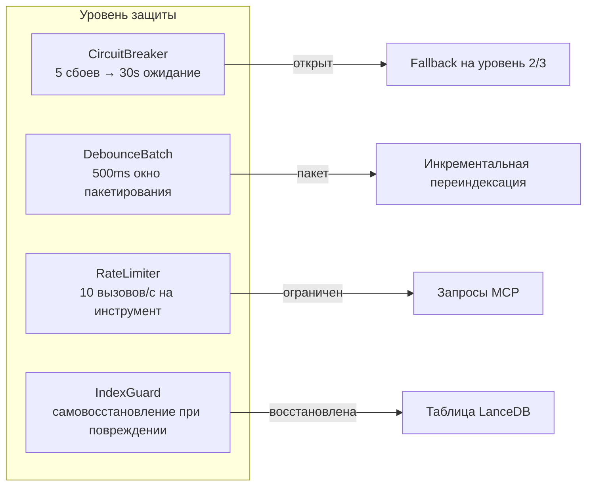

# Graceful Degradation — Руководство по отказоустойчивости

> **Часть MSCodeBase Intelligence** | v3.0.0

## Обзор

MSCodeBase никогда не падает полностью. Вместо этого он **деградирует graceful-образом** через 5 уровней,
сохраняя базовую функциональность даже при отказе внешних сервисов.



## Детали уровней

### Уровень 1: Полный конвейер (Production)

| Компонент | Статус |
|-----------|:------:|
| LM Studio | ✅ Онлайн |
| BM25 индекс | ✅ Построен |
| Реранкер | ✅ Доступен |
| mode=ask (phi-4) | ✅ Доступен |
| **Задержка** | **300ms-5s** |
| **Качество** | **Наилучшее** |

**Триггер:** LM Studio отвечает на `127.0.0.1:1234/v1/models`

### Уровень 2: ONNX Runtime (Fallback)

```python
# Автоматический fallback, когда LM Studio недоступен
class RemoteEmbedder:
    def _check_lm_studio(self) -> bool:
        """Маршрутизация через CircuitBreaker для предотвращения каскадных сбоев."""
        if self._breaker is not None:
            return bool(self._breaker.call(self._check_lm_studio_raw, fallback=True))
        return self._check_lm_studio_raw()
    
    def _init_onnx(self):
        """Загрузка ONNX модели из .codebase_models/onnx/bge-m3/"""
        if not self.local_model_dir.exists():
            raise FileNotFoundError("Запустите: python scripts/download_model.py")
        self._onnx_session = ort.InferenceSession(str(self.local_model_dir / "model.onnx"))
```

| Компонент | Статус |
|-----------|:------:|
| LM Studio | ❌ Офлайн |
| ONNX модель | ✅ Доступна (438 МБ) |
| Реранкер | ❌ Недоступен |
| mode=ask | ❌ Недоступен |
| **Задержка** | **1-6s** |
| **Качество** | **Хорошее** (только эмбеддинги, без реранкера) |

### Уровень 3: Только BM25 (Минимальный)

```python
# Graceful degradation в BM25 builder
class Searcher:
    def _build_bm25_index(self) -> None:
        if self.indexer.table is None:
            self._bm25 = {}  # Пустой BM25 = деградированный режим
            return
        try:
            if self.indexer.table.count_rows() == 0:
                self._bm25 = {}
                return
        except Exception:
            self._bm25 = {}  # Таблица повреждена → деградированный режим
            return
```

| Компонент | Статус |
|-----------|:------:|
| LM Studio | ❌ Офлайн |
| ONNX модель | ❌ Отсутствует |
| BM25 индекс | ✅ Доступен |
| Реранкер | ❌ Недоступен |
| mode=ask | ❌ Недоступен |
| **Задержка** | **50ms-300ms** |
| **Качество** | **Базовое** (только ключевые слова) |

### Уровень 4: Fallback (Первый запуск)

```python
# Первый запуск после пересоздания таблицы
class Indexer:
    def _warmup_status(self) -> None:
        count = self.table.count_rows()
        self._cached_total_chunks = count
        if count == 0:
            logger.debug("🔥 Холодный старт — пустая база данных")
```

| Компонент | Статус |
|-----------|:------:|
| LM Studio | ❌ Офлайн |
| ONNX модель | ❌ Недоступна |
| BM25 индекс | ❌ Пуст |
| Реранкер | ❌ Недоступен |
| mode=ask | ❌ Недоступен |
| **Задержка** | N/A |
| **Качество** | **Нет** (ожидание индекса) |

## Автовосстановление



**Ключевые свойства:**
- Сканер запускается каждые 30s в фоновом потоке
- Когда более высокий уровень становится доступен → **автоматическое переключение**
- Перезапуск не требуется
- CircuitBreaker предотвращает быстрое циклическое включение/выключение

## Механизмы защиты



| Защита | Механизм | Восстановление |
|-----------|-----------|----------|
| **CircuitBreaker** | 5 сбоев → OPEN (30s) → HALF_OPEN → CLOSED | Автовосстановление после ожидания |
| **DebounceBatch** | 500ms окно, макс 100 файлов | Триггерит перестроение BM25 один раз |
| **RateLimiter** | Скользящее окно, 10 вызовов/с на инструмент | Отбрасывает избыток с RateLimitError |
| **IndexGuard** | Проверка количества + валидация схемы | Пересоздаёт таблицу при повреждении |
