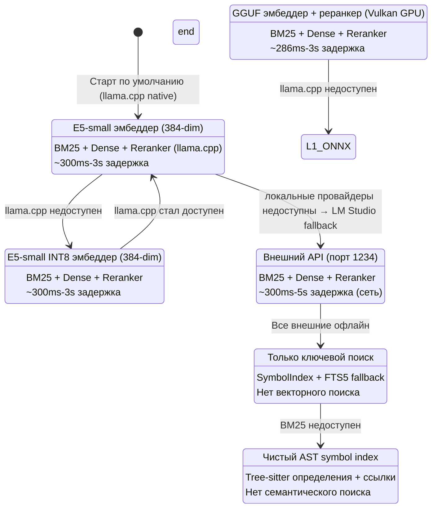
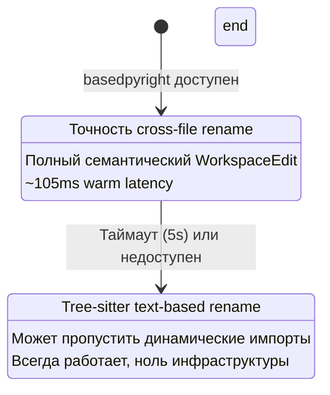
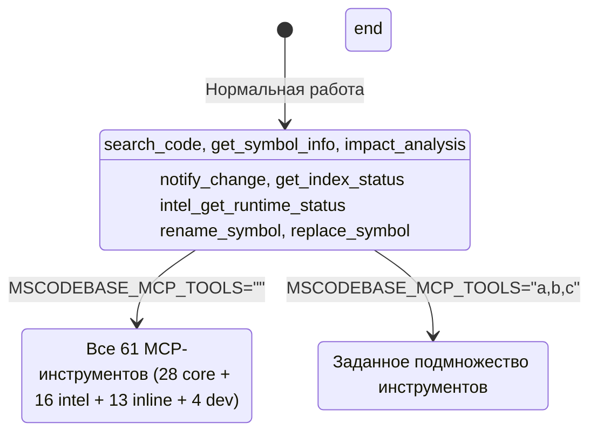
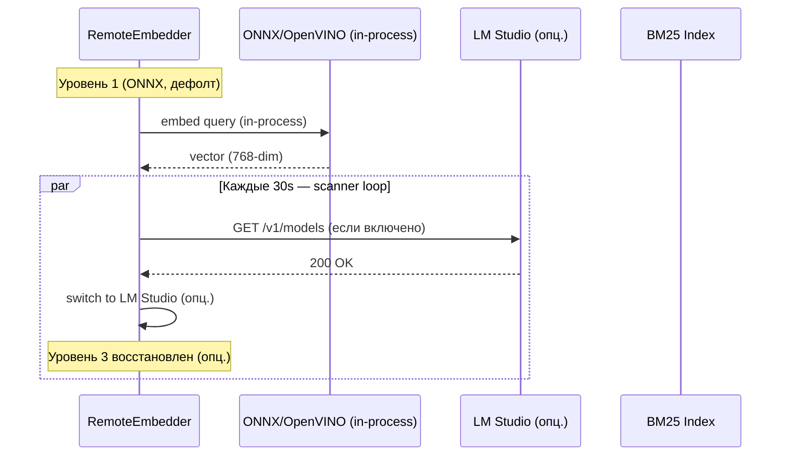

# Graceful Degradation — Руководство по отказоустойчивости

> **Часть MSCodeBase Intelligence** | v3.4.0

## Обзор

MSCodeBase никогда не падает полностью. Вместо этого он **плавно деградирует** через 6 уровней,
сохраняя базовую функциональность даже при отказе внешних сервисов.

> **Реальность провайдеров (2026-08-16):** Провайдер эмбеддингов работает через **llama.cpp GGUF**
> (`llama-server.exe`, нативный, предпочтительный) — ONNX INT8 предзагрузка отменяется, как только
> llama.cpp обнаружен, рантайм-сканер переключает режим на `llama_cpp`.
> **ONNX INT8 / OpenVINO INT8** (`multilingual-e5-small-int8`, 384-dim) — **in-process fallback**
> (путь при старте, пока llama.cpp не поднялся). `LM Studio` — **опциональный fallback**, если ни один
> локальный провайдер недоступен. **Реранкер** работает как отдельный процесс `llama-server.exe`,
> обслуживающий GGUF-модель `bge-reranker-v2-m3` (порт `:8081`).


```mermaid
stateDiagram-v2
    [*] --> L1_GGUF: Старт по умолчанию (llama.cpp native)

    state L1_GGUF[Уровень 1: llama.cpp GGUF (native)]
        L1_GGUF: E5-small эмбеддер (384-dim)
        L1_GGUF: BM25 + Dense + Reranker (llama.cpp)
        L1_GGUF: ~300ms-3s задержка
    end

    L1_GGUF --> L2_ONNX: llama.cpp недоступен
    L1_GGUF --> L3_LM: локальные провайдеры недоступны → LM Studio fallback

    state L2_ONNX[Уровень 2: ONNX/OpenVINO INT8 (in-process fallback)]
        L2_ONNX: E5-small INT8 эмбеддер (384-dim)
        L2_ONNX: BM25 + Dense + Reranker
        L2_ONNX: ~300ms-3s задержка
    end

    L2_ONNX --> L1_GGUF: llama.cpp стал доступен

    state L2_GGUF[Уровень 2: llama.cpp GGUF (GPU)]
        L2_GGUF: GGUF эмбеддер + реранкер (Vulkan GPU)
        L2_GGUF: BM25 + Dense + Reranker
        L2_GGUF: ~286ms-3s задержка
    end

    L2_GGUF --> L1_ONNX: llama.cpp недоступен

    state L3_LM[Уровень 3: LM Studio (remote, опц.)]
        L3_LM: Внешний API (порт 1234)
        L3_LM: BM25 + Dense + Reranker
        L3_LM: ~300ms-5s задержка (сеть)
    end

    L3_LM --> L4_BM25: Все внешние офлайн

    state L4_BM25[Уровень 4: Только BM25]
        L4_BM25: Только ключевой поиск
        L4_BM25: SymbolIndex + FTS5 fallback
        L4_BM25: Нет векторного поиска
    end

    L4_BM25 --> L5_SYMBOL: BM25 недоступен

    state L5_SYMBOL[Уровень 5: Только SymbolIndex]
        L5_SYMBOL: Чистый AST symbol index
        L5_SYMBOL: Tree-sitter определения + ссылки
        L5_SYMBOL: Нет семантического поиска
    end
```

### Cross-cutting слои (всегда доступны)

Эти слои **независимы** от уровня поиска выше:


```mermaid
stateDiagram-v2
    [*] --> LSP_ACTIVE: basedpyright доступен

    state LSP_ACTIVE[LSP: basedpyright]
        LSP_ACTIVE: Точность cross-file rename
        LSP_ACTIVE: Полный семантический WorkspaceEdit
        LSP_ACTIVE: ~105ms warm latency
    end

    LSP_ACTIVE --> LSP_FALLBACK: Таймаут (5s) или недоступен

    state LSP_FALLBACK[LSP: SymbolIndex]
        LSP_FALLBACK: Tree-sitter text-based rename
        LSP_FALLBACK: Может пропустить динамические импорты
        LSP_FALLBACK: Всегда работает, ноль инфраструктуры
    end
```


```mermaid
stateDiagram-v2
    [*] --> DEFAULT_TOOLS: Нормальная работа

    state DEFAULT_TOOLS[Видимо: 12 инструментов]
        DEFAULT_TOOLS: search_code, get_symbol_info, impact_analysis
        DEFAULT_TOOLS: notify_change, get_index_status
        DEFAULT_TOOLS: intel_get_runtime_status
        DEFAULT_TOOLS: rename_symbol, replace_symbol
    end

    DEFAULT_TOOLS --> ALL_TOOLS: MSCODEBASE_MCP_TOOLS=""
    DEFAULT_TOOLS --> CUSTOM_TOOLS: MSCODEBASE_MCP_TOOLS="a,b,c"

    state ALL_TOOLS[Видимо: 61 инструментов]
        ALL_TOOLS: Все 61 MCP-инструментов (28 core + 16 intel + 13 inline + 4 dev)
    end

    state CUSTOM_TOOLS[Пользовательский выбор]
        CUSTOM_TOOLS: Заданное подмножество инструментов
    end
```

## Детали уровней

### Уровень 1: llama.cpp GGUF (native, дефолт)

```python
# Предпочтительный путь: llama.cpp (Zed 1.10.0 native) — ONNX предзагрузка отменяется, когда он поднялся
class RemoteEmbedder:
    def _preload_onnx_delayed(self):
        if self._check_llama_cpp():
            self.mode = "llama_cpp"  # ONNX предзагрузка отменена — llama.cpp основной
```

| Компонент | Статус |
|-----------|:------:|
| llama.cpp GGUF (e5-small) | ✅ Предпочтительный (native llama-server, `:8080`) |
| BM25 index | ✅ Построен |
| Reranker (llama.cpp) | ✅ Доступен (`:8081`) |
| mode=ask | ⚠️ Опционально (нужен LLM profile) |
| **Задержка** | **300ms-3s** |
| **Качество** | **Лучшее** (без внешних зависимостей) |

**Триггер:** llama.cpp доступен (дефолт). При его недоступности — in-process ONNX fallback.

### Уровень 2: ONNX/OpenVINO INT8 (in-process fallback)

Если у пользователя есть Vulkan-GPU и он предпочитает GGUF-эмбеддинг, `llama-server.exe`
может обслуживать эмбеддер. Это путь ускорения, не дефолт.

| Компонент | Статус |
|-----------|:------:|
| llama.cpp embed (GPU) | ✅ Доступен |
| BM25 index | ✅ Построен |
| Reranker | ✅ Доступен |
| mode=ask | ⚠️ Опционально |
| **Задержка** | **286ms-3s** |
| **Качество** | **Лучшее** |

### Уровень 3: LM Studio (remote, опциональный fallback)

```python
# Достигается только если локальная ONNX/OpenVINO модель недоступна
class RemoteEmbedder:
    def _check_lm_studio(self) -> bool:
        """Через CircuitBreaker для предотвращения каскадных сбоев."""
        if self._breaker is not None:
            return bool(self._breaker.call(self._check_lm_studio_raw, fallback=True))
        return self._check_lm_studio_raw()
```

| Компонент | Статус |
|-----------|:------:|
| LM Studio | ✅ Online (если запущен) |
| ONNX model | ❌ Отсутствует |
| Reranker | ✅ Доступен (через LM Studio) |
| mode=ask | ✅ Доступен |
| **Задержка** | **300ms-5s** (сеть) |
| **Качество** | **Хорошее** |

**Триггер:** `EMBEDDING_PROVIDER=lm_studio` или локальная ONNX модель отсутствует.

### Уровень 4: Только BM25 (минимальный)

```python
# Graceful degradation в BM25 builder
class Searcher:
    def _build_bm25_index(self) -> None:
        if self.indexer.table is None:
            self._bm25 = {}  # Empty BM25 = degraded mode
            return
        try:
            if self.indexer.table.count_rows() == 0:
                self._bm25 = {}
                return
        except Exception:
            self._bm25 = {}  # Table corrupted → degraded
            return
```

| Компонент | Статус |
|-----------|:------:|
| ONNX model | ❌ Отсутствует |
| LM Studio | ❌ Офлайн |
| BM25 index | ✅ Доступен |
| Reranker | ❌ Недоступен |
| mode=ask | ❌ Недоступен |
| **Задержка** | **50ms-300ms** |
| **Качество** | **Базовое** (только ключевые слова) |

### Уровень 5: Только SymbolIndex (последняя надежда)

| Компонент | Статус |
|-----------|:------:|
| ONNX model | ❌ Отсутствует |
| BM25 index | ❌ Недоступен |
| SymbolIndex | ✅ Доступен |
| Reranker | ❌ Недоступен |
| mode=ask | ❌ Недоступен |
| **Задержка** | **<50ms** |
| **Качество** | **Только AST-символы** (нет семантического поиска) |

### Уровень 6: Fallback (первый запуск)

| Компонент | Статус |
|-----------|:------:|
| ONNX model | ❌ Недоступен |
| BM25 index | ❌ Пуст |
| Reranker | ❌ Недоступен |
| mode=ask | ❌ Недоступен |
| **Задержка** | N/A |
| **Качество** | **Нет** (индекс строится) |

## Авто-восстановление


```mermaid
sequenceDiagram
    participant EM as RemoteEmbedder
    participant ONNX as ONNX/OpenVINO (in-process)
    participant LM as LM Studio (опц.)
    participant BM25 as BM25 Index

    Note over EM: Уровень 1 (ONNX, дефолт)
    EM->>ONNX: embed query (in-process)
    ONNX-->>EM: vector (768-dim)

    par Каждые 30s — scanner loop
        EM->>LM: GET /v1/models (если включено)
        LM-->>EM: 200 OK
        EM->>EM: switch to LM Studio (опц.)
        Note over EM: Уровень 3 восстановлен (опц.)
    end
```
