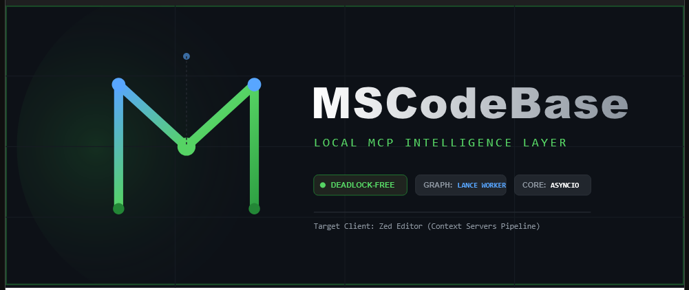

<div align="center">



[🇬🇧 English](../../README.md) • [🇷🇺 Русский](README.md) • [🇨🇳 中文](../zh/README.md)

# MSCodebase Intelligence

**ИИ-семантический поиск кода для Zed IDE — MCP-сервер глубокого анализа кода**

[](https://www.python.org/downloads/)
[](https://opensource.org/licenses/MIT)
[](https://modelcontextprotocol.io/)
[](https://zed.dev/)
[](../../tests/)

[Возможности](#-возможности) • [Быстрый старт](#-быстрый-старт) • [Инструменты](#mcp-инструменты-49-всего) • [Документация](#-карта-документации) • [Установка](INSTALL.md) • [Архитектура](ARCHITECTURE.md) • [Участие](../../CONTRIBUTING.md) • [Безопасность](../../SECURITY.md)

*Последнее обновление: 2026-08-03*

</div>

---

## 🎯 Позиционирование

**MSCodeBase Intelligence** — это MCP-сервер для **Zed IDE**, который предоставляет AI-ассистентам **глубокое понимание всей кодовой базы**: семантический поиск, граф вызовов, память проекта, диагностика.

Это **не** LSP-сервер и не замена встроенному автодополнению редактора. Это слой «кодового интеллекта» поверх редактора:

```
┌─────────────────────────────────────────────────────┐
│                      Zed IDE                         │
│  ┌───────────────────────────────────────────────┐  │
│  │        LSP (встроенное автодополнение,        │  │
│  │        подсказки в строке, диагностика)        │  │
│  └───────────────────────────────────────────────┘  │
│                        │                              │
│                        ▼                              │
│  ┌───────────────────────────────────────────────┐  │
│  │  MSCodeBase (MCP-сервер)                     │  │
│  │  · Семантический поиск по кодовой базе        │  │
│  │  · Граф вызовов и анализ влияния              │  │
│  │  · Память проекта (ADR, техдолг)              │  │
│  │  · Самодиагностика и самовосстановление       │  │
│  │  · 58 инструментов для AI-ассистента          │  │
│  └───────────────────────────────────────────────┘  │
└─────────────────────────────────────────────────────┘
```

### Что вы получаете

| Возможность | MSCodeBase | Стандартный LSP (pyright/pylsp) |
|-------------|:----------:|:-------------------------------:|
| 🔍 **Семантический поиск** (BM25 + Vector + Reranker) | ✅ | ❌ |
| 🧠 **Граф вызовов + анализ влияния** | ✅ | ❌ |
| 🗃️ **Память проекта** (ADR, известные проблемы) | ✅ | ❌ |
| 🏥 **Самодиагностика + самовосстановление** | ✅ | ❌ |
| 🔎 **Кросс-репозиторный поиск** | ✅ | ❌ |
| 🤖 **Генерация ответов RAG** (mode=ask) | ✅ | ❌ |
| 🔬 **Прозрачность поиска** (per-stage score trace) | ✅ | ❌ |
| 🏛️ **Детектор дрейфа архитектуры** (chain/hub/circular) | ✅ | ❌ |
| ✅ **Верификация утверждений** (проверка фактов AI-агента) | ✅ | ❌ |
| ✏️ **Встроенное автодополнение** | ❌ | ✅ |
| 🏷️ **Подсказки в строке (inlay hints)** | ❌ | ✅ |

### LSP: только для rename (гибридный режим)

MSCodeBase **использует LSP только для `codebase(action="rename")`** — LSP-клиент (`src/core/lsp_client.py`) запускает **pyright-langserver** для точного rename между файлами, с автоматическим fallback на SymbolIndex (Tree-sitter) при таймауте. Вся остальная функциональность реализована через **58 MCP-инструментов**.

Отдельный LSP-сервер (`src/lsp_main.py`) был экспериментальным и **не работает в Zed** — см. [LSP_WONTFIX.md](investigations/LSP_WONTFIX.md).

### Платформы

Спроектирован и протестирован на **Windows**. macOS и Linux должны работать, но официально не валидированы.

### Языки

| Язык | Парсинг | Граф вызовов | Data Flow (ASSIGNED_FROM) |
|---|---|---|---|
| **Python** | ✅ | ✅ | ✅ |
| **TypeScript** | ✅ | ✅ | ✅ |
| **TSX** | ✅ | ✅ | ✅ |
| **Rust** | ✅ | ✅ | ✅ |
| **Go** | ✅ | ✅ | ✅ |
| **JavaScript** | ✅ | ✅ | ✅ |
| **Java** | ✅ | ✅ | ✅ |
| **C#** | ✅ | ✅ | ✅ |
| **Ruby** | ✅ | ✅ | ✅ |
| **PHP** | ✅ | ✅ | ✅ |
| **Kotlin** | ✅ | ✅ | ✅ |
| **Swift** | ✅ | ✅ | ✅ |
| **C** | ✅ | ✅ | ✅ |
| **C++** | ✅ | ✅ | ✅ |
| **Scala** | ✅ | ✅ | ✅ |
| **Dart** | ✅ | ✅ | ✅ |
| **Shell/Bash** | ✅ | ❌ | ❌ |

## ✨ Возможности

| Возможность | Описание |
|-------------|----------|
| 🔍 **Унифицированный поиск** | `search_code(query, mode, intent_hint)` — единый инструмент: fast/quality/deep/context/ask/auto |
| 🧠 **Интеллектуальный слой** | 14 высокоуровневых инструментов `intel_*`: самодиагностика, топология, память, предсказание ошибок |
| 🗃️ **Память проекта** | ADR, известные проблемы, технический долг — автоматически сохраняется между сессиями |
| 🌐 **Кросс-репозиторный поиск** | Поиск по нескольким проектам с синтаксисом `@mention` |
| 🌳 **Граф вызовов** | Полный граф вызовов: определение + вызывающие + вызываемые + анализ влияния |
| 🏗 **Структурный поиск** | 13 AST-паттернов (class_inheritance, async_function, decorator и др.) |
| 🔎 **Контекстный поиск** | Поиск похожего кода — вставьте фрагмент, получите семантические дубликаты |
| 🪣 **Мульти-бакетный RAG** | Бакеты кода/документации, мягкое взвешивание, intent_hint (code/docs/auto) |
| 🤖 **mode=ask** | Генерация ответов RAG через phi-4 (профиль server) |
| 💾 **LanceDB v2** | Векторная БД с изоляцией по проектам (инкрементальный BM25-реиндекс) |
| 🛡 **Ограничение запросов** | DebounceBatch + CircuitBreaker — защита от VFS-циклов |
| 🏥 **Самодиагностика** | `get_health_report` + `index_health` — полная проверка и восстановление |
| 🧪 **Чистая архитектура** | DI-контейнер (18 сервисов), 58 инструментов (28 core + 14 intel + 12 inline + 4 dev), 1180 тестов |
| 🔗 **Граф потока данных** | Рёбра `ASSIGNED_FROM` отслеживают присваивания. Unified Walker + Conditional Flow (if/for/while/try). 29 типов рёбер в PropertyGraph. |
| 🪟 **Мульти-оконность** | `ProjectIndexerRegistry` — изолированный Indexer на проект, LRU 5, ResourceMonitor throttle |
| ✏️ **Write Tools** | `codebase(action=...)` — единый хаб модификации кода: rename/move/delete/replace/insert с preview/apply + `@modification_guard` |
| ⚡ **Meta-Patching** | LanceDB `move_chunks_metadata` — file_path rename без пере-эмбеддинга (50ms против 5s) |
| ⚙️ **SYSTEM_PROFILE** | `light` (синхронный) / `server` (асинхронный с phi-4) |

---

## 🚀 Быстрый старт

Установите расширение `mscodebase-intelligence` в Zed, затем:

```bash
cd D:\Project\MSCodeBase
python install.py

# Перезапустите Zed (File → Quit → reopen)
# Проверьте: intel_get_runtime_status()
```

**install.py выполняет:**
1. Копирует 39+ файлов исходников в директорию расширения
2. Устанавливает Python-зависимости
3. Скачивает llama-server.exe (reranker) + модель multilingual-e5-small (ONNX, CPU)
4. Настраивает MCP в settings.json Zed

См. также: [AI_INSTALLATION_PROMPT.md](../../AI_INSTALLATION_PROMPT.md), [INSTALL.md](INSTALL.md)

### Провайдеры

MCP использует multilingual-e5-small (ONNX, CPU, in-process) для эмбеддингов и llama-server для реранкера:

```
multilingual-e5-small ONNX (CPU, in-process) → llama-server reranker
   ~0.5 GB RAM                 ~1.0 GB RAM
   ~52 ch/s                     1 процесс
```

Бенчмарки: [../../docs/research/2026-07-10-final-benchmark.md](../../docs/research/2026-07-10-final-benchmark.md)

---

## 📚 Карта документации

| Документ | Описание | Аудитория | Языки |
|----------|----------|-----------|-------|
| **[INSTALL.md](INSTALL.md)** | Установка, настройка, удаление | Пользователи | 🇬🇧 🇷🇺 🇨🇳 |
| **[ARCHITECTURE.md](ARCHITECTURE.md)** | Чистая архитектура, слои, DI | Разработчики | 🇬🇧 🇷🇺 🇨🇳 |
| **[ARCHITECTURE_DEEP.md](ARCHITECTURE_DEEP.md)** | Глубокая архитектура: pipeline, lifecycle, сравнение | Архитекторы | 🇬🇧 🇷🇺 🇨🇳 |
| **[SEARCH_PIPELINE.md](SEARCH_PIPELINE.md)** | Пайплайн поиска: BM25 → RRF → Reranker | Разработчики | 🇬🇧 |
| **[GRACEFUL_DEGRADATION.md](GRACEFUL_DEGRADATION.md)** | 5 уровней плавной деградации (llama.cpp → ONNX → BM25) | DevOps | 🇬🇧 |
| **[ARCHITECTURE_LAYERS.md](ARCHITECTURE_LAYERS.md)** | 10 слоев рантайма | Архитекторы | 🇬🇧 🇷🇺 🇨🇳 |
| **[FAQ.md](FAQ.md)** | Часто задаваемые вопросы | Все | 🇬🇧 🇷🇺 🇨🇳 |
| **[TELEMETRY.md](TELEMETRY.md)** | Метрики, ETA, сбор данных | DevOps | 🇬🇧 🇷🇺 🇨🇳 |
| **[investigations/ONNX_SESSION_REPORT.md](../en/investigations/ONNX_SESSION_REPORT.md)** | Полная миграция ONNX, 7 исправлений, бенчмарки | Поддержка | 🇬🇧 |
| **[investigations/LSP_WONTFIX.md](investigations/LSP_WONTFIX.md)** | Исследование LSP на Windows (WONTFIX) | Поддержка | 🇬🇧 🇨🇳 |
| **[ZED_WINDOWS_QUIRKS.md](ZED_WINDOWS_QUIRKS.md)** | Особенности Windows, Restricted Mode | Пользователи Windows | 🇬🇧 🇷🇺 🇨🇳 |
| **[CHANGELOG.md](CHANGELOG.md)** | История версий | Все | 🇬🇧 🇷🇺 🇨🇳 |
| **[CONTRIBUTING.md](CONTRIBUTING.md)** | Как внести вклад, PR | Контрибьюторы | 🇬🇧 🇷🇺 🇨🇳 |
| **[SECURITY.md](SECURITY.md)** | Политика безопасности, уязвимости | Безопасность | 🇬🇧 🇷🇺 🇨🇳 |
| **[../../AGENTS.md](../../AGENTS.md)** | Системные правила AI-агента | AI-агент | 🇬🇧 |
| **[../../SECURITY.md](../../SECURITY.md)** | Политика безопасности, сообщение об уязвимостях | Безопасность | 🇬🇧 |
| **[../../CODE_OF_CONDUCT.md](../../CODE_OF_CONDUCT.md)** | Стандарты сообщества | Контрибьюторы | 🇬🇧 |

| **[../../KNOWN_ISSUES.md](../../KNOWN_ISSUES.md)** | Известные проблемы и реестр техдолга | Все | 🇬🇧 |

Все документы перекрёстно ссылаются друг на друга. Доступны на 3 языках: English, Русский, 中文.

---

## MCP Инструменты (49 всего)

### Основной поиск

| Инструмент | Когда использовать |
|------------|-------------------|
| `search_code(query, mode, filter_layer, intent_hint)` | **Главный инструмент поиска.** `mode="auto"` / `"fast"` / `"quality"` / `"deep"` / `"context"` / `"ask"`. `intent_hint="code"` / `"docs"` / `"auto"` — мягкое взвешивание бакетов. `filter_layer="core"` — поиск в конкретном архитектурном слое |
| `structural_search(pattern)` | AST-поиск: `class_inheritance`, `async_function`, `function_with_decorator` и другие |
| `cross_repo_search(query @repo)` | Поиск по нескольким проектам (моно-репозиторий) |
| `cross_project_deps(action)` | Граф зависимостей между проектами: `graph` / `deps` / `cycles` / `impact` |
| `get_symbol_info(query)` | Граф вызовов: вызывающие, вызываемые, затрагиваемые файлы |
| `execute_script(code, timeout, args)` | **Песочница Python-выполнения (3 слоя).** AST-валидация + runtime-обёртка `__import__` + изоляция subprocess. Аудит-лог. Возвращает `{stdout, stderr, exit_code, duration_ms, truncated, timed_out}` |
| `impact_analysis(symbol)` | Анализ влияния изменений символа (оценка риска, глубина) |

### Управление индексом (через `codebase(action="index", ...)`)

| Действие | Когда использовать |
|------|-------------|
| `codebase(action="index", path="status")` | Статус индекса: чанки, файлы, символы (`get_index_status`) |
| `codebase(action="index", path="progress")` | Прогресс индексации (фаза, проценты) |
| `codebase(action="index", path="project_dir", project_root=...)` | Запустить полную индексацию проекта (`index_project_dir`) |
| `codebase(action="index", path="timeline")` | История индексации по датам |
| `codebase(action="index", path="health")` | Диагностика индекса и самовосстановление (`index_health`) |
| `notify_change(file_path)` | Принудительное обновление индекса для файла (через DebounceBatch) — inline-тул |
| `generate_chunk_summaries(root)` | LLM-генерированные описания для чанков кода |
| `scan_changes(project_root)` | Архитектурный diff — анализ изменений с последнего baseline |

### Система и диагностика

| Инструмент | Когда использовать |
|------------|-------------------|
| `get_health_report()` | **Полная самодиагностика:** индекс, эмбеддер, логи, синхронизация |
| `get_logs(project_root)` | Последние ошибки и предупреждения из логов проекта |
| `read_live_file(path)` | Чтение файла из памяти LSP (включая несохранённые изменения) |

### Аналитика

| Инструмент | Когда использовать |
|------------|-------------------|
| `get_hotspots(project_root)` | Горячие точки — файлы с высоким уровнем багов |
| `get_repo_rank(project_root, top_k)` | Ранжирование важностей символов (PageRank на графе вызовов) |
| `get_bug_correlation(project_root)` | Анализ корреляции багов и изменений |
| `get_repo_map(project_root)` | Карта проекта: дерево файлов + ключевые символы |
| `graph_query(action="related", target=path)` | Файлы, связанные через совместные изменения / корреляцию багов (мультиплексирует бывший `get_related_files`) |
| `graph_query(action, target)` | Запросы к графу: `impact` / `feature` / `deps` / `tests` / `cypher` / `flow` / `drift` / `verify` |
| `find_similar_bugs(error)` | Поиск похожих багов из истории по тексту ошибки |

### Git и история (через `codebase(action="git", ...)`)

| Действие | Когда использовать |
|------|-------------|
| `codebase(action="git", path="log", ...)` | Семантическая история коммитов (`get_commit_history`) |
| `codebase(action="git", path="history", ...)` | История изменений конкретного файла |
| `codebase(action="git", path="branch")` | Информация о ветке + статус индекса (`get_branch_info`) |

### Жизненный цикл и верификация

| Инструмент | Когда использовать |
|------------|-------------------|
| `submit_background_task(type, root)` | Запуск долгих задач: `bug_correlation` / `build_knowledge_graph` / `full_analysis` |
| `get_task_status(task_id)` | Статус фоновой задачи |
| `verify_action(action_type)` | Верификация: `file_write` / `git_commit` / `git_push` / `index_sync` |

### Write Tools — `codebase(action=...)`

Единый хаб модификации кода. Все операции через один инструмент с параметром `action`:

| action | Описание |
|--------|----------|
| `rename` | Переименование символа во всех файлах (preview/apply, проверка коллизий) |
| `move` | Перемещение символа в другой файл (preview/apply, обновление импортов) |
| `delete` | Безопасное удаление с проверкой ссылок (force mode) |
| `replace` | Замена тела функции/класса (preview/apply) |
| `insert_before` | Вставка кода перед anchor-символом (preview/apply) |
| `insert_after` | Вставка кода после тела anchor (preview/apply) |
| `ack_impact` | Подтверждение влияния для modification guard |

### Интеллектуальный слой (intel_*) — 14 высокоуровневых инструментов

| Инструмент | Назначение |
|------------|------------|
| `intel_get_runtime_status()` | Агрегированный статус здоровья: эмбеддер, индекс, использование ресурсов |
| `intel_trigger_reindex()` | Реиндексация без ожидания (не блокирует Zed) |
| `intel_get_job_status(job_id)` | Прогресс фоновой задачи |
| `intel_code_topology(symbol)` | Граф вызовов + топология модулей (< 2 сек) |
| `intel_get_project_memory()` | Карта памяти проекта: ADR, known_issues, tech_debt |
| `intel_log_incident(...)` | Запись инцидента в историю проекта |
| `intel_analyze_incident(error)` | Поиск похожих инцидентов + готовые решения |
| `intel_add_memory_node(section, data)` | Добавление записи в память проекта |
| `intel_get_hotspots()` | Топ-5 файлов с наибольшей баг-нагрузкой |
| `intel_predict_root_cause(error)` | Предсказание первопричины по логам + истории |
| `intel_get_telemetry(days)` | Поинструментальная телеметрия, использование ресурсов, статистика LLM |
| `intel_auto_collect_adrs(max_commits)` | Автогенерация ADR из истории коммитов |
| `intel_reset_index()` | Удалить и пересобрать индекс с нуля |

> `intel_tool_health()`, `intel_explain_project_state()`, `intel_get_project_context()` — см. Диагностические инструменты ниже.

### Dev Tools (4)

| Инструмент | Назначение |
|------------|------------|
| `generate_docs(project_root)` | Генерация Markdown-документации из PropertyGraph (DEPRECATED — используйте auto_update_docs) |
| `bump_version(project_root, part, dry_run)` | Бамп версии проекта + обновление CHANGELOG |
| `auto_update_docs(project_root, action)` | Автообновление документации: update/check |
| `install_git_hooks(project_root, action)` | Установка pre-commit хуков: install/uninstall/status |

### Диагностические инструменты (7)

| Инструмент | Назначение |
|------------|------------|
| `debug_runtime_passport()` | Паспорт процесса: RUN_ID, PID, информация о сборке |
| `get_runtime_counters()` | Счётчики рантайма: вызовы, блокировки, предупреждения |
| `intel_execution_timeline(limit)` | Лента последних действий с длительностью |
| `intel_get_project_context(root)` | Единый снэпшот: состояние, индекс, здоровье, память |
| `intel_explain_project_state(root)` | Человекочитаемый диагноз состояния проекта |
| `intel_tool_health()` | Процент успеха инструментов, задержки, уверенность |
| `refresh_db_connection()` | Сброс handle БД и переподключение |

---

## 🏗️ Архитектура

### Чистая архитектура с DI-контейнером

```
┌──────────────────────────────────────────────────────────────────┐
│                   MCP Server (~1000 строк)                       │
│            server.py + server_tools.py + server_factory.py — регистрация и маршрутизация                │
│                                                                  │
│  ┌──────────────────────────────────────────────────────────┐   │
│  │              DI Container (18 сервисов)                    │   │
│  │  src/core/di_container.py — ServiceCollection              │   │
│  │                                                           │   │
│  │  ┌──────────┐  ┌────────────┐  ┌──────────────────────┐  │   │
│  │  │ Indexer  │  │  Searcher  │  │  DebounceBatch       │  │   │
│  │  │ Embedder │  │  SymbolIdx │  │  CircuitBreaker      │  │   │
│  │  │ Parser   │  │  FileGuard │  │  RateLimiter         │  │   │
│  │  └──────────┘  └────────────┘  └──────────────────────┘  │   │
│  └──────────────────────────────────────────────────────────┘   │
│                           │                                       │
│              ┌────────────┴────────────┐                         │
│              ▼                          ▼                         │
│  ┌────────────────────┐  ┌────────────────────────────────────┐  │
│  │  28 Классов        │  │  14 intel_* + 12 inline          │  │
│  │  │  src/mcp/tools/*.py │  │  src/core/intelligence_layer.py    │  │
│  │  │  Один класс на       │  │  decorator error_boundary         │
│  │  │  инструмент          │  │  JSON status/message/detail       │
│  │  │  Constructor Inj.   │  │  asyncio.wait_for(timeout)        │  │
│  │  │  Constructor Inj.   │  │                                    │  │
│  │  └────────────────────┘  └────────────────────────────────────┘  │
│  └──────────────────────────────────────────────────────────────────┘
│         │
│         ▼
│  ┌─────────────────┐     ┌───────────────────┐
│  │  RemoteEmbedder  │     │  LanceDB v2       │
│  │  (ONNX multilingual-e5-small,  │     │  (Vector DB)       │
│  │   CPU, in-process)│     │  BM25 + Vector    │
│  └─────────────────┘     └───────────────────┘
```

---

## ⚡ Производительность

| Режим | Задержка | Лучше всего для |
|:------|:---------|:----------------|
| `search_code(query, mode="fast")` | ~80-500ms | Простой ключевой слова / точное имя |
| `search_code(query, mode="quality")` | ~250-2000ms | Семантический поиск с реранкером |
| `search_code(query, mode="deep")` | ~2-5s | Сложное исследование по модулям |
| `search_code(query, mode="context")` | ~200-800ms | Поиск похожего кода по фрагменту |
| `get_symbol_info(query)` | ~200-1500ms | Определение символа + граф вызовов |
| `impact_analysis(symbol)` | ~1-5s | Анализ влияния изменений |

### Переменные окружения

| Переменная | Значение по умолчанию | Описание |
|------------|----------------------|----------|
| `LM_STUDIO_URL` | `http://localhost:1234/v1` | API-ендпоинт LM Studio |
| `LM_STUDIO_PORT` | `1234` | Порт LM Studio |
| `OLLAMA_URL` | `http://localhost:11434` | API-ендпоинт Ollama |
| `LOG_LEVEL` | `INFO` | Уровень детализации логирования |
| `ZED_WINDOWS_QUIRKS.md` | *(см. файл)* | Инструкции для Windows |

---

## 🔧 Устранение неполадок

### MCP-сервер не отвечает

**Симптомы:** таймаут инструментов, нет ответа.

**Что проверить:**
1. **File → Quit** → откройте проект заново
2. Запустите `python install.py` для перенастройки
3. Проверьте логи: `%LOCALAPPDATA%\Zed\extensions\mscodebase-intelligence\.codebase_indices\logs\`

### Индекс пуст (0 чанков)

Запустите в панели агента:
```
intel_trigger_reindex()
```

Затем проверьте: `get_index_status()`

### Проблемы с подключением LM Studio

```bash
# Проверьте, отвечает ли сервер:
python -c "import urllib.request; print(urllib.request.urlopen('http://localhost:1234/v1/health').read())"
```

Ожидается: `{"status":"ok"}`.

---

## 📁 Структура проекта

```
mscodebase-intelligence/
├── src/
│   ├── main.py                   # Точка входа MCP-сервера (~200 строк)
│   ├── lsp_main.py               # LSP-сервер (на DI, для индексации при didSave)
│   ├── mcp/
│   │   ├── server.py               # Создание MCP-сервера (~597 строк)
│   │   ├── server_factory.py       # DI setup + жизненный цикл сервера (~478 строк)
│   │   ├── server_tools.py         # Регистрация инструментов + 12 inline (~607 строк)
│   │   └── tools/                  # 13 модулей + base-класс
│   │       ├── codebase_tool.py    # codebase(action=...) hub + execute_script
│   │       ├── search_tools.py     # search_code, get_symbol_info, impact_analysis
│   │       ├── indexing_tools.py   # notify_change, index_project_dir, index_health
│   │       ├── git_tools.py        # get_branch_info, get_commit_history, get_file_history
│   │       ├── system_tools.py     # get_index_status, get_health_report, read_live_file, get_logs
│   │       ├── analysis_tools.py   # structural_search, get_repo_map, get_repo_rank, scan_changes
│   │       ├── graph_tools.py      # cross_repo_search, cross_project_deps, graph_query
│   │       ├── investigation_tools.py  # get_bug_correlation, get_hotspots, find_similar_bugs
│   │       ├── lifecycle_tools.py  # submit_background_task, get_task_status, verify_action
│   │       ├── meta_tools.py       # IndexTool, GitTool, SystemTool (spoke для codebase hub)
│   │       └── write_tools.py      # WriteTool (rename, move, delete, replace, insert)
│   ├── core/
│   │   ├── di_container.py       # ★ DI-контейнер (18 сервисов, ServiceCollection)
│   │   ├── error_handler.py      # ★ error_boundary + ToolError
│   │   ├── rate_limiter.py       # ★ SlidingWindowRateLimiter + DebounceBatch + CircuitBreaker
│   │   ├── indexer.py            # Векторное хранилище LanceDB
│   │   ├── searcher.py           # Гибридный поиск (BM25 + Dense + RRF)
│   │   ├── symbol_index.py       # Граф вызовов (BFS, анализ влияния)
│   │   ├── intelligence_layer.py # Инструменты intel_* (13 высокоуровневых)
│   │   ├── llama_runner.py       # ★ Менеджер жизненного цикла llama-server (reranker)
│   ├── remote_embedder.py    # ONNX/OpenVINO multilingual-e5-small (in-process) + LM Studio / Ollama fallback
│   │   ├── reranker.py           # Мульти-провайдерный реранкер (HTTP к провайдерам)
│   │   ├── parser.py             # Tree-sitter AST
│   │   ├── health_report.py      # Движок самодиагностики
│   │   └── ...
│   └── utils/
│       ├── paths.py              # SafePathManager, to_win_long_path
│       └── zed_config.py         # Автонастройка Zed
├── docs/
│   ├── en/               # Документация на английском
│   ├── ru/               # Документация на русском
│   └── zh/               # Документация на китайском
├── tests/                        # 853 теста (pytest)
├── .agents/skills/               # Навыки для AI-агента
├── install.py                    # Установщик
└── README.md
```

---

## 🛠️ Разработка

См. [CONTRIBUTING.md](CONTRIBUTING.md) для:
- Как добавлять новые MCP-инструменты
- Структура тестов и CI-пайплайн
- Соглашения по сообщениям коммитов

### Быстрый старт для разработчиков

```bash
# Настройка
python -m venv .venv
.venv\Scripts\activate
pip install -r requirements.txt

# Запуск MCP-сервера напрямую (тест)
python -m src.main

# Запуск тестов
pytest tests/ -m "not integration and not benchmark"
```

---

## 📄 Лицензия

Лицензия MIT — подробнее в [LICENSE](../../LICENSE).

---

## 🙏 Благодарности

- [Zed IDE](https://zed.dev/) — редактор кода
- [LM Studio](https://lmstudio.ai/) — локальный инференс LLM
- [LanceDB](https://lancedb.github.io/) — векторная база данных
- [Model Context Protocol](https://modelcontextprotocol.io/) — стандарт MCP
