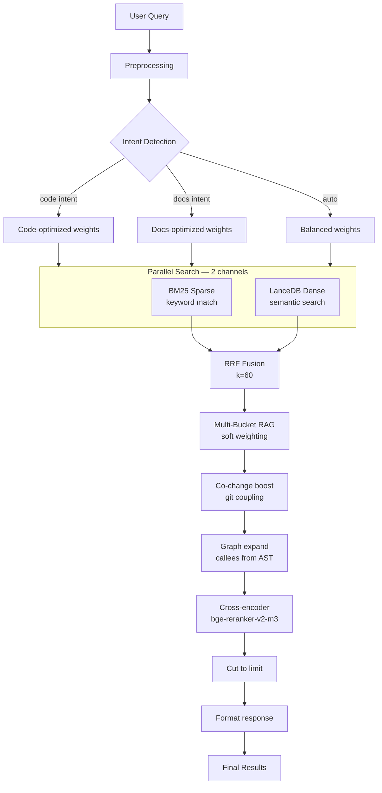
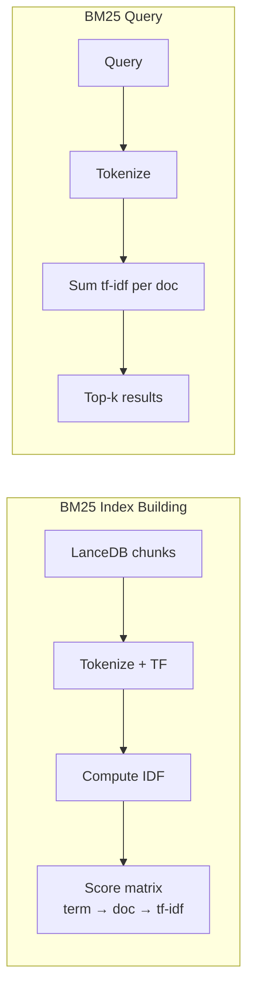
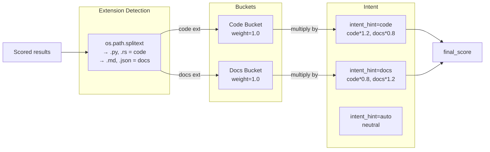
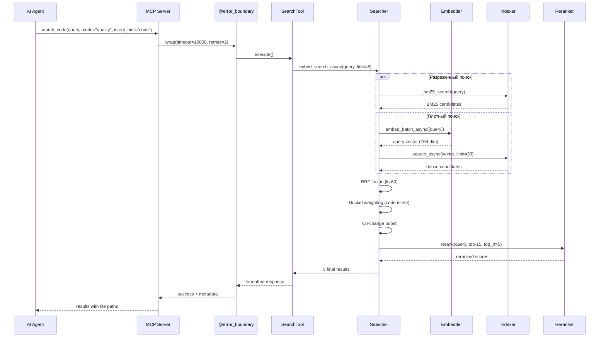

# Поисковый пайплайн — Полная техническая документация

> **Часть MSCodeBase Intelligence** | v3.0.0

## Обзор

Поисковый пайплайн — ядро MSCodeBase. Он объединяет **4 этапа поиска** для нахождения наиболее релевантного контекста кода.



## Детали этапов

### 1. Расширение запроса (Query Expansion)

```python
_EXPANSION_SYNONYMS = {
    "auth": ["authentication", "login", "authorize"],
    "error": ["exception", "failure", "bug"],
    "create": ["add", "insert", "new"],
    # ... ещё 8 групп
}

def expand_query(query: str, max_expansions: int = 3) -> list[str]:
    """Генерирует варианты с синонимами. Каждый вариант ищется независимо."""
    variants = [query]
    words = query.lower().split()
    for word in words:
        synonyms = _EXPANSION_SYNONYMS.get(word, [])
        for syn in synonyms[:max_expansions - 1]:
            variant = query.replace(word, syn, 1)
            if variant not in variants:
                variants.append(variant)
    return variants
```

### 2. BM25 поиск (разреженный)

- **Назначение:** Точное совпадение по ключевым словам — находит код, содержащий конкретные термины
- **Индекс:** Инкрементальный, строится из чанков LanceDB, хранится как `Dict[doc_id, Dict[term, tf-idf]]`
- **Обновление:** DebounceBatch (500ms) при изменениях файлов, полная перестройка при реиндексации
- **Производительность:** O(log N) на запрос



### 3. Плотный поиск (векторный, LanceDB)

- **Назначение:** Семантическая близость — находит концептуально связанный код
- **Модель:** `multilingual-e5-base` (intfloat, 768-dim)
- **Провайдер:** ONNX INT8 in-process (primary) / LM Studio (fallback)
- **Индекс:** LanceDB v2 с IVF-PQ квантизацией

```python
async def dense_search(query_vector: list, limit: int) -> list:
    table = await ensure_async_table()
    builder = await table.search(query_vector, vector_column_name="vector")
    df = await builder.limit(limit).to_pandas()
    return [{"text": row["text"], "metadata": {...}} for _, row in df.iterrows()]
```

### 4. RRF Fusion (Reciprocal Rank Fusion)

> ⚠️ **Важно:** Ранги считаются **раздельно** для каждого канала, начиная с 1.
> Объединённый `enumerate(bm25 + dense)` дал бы неверные скоры.

```python
def rrf_fusion(bm25: list, dense: list, k: int = 60) -> list:
    """Слияние результатов BM25 + dense по формуле RRF.
    
    Ранги считаются отдельно для каждого канала (начиная с 1),
    как того требует математически корректная RRF.
    """
    scores = {}
    results_map = {}
    
    # BM25 ранги (отдельный enumerate с start=1)
    for rank, doc in enumerate(bm25, 1):
        key = f"{doc['metadata']['file']}:{doc['metadata']['chunk_index']}"
        scores[key] = scores.get(key, 0.0) + 1.0 / (k + rank)
        if key not in results_map:
            results_map[key] = {
                **doc,
                "bm25_score": 1.0 / (k + rank),
                "dense_score": 0.0,
            }
        else:
            results_map[key]["bm25_score"] = 1.0 / (k + rank)
    
    # Dense ранги (отдельный enumerate с start=1)
    for rank, doc in enumerate(dense, 1):
        key = f"{doc['metadata']['file']}:{doc['metadata']['chunk_index']}"
        scores[key] = scores.get(key, 0.0) + 1.0 / (k + rank)
        if key not in results_map:
            results_map[key] = {
                **doc,
                "bm25_score": 0.0,
                "dense_score": 1.0 / (k + rank),
            }
        else:
            results_map[key]["dense_score"] = 1.0 / (k + rank)
    
    for key in results_map:
        results_map[key]["final_score"] = (
            results_map[key]["bm25_score"] + results_map[key]["dense_score"]
        )
    
    return sorted(results_map.values(), key=lambda x: x["final_score"], reverse=True)
```

### 5. Multi-Bucket RAG



### 6. Co-change Boost

Использует git-историю для повышения файлов, которые исторически изменяются вместе:

```python
def apply_co_change_boost(chunks: list) -> list:
    """Повышает файлы, связанные с топ-3 результатами через git-историю."""
    top_files = {c["metadata"]["file"] for c in chunks[:3]}
    matrix = commit_memory.compute_co_change_matrix()
    
    for chunk in chunks:
        file = chunk["metadata"]["file"]
        partners = matrix.get(file, {})
        if partners and any(tf in partners for tf in top_files):
            best = max(partners.get(tf, 0) for tf in top_files)
            chunk["final_score"] *= (1.0 + best * 0.3)
    return chunks
```

### 7. Кросс-энкодер Reranker

**Модель:** `bge-reranker-v2-m3` (через LM Studio / Ollama)

> **Примечание:** Визуализация реранкера предполагает LM Studio (GPU). При использовании ONNX Runtime (fallback) реранкер использует ту же модель `bge-reranker-v2-m3` через ONNX Runtime (CPU) с пониженной пропускной способностью.

- Оценивает каждую пару (запрос, чанк) независимо — **точнее, чем векторный косинус**
- Реранжит только топ-30 кандидатов (контролируется `MAX_RERANKER_INPUT`)
- Корректно переключается на fallback, если LM Studio недоступна

```python
async def rerank(query: str, candidates: list, top_n: int = 5) -> list:
    """Одноэтапный реранкер: запрос + чанк → оценка релевантности."""
    if not candidates:
        return candidates
    scores = await multi_reranker.rerank(query, candidates)
    for i, chunk in enumerate(candidates):
        chunk["final_score"] = scores[i] if i < len(scores) else 0
    return sorted(candidates, key=lambda x: x["final_score"], reverse=True)[:top_n]
```

## Полная диаграмма последовательности



## Бенчмарки производительности

| Этап | Время | Накопительно |
|-------|:----:|:----------:|
| Расширение запроса | <1ms | <1ms |
| BM25 поиск | ~150ms | ~150ms |
| Эмбеддинг запроса | ~800ms | ~950ms |
| LanceDB ANN | ~400ms | ~1350ms |
| RRF fusion | <1ms | ~1350ms |
| Bucket weighting | <1ms | ~1350ms |
| Co-change boost | ~50ms | ~1400ms |
| Реранкер (5 кандидатов) | ~1200ms | ~2600ms |
| **Итого (quality mode)** | **~5600ms** | |
| **Итого (fast mode, только BM25)** | **~2300ms** | |
| **Итого (deep mode, рекурсивный)** | **2-5s** | |

> *Замеры с ONNX Runtime (CPU). LM Studio (GPU) может быть в 3-5 раз быстрее.*

## Конфигурация

```ini
# .env настройки поиска
DEFAULT_SEARCH_LIMIT=6
MAX_SEARCH_RESULTS=20
QUERY_SYNONYMS_ENABLED=true
MAX_QUERY_EXPANSIONS=3
OVERFETCH_FACTOR=3
RERANKER_PROVIDERS=ollama,lm_studio

# Веса корзин (1.0 = нейтрально)
CODE_BUCKET_WEIGHT=1.0
DOCS_BUCKET_WEIGHT=1.0
```
