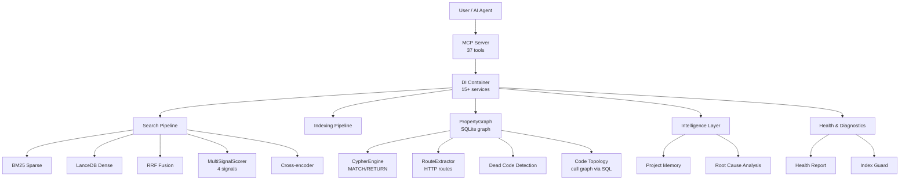
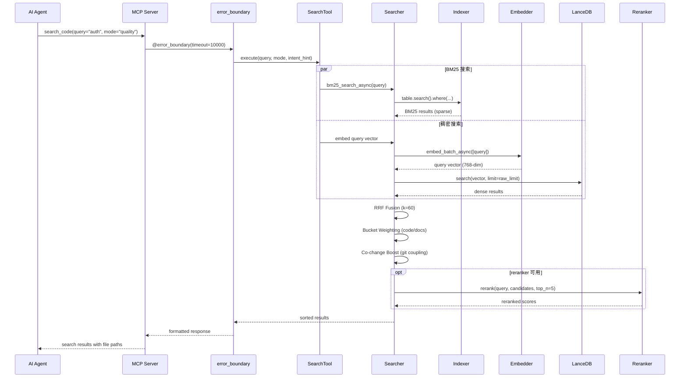
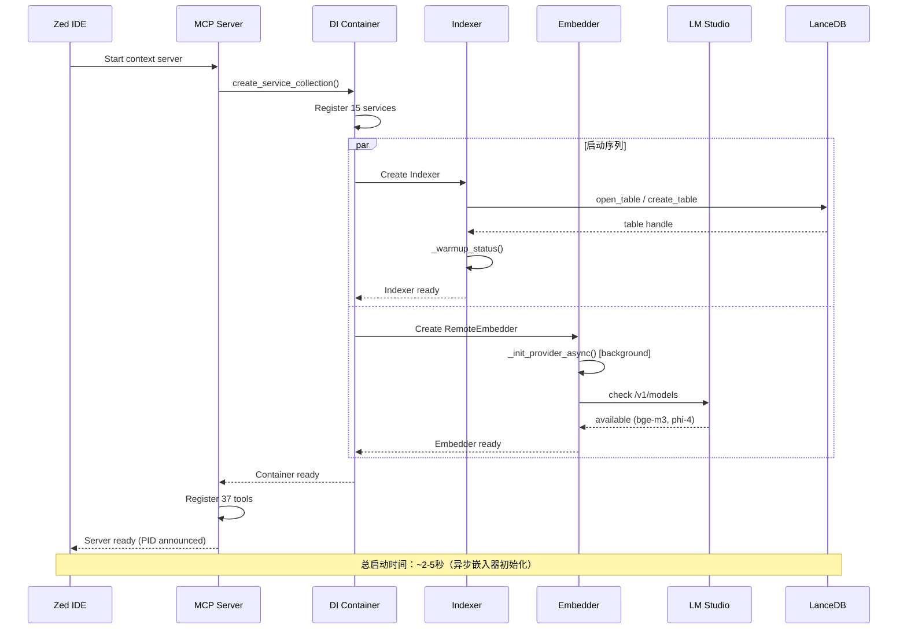
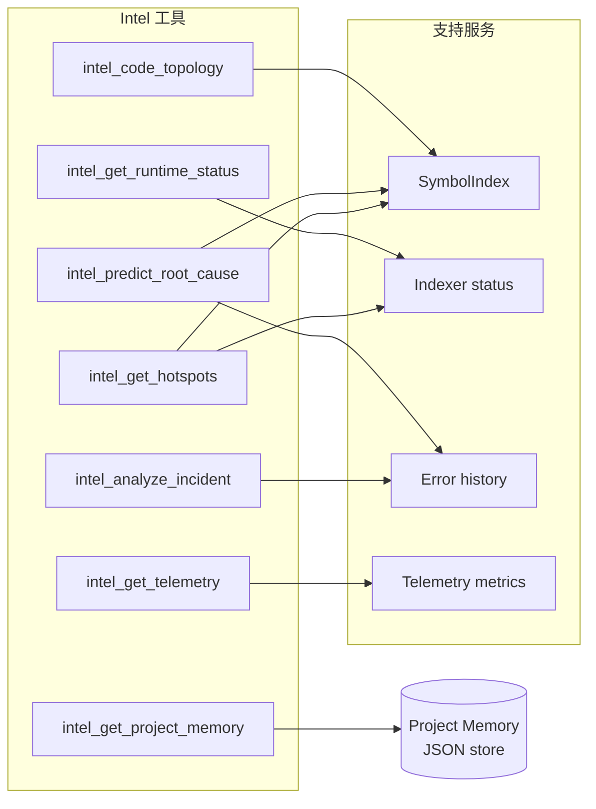
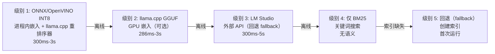

# MSCodeBase Intelligence — 深入架构指南

[🇬🇧 English](../en/ARCHITECTURE_DEEP.md) • [🇷🇺 Русский](../ru/ARCHITECTURE_DEEP.md) • [🇨🇳 中文](ARCHITECTURE_DEEP.md)

> **版本：** v3.2.0 | **最后更新：** 2026-07-12



---

## 1. 架构层

系统分为 10 个运行时层，从最低级（基础设施）到最高级（面向用户的工具）。

```mermaid
flowchart LR
    subgraph "第 11 层 — MCP 工具"
        T1[search_code]
        T2[query_graph\nCypher]
        T3[impact_analysis]
        T4[intel_*]
    end
    subgraph "第 10 层 — 错误边界"
        EB[@error_boundary]
    end
    subgraph "第 9 层 — 智能层"
        IL[intel_predict_root_cause\nintel_code_topology]
    end
    subgraph "第 8 层 — 搜索 + MultiSignal"
        SH[hybrid_search_async\nRRF + MultiSignalScorer]
    end
    subgraph "第 7 层 — 索引"
        IX[Indexer\nLanceDB + BM25]
    end
    subgraph "第 6.5 层 — 数据流（v3.2）"
        DF[ASSIGNED_FROM edges\nTree-sitter scope walk]
    end
    subgraph "第 6 层 — 图（v3.0）"
        PG[PropertyGraph\nSQLite WAL + mmap]
        CY[CypherEngine\nMATCH→SQL]
        RE[RouteExtractor]
    end
    subgraph "第 5 层 — 嵌入"
        EM[RemoteEmbedder\nllama.cpp / LM Studio]
    end
    subgraph "第 4 层 — 解析"
        PS[Tree-sitter AST\nParser + SymbolIndexAdapter]
    end
    subgraph "第 3 层 — 存储"
        ST[LanceDB v2 + SQLite\ngraph.db]
    end
    subgraph "第 2 层 — 速率限制"
        RL[CircuitBreaker\nDebounceBatch]
    end
    subgraph "第 1 层 — DI 容器"
        DI[ServiceCollection\n18 services]
    end
    T1 --> EB --> IL --> SH --> IX --> PG --> EM --> PS --> ST --> RL --> DI
    PG --> CY
    PG --> RE
```

---

## 2. 搜索流水线 — 完整流程



### 模式性能

| 模式 | 流水线（pipeline） | 延迟 | 用例 |
|------|----------|---------|----------|
| `fast` | 仅 BM25 | ~300ms | 精确符号查找 |
| `quality` | BM25 + Dense + RRF + Reranker | ~1200ms | 架构问题 |
| `deep` | 递归图扩展 | 2-5s | 复杂调查 |
| `context` | 代码片段相似度 | ~500ms | 查找相似代码 |
| `ask` | 搜索 → phi-4 生成 | 5-15s | RAG 问答 |

---

## 3. 工具生命周期

```mermaid
flowchart TD
    Start[Agent 调用工具] --> Resolve[DI 容器解析服务]
    Resolve --> Guard{RuntimeCoordinator\ncan_execute?}
    Guard -->|blocked| Error[返回错误\n带恢复提示]
    Guard -->|ready| Boundary[error_boundary 包裹调用\n带超时 + 重试]
    
    Boundary --> Execute[Tool.execute params]
    Execute --> LMEnd{llama.cpp / LM Studio\navailable?}
    
    LMEnd -->|yes| LLAMA[RemoteEmbedder\nllama.cpp GGUF (GPU)]
    LMEnd -->|no| LM[RemoteEmbedder\nembeddings via LM Studio]
    LMEnd -->|no| ONNX[RemoteEmbedder\nembeddings via ONNX Runtime]
    
    LM --> Result[返回结构化结果]
    ONNX --> Result
    
    Result --> Telemetry[record_tool_call\nmetrics + latency]
    Telemetry --> Done[响应给 Agent]
    
    Boundary -->|timeout| Retry{还有\n重试次数?}
    Retry -->|yes| Execute
    Retry -->|no| Timeout[超时错误]
```

---

## 4. 组件交互 — 启动流程



---

## 5. 智能层架构



---

## 6. 数据模型

```mermaid
erDiagram
    CHUNK ||--o{ METADATA : contains
    CHUNK {
        string id PK
        vector vector "768-dim float"
        string text "compact chunk"
        string text_full "full function text"
        string file_path "relative path"
        string file_hash "MD5 for incremental"
        int chunk_index
        string source "lsp_vfs | filesystem"
        string indexed_at ISO8601
        string summary "LLM-generated"
        string callees "JSON array of callee names"
        float health_score "1-10"
        string health_band "healthy|warning|alert"
    }
    METADATA {
        string layer "core | mcp | tests"
        string module_name "core.searcher"
        string hierarchy_level "function | class | module"
        bool is_public
        string symbol_type "function_definition"
        string parent_id "hash for multi-granularity"
    }
    SYMBOL {
        string name
        string file_path
        int line
        string kind
        bool is_definition
    }
    SYMBOL ||--o{ SYMBOL : calls
```

---

## 7. MSCodeBase vs 生态系统对比

| 标准 | **MSCodeBase** | Qartez MCP | CodeGraph | SymDex |
|-----------|:--------------:|:----------:|:---------:|:------:|
| **语言** | Python + LanceDB (Rust-core) | Rust | TypeScript | - |
| **搜索** | BM25 + Dense + RRF + Reranker | 静态分析 | 知识图谱 | 符号查找 |
| **工具** | **43** | 30+ | - | - |
| **测试** | **396** | - | - | - |
| **Windows** | **原生**（UNC, MAX_PATH） | - | - | - |
| **增量索引** | MD5 + DebounceBatch | - | - | - |
| **自恢复** | IndexGuard | - | - | - |
| **项目记忆** | ADR / debt / issues | - | - | - |
| **重排序器（reranker）** | bge-reranker-v2-m3 | - | - | - |
| **共变更** | Git 耦合矩阵 | - | - | - |
| **健康检查** | 完整诊断 | - | - | - |
| **文档** | **3 种语言** | 1 | 1 | 1 |
| **许可证** | MIT | Dual | MIT | - |

---

## 8. 系统配置对比

| 特性 | `light` 配置 | `server` 配置 |
|---------|:---------------:|:----------------:|
| `mode=ask` (phi-4) | ❌ 阻止 | ✅ 可用 |
| 异步搜索 | ✅ | ✅ |
| 重排序器（reranker） | ✅ | ✅ |
| RAM 使用 | ~150 MB | ~300 MB（含 phi-4） |
| 启动时间 | ~1s | ~3s |
| 使用场景 | 日常编码 | 深入分析 |

---

## 9. 优雅降级级别



**自动恢复：** 系统默认运行 ONNX/OpenVINO E5-base（进程内），并持续扫描可选的 llama.cpp GGUF GPU 嵌入器（embedder），然后是 LM Studio/Ollama 作为回退（fallback）。当更高级别变为可用时，自动切换 — 无需重启。

---

## 10. 关键指标

| 指标 | 值 |
|--------|-------|
| **搜索模式** | 6（fast, quality, deep, context, ask, auto） |
| **MCP 工具** | 37（19 个核心 + 12 个 intel + 6 个诊断） |
| **DI 中的服务** | 15 |
| **测试** | 396 |
| **语言** | 3（EN, RU, ZH） |
| **模式字段** | 19（chunk: 9 + metadata: 6 + v3.0: 4） |
| **嵌入维度** | 384（E5-small INT8，进程内） |
| **重排序器（reranker）** | bge-reranker-v2-m3 |
| **LLM** | phi-4-mini-instruct（可选，仅 mode=ask） |
| **向量数据库** | LanceDB v2 |
| **解析器** | Tree-sitter |
