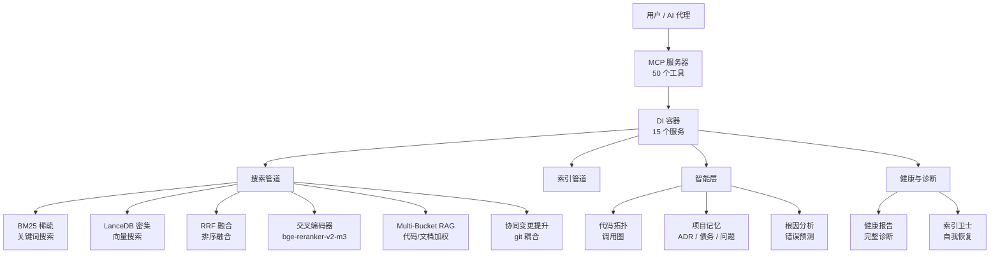
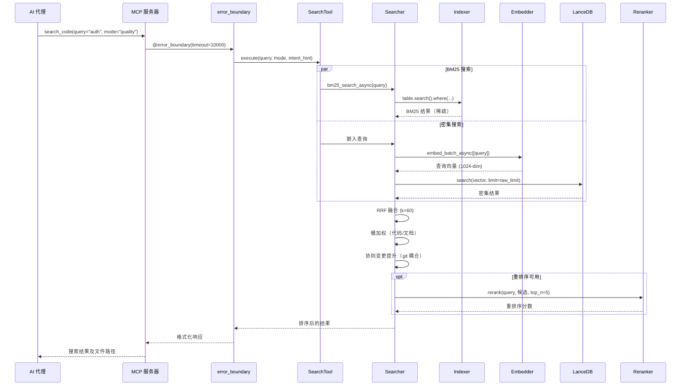
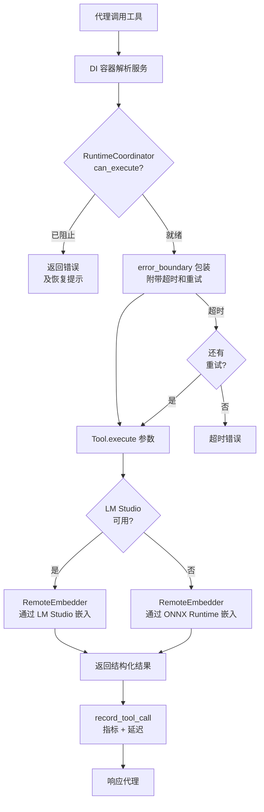
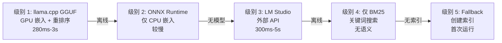

# MSCodeBase Intelligence — 深度架构指南

[🇬🇧 English](../en/ARCHITECTURE_DEEP.md) • [🇷🇺 Русский](../ru/ARCHITECTURE_DEEP.md) • [🇨🇳 中文](ARCHITECTURE_DEEP.md)

> **版本：** v2.7.0+ | **最后更新：** 2026-07-07



---

## 1. 架构层次

系统分为 10 个运行时层，从基础设施层（最底层）到用户层面（最顶层）。

```mermaid
flowchart LR
    subgraph "第10层 — MCP 工具"
        T1[search_code]
        T2[get_symbol_info]
        T3[impact_analysis]
        T4[intel_*]
    end
    subgraph "第9层 — 错误边界"
        EB[@error_boundary\n超时 + 重试]
    end
    subgraph "第8层 — 智能"
        IL[intel_predict_root_cause\nintel_code_topology\nintel_get_project_memory]
    end
    subgraph "第7层 — 搜索"
        SH[hybrid_search_async\nRRF + 重排序 + 桶]
    end
    subgraph "第6层 — 索引"
        IX[Indexer\nLanceDB + BM25 + SymbolIndex]
    end
    subgraph "第5层 — 嵌入"
        EM[RemoteEmbedder\nLM Studio / Ollama / ONNX]
    end
    subgraph "第4层 — 解析"
        PS[Tree-sitter AST\nParser + SymbolIndex]
    end
    subgraph "第3层 — 存储"
        ST[LanceDB v2\n按项目隔离]
    end
    subgraph "第2层 — 限流"
        RL[CircuitBreaker\nDebounceBatch\nSlidingWindow]
    end
    subgraph "第1层 — DI 容器"
        DI[ServiceCollection\n15 个单例 + 工厂]
    end
    T1 --> EB --> IL --> SH --> IX --> EM --> PS --> ST --> RL --> DI
```

---

## 2. 搜索管道 — 完整流程



### 模式性能

| 模式 | 管道 | 延迟 | 用例 |
|------|------|------|------|
| `fast` | 仅 BM25 | ~300ms | 精确符号查找 |
| `quality` | BM25 + Dense + RRF + 重排序 | ~1200ms | 架构相关问题 |
| `deep` | 递归图扩展 | 2-5s | 复杂调查 |
| `context` | 代码片段相似性 | ~500ms | 查找相似代码 |
| `ask` | 搜索 → phi-4 生成 | 5-15s | RAG 问答 |

---

## 3. 工具生命周期



---

## 4. 数据模型

```mermaid
erDiagram
    CHUNK ||--o{ METADATA : 包含
    CHUNK {
        string id PK
        vector vector "1024-dim float"
        string text "紧凑块"
        string text_full "完整函数文本"
        string file_path "相对路径"
        string file_hash "MD5 用于增量"
        int chunk_index
        string source "lsp_vfs | filesystem"
        string indexed_at ISO8601
        string summary "LLM 生成"
        string callees "被调用者 JSON 数组"
        float health_score "1-10"
        string health_band "healthy|warning|alert"
    }
    METADATA {
        string layer "core | mcp | tests"
        string module_name "core.searcher"
        string hierarchy_level "function | class | module"
        bool is_public
        string symbol_type "function_definition"
        string parent_id "用于多粒度的哈希"
    }
    SYMBOL {
        string name
        string file_path
        int line
        string kind
        bool is_definition
    }
    SYMBOL ||--o{ SYMBOL : 调用
```

---

## 5. 对比：MSCodeBase vs 生态系统

| 标准 | **MSCodeBase** | Qartez MCP | CodeGraph | SymDex |
|------|:--------------:|:----------:|:---------:|:------:|
| **语言** | Python + LanceDB (Rust-core) | Rust | TypeScript | - |
| **搜索** | BM25 + Dense + RRF + 重排序 | 静态分析 | 知识图谱 | 符号查找 |
| **工具数** | **50** | 30+ | - | - |
| **测试** | **396** | - | - | - |
| **Windows** | **原生**（UNC, MAX_PATH） | - | - | - |
| **增量索引** | MD5 + DebounceBatch | - | - | - |
| **自我恢复** | IndexGuard | - | - | - |
| **项目记忆** | ADR / 债务 / 问题 | - | - | - |
| **重排序器** | bge-reranker-v2-m3 | - | - | - |
| **协同变更** | Git 耦合矩阵 | - | - | - |
| **健康检查** | 完整诊断 | - | - | - |
| **文档** | **3 种语言** | 1 | 1 | 1 |
| **许可证** | MIT | 双重 | MIT | - |

---

## 6. 系统配置文件对比

| 功能 | `light` 配置 | `server` 配置 |
|------|:------------:|:-------------:|
| `mode=ask` (phi-4) | ❌ 被阻止 | ✅ 可用 |
| 异步搜索 | ✅ | ✅ |
| 重排序器 | ✅ | ✅ |
| RAM 使用量 | ~150 MB | ~300 MB（含 phi-4） |
| 启动时间 | ~1s | ~3s |
| 使用场景 | 日常编码 | 深度分析 |

---

## 7. 降级级别



**自动恢复：** 系统持续扫描 llama.cpp GGUF，然后是 LM Studio/Ollama。
当更高级别可用时，自动切换 — 无需重启。\n完整管道\n300ms-5s"] -->|离线| L2
    L2["级别 2: ONNX Runtime\n仅嵌入\nCPU, 较慢"] -->|无模型| L3
    L3["级别 3: 仅 BM25\n关键词搜索\n无语义"] -->|无索引| L4
    L4["级别 4: Fallback\n创建索引\n首次运行"]
```

**自动恢复：** 系统持续扫描 LM Studio/Ollama 的可用性。
当更高级别可用时，自动切换 — 无需重启。

---

## 8. 关键指标

| 指标 | 值 |
|------|-----|
| **搜索模式** | 6（fast, quality, deep, context, ask, auto） |
| **MCP 工具** | 50（34 low-level + 14 intel） |
| **DI 中的服务** | 15 |
| **测试** | 396 |
| **语言** | 3（EN, RU, ZH） |
| **模式字段** | 19（块：9 + 元数据：6 + v3.0：4） |
| **嵌入维度** | 1024（bge-m3） |
| **重排序器** | bge-reranker-v2-m3 |
| **LLM** | phi-4-mini-instruct |
| **向量数据库** | LanceDB v2 |
| **解析器** | Tree-sitter |
