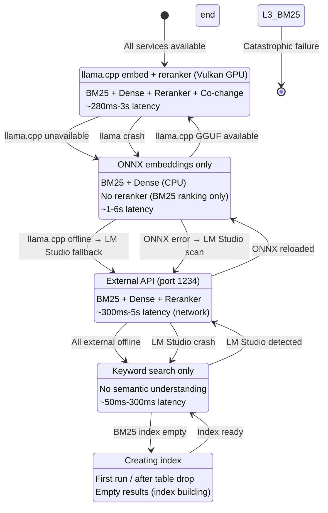
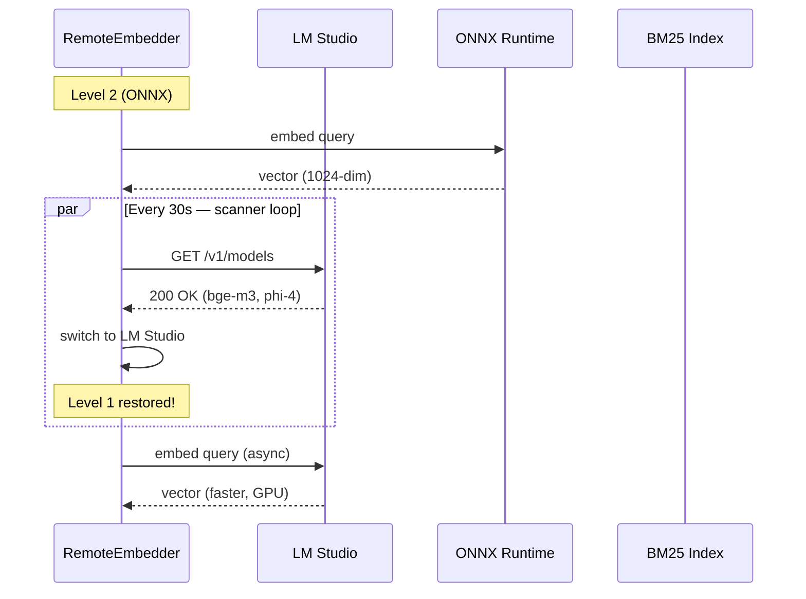
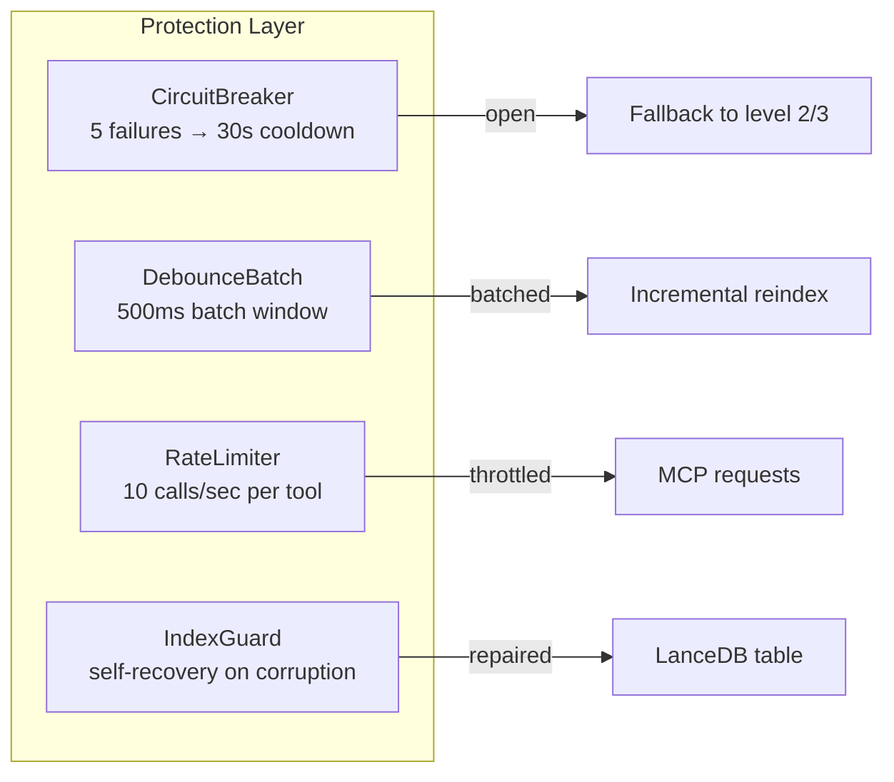

# 优雅降级 — 系统韧性指南

> **MSCodeBase Intelligence 的一部分** | v2.7.0+

## 概述

MSCodeBase 从不完全崩溃。相反，它通过 5 个级别**优雅降级**，
即使在外部服务故障时也能维持基本功能。



## 各级别详情

### 级别 1：完整流水线（生产环境）

| 组件 | 状态 |
|-----------|:------:|
| LM Studio | ✅ 在线 |
| BM25 索引 | ✅ 已构建 |
| Reranker | ✅ 可用 |
| mode=ask (phi-4) | ✅ 可用 |
| **延迟** | **300ms-5s** |
| **质量** | **最佳** |

**触发条件：** LM Studio 在 `127.0.0.1:1234/v1/models` 响应

### 级别 2：ONNX Runtime（回退）

```python
# 当 LM Studio 不可达时自动回退
class RemoteEmbedder:
    def _check_lm_studio(self) -> bool:
        """通过 CircuitBreaker 路由以防止级联故障。"""
        if self._breaker is not None:
            return bool(self._breaker.call(self._check_lm_studio_raw, fallback=True))
        return self._check_lm_studio_raw()
    
    def _init_onnx(self):
        """从 .codebase_models/onnx/bge-m3/ 加载 ONNX 模型"""
        if not self.local_model_dir.exists():
            raise FileNotFoundError("运行：python scripts/download_model.py")
        self._onnx_session = ort.InferenceSession(str(self.local_model_dir / "model.onnx"))
```

| 组件 | 状态 |
|-----------|:------:|
| LM Studio | ❌ 离线 |
| ONNX 模型 | ✅ 可用（438 MB） |
| Reranker | ❌ 不可用 |
| mode=ask | ❌ 不可用 |
| **延迟** | **1-6s** |
| **质量** | **良好**（仅 embedding，无 reranker） |

### 级别 3：仅 BM25（最低限度）

```python
# BM25 构建器中的优雅降级
class Searcher:
    def _build_bm25_index(self) -> None:
        if self.indexer.table is None:
            self._bm25 = {}  # 空 BM25 = 降级模式
            return
        try:
            if self.indexer.table.count_rows() == 0:
                self._bm25 = {}
                return
        except Exception:
            self._bm25 = {}  # 表损坏 → 降级
            return
```

| 组件 | 状态 |
|-----------|:------:|
| LM Studio | ❌ 离线 |
| ONNX 模型 | ❌ 缺失 |
| BM25 索引 | ✅ 可用 |
| Reranker | ❌ 不可用 |
| mode=ask | ❌ 不可用 |
| **延迟** | **50ms-300ms** |
| **质量** | **基础**（仅关键词） |

### 级别 4：回退（首次运行）

```python
# 表重建后的首次运行
class Indexer:
    def _warmup_status(self) -> None:
        count = self.table.count_rows()
        self._cached_total_chunks = count
        if count == 0:
            logger.debug("🔥 冷启动 — 空数据库")
```

| 组件 | 状态 |
|-----------|:------:|
| LM Studio | ❌ 离线 |
| ONNX 模型 | ❌ 不可用 |
| BM25 索引 | ❌ 为空 |
| Reranker | ❌ 不可用 |
| mode=ask | ❌ 不可用 |
| **延迟** | 不适用 |
| **质量** | **无**（等待索引） |

## 自动恢复



**关键特性：**
- 扫描器每 30 秒在后台线程中运行
- 当更高级别变为可用时 → **自动切换**
- 无需重启
- CircuitBreaker 防止快速开关循环

## 保护机制



| 保护机制 | 原理 | 恢复 |
|-----------|-----------|----------|
| **CircuitBreaker** | 5 次失败 → OPEN（30 秒）→ HALF_OPEN → CLOSED | 冷却后自动恢复 |
| **DebounceBatch** | 500ms 窗口，最多 100 个文件 | 触发一次 BM25 重建 |
| **RateLimiter** | 滑动窗口，每个工具 10 次调用/秒 | 超出时以 RateLimitError 丢弃 |
| **IndexGuard** | 计数检查 + 模式验证 | 表损坏时重建 |
