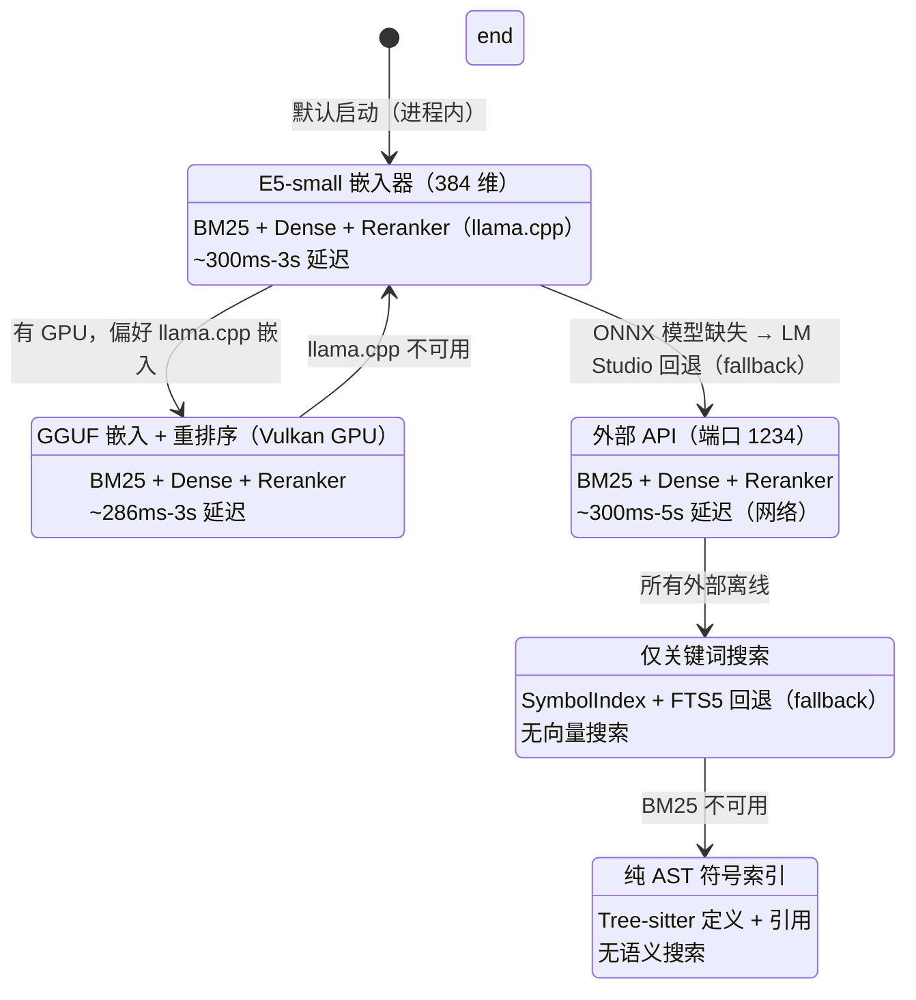
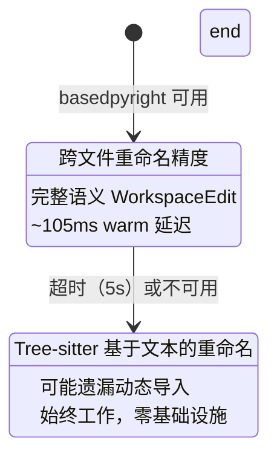
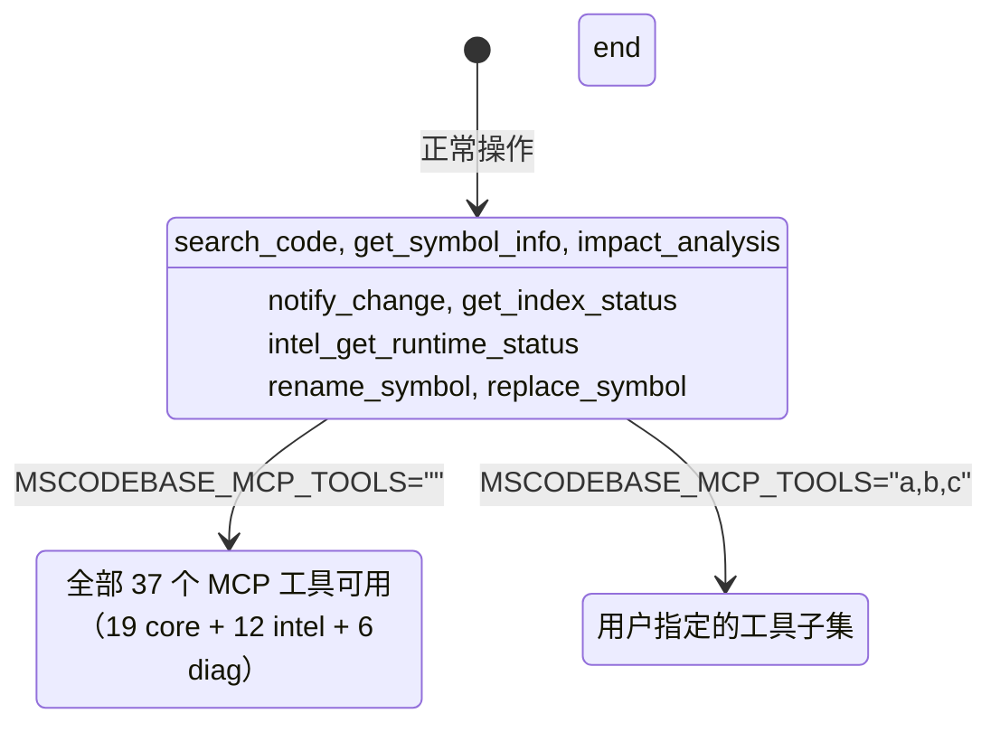
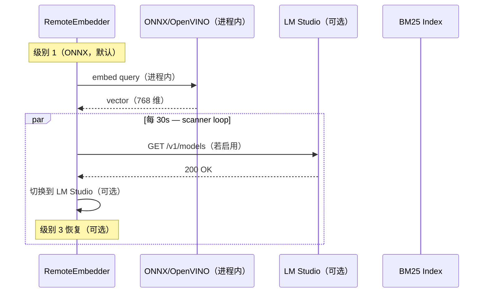

# 优雅降级（Graceful Degradation）— 系统弹性指南

> **MSCodeBase Intelligence 的一部分** | v3.2.1

## 概述

MSCodeBase 永远不会完全崩溃。相反，它通过 **6 个级别优雅降级**，
即使外部服务失败也能保持基本功能。

> **提供者（provider）现状（2026-07-12）：** 嵌入提供者（provider）通过 **ONNX INT8 / OpenVINO INT8**
> **进程内** 运行（`multilingual-e5-small-int8`，384 维，Windows CPU 上 ~37 ch/s）。
> 这是 **默认且主要** 的路径 — 语义搜索不需要外部服务器。`LM Studio` 仅是
> **可选的回退（fallback）**，当本地 ONNX/OpenVINO 模型不可用时。**重排序器（reranker）** 作为独立
> `llama-server.exe` 进程运行，提供 `bge-reranker-v2-m3` GGUF 模型（端口 `:8081`）。



### 横切层（始终可用）

以下各层 **独立于** 上述搜索级别：





## 级别详情

### 级别 1: ONNX/OpenVINO INT8（默认，进程内）

```python
# 默认提供者路径（EMBEDDING_PROVIDER=e5_onnx）
class RemoteEmbedder:
    def _init_provider_async(self):
        _provider = os.getenv("EMBEDDING_PROVIDER", "e5_onnx")
        if _provider in ("e5_onnx", "auto", ""):
            self._init_onnx()
            # OpenVINO INT8 优先（Windows CPU 上 ~37 ch/s）
            if getattr(self, "_ov_compiled", None) is not None:
                self.mode = "onnx"
```

| 组件 | 状态 |
|-----------|:------:|
| ONNX/OpenVINO E5-small | ✅ 进程内（384 维，INT8） |
| BM25 索引 | ✅ 已构建 |
| 重排序器（reranker）（llama.cpp） | ✅ 可用（`:8081`） |
| mode=ask | ⚠️ 可选（需要 LLM profile） |
| **延迟** | **300ms-3s** |
| **质量** | **最佳**（无外部依赖） |

**触发：** 默认启动。不需要外部服务器。

### 级别 2: llama.cpp GGUF（GPU，可选）

如果用户有 Vulkan GPU 并偏好 GGUF 嵌入，`llama-server.exe` 可提供嵌入器（embedder）。这是加速路径，非默认。

| 组件 | 状态 |
|-----------|:------:|
| llama.cpp 嵌入（GPU） | ✅ 可用 |
| BM25 索引 | ✅ 已构建 |
| 重排序器（reranker） | ✅ 可用 |
| mode=ask | ⚠️ 可选 |
| **延迟** | **286ms-3s** |
| **质量** | **最佳** |

### 级别 3: LM Studio（远程，可选回退 fallback）

```python
# 仅当本地 ONNX/OpenVINO 模型不可用时到达
class RemoteEmbedder:
    def _check_lm_studio(self) -> bool:
        """通过 CircuitBreaker 路由，防止级联失败。"""
        if self._breaker is not None:
            return bool(self._breaker.call(self._check_lm_studio_raw, fallback=True))
        return self._check_lm_studio_raw()
```

| 组件 | 状态 |
|-----------|:------:|
| LM Studio | ✅ 在线（若运行） |
| ONNX 模型 | ❌ 缺失 |
| 重排序器（reranker） | ✅ 可用（通过 LM Studio） |
| mode=ask | ✅ 可用 |
| **延迟** | **300ms-5s**（网络） |
| **质量** | **良好** |

**触发：** `EMBEDDING_PROVIDER=lm_studio` 或本地 ONNX 模型缺失。

### 级别 4: 仅 BM25（最小）

```python
# BM25 builder 中的优雅降级
class Searcher:
    def _build_bm25_index(self) -> None:
        if self.indexer.table is None:
            self._bm25 = {}  # 空 BM25 = 降级模式
            return
        try:
            if self.indexer.table.count_rows() == 0:
                self._bm25 = {}
                return
        except Exception:
            self._bm25 = {}  # 表损坏 → 降级
            return
```

| 组件 | 状态 |
|-----------|:------:|
| ONNX 模型 | ❌ 缺失 |
| LM Studio | ❌ 离线 |
| BM25 索引 | ✅ 可用 |
| 重排序器（reranker） | ❌ 不可用 |
| mode=ask | ❌ 不可用 |
| **延迟** | **50ms-300ms** |
| **质量** | **基础**（仅关键词） |

### 级别 5: 仅 SymbolIndex（最后手段）

| 组件 | 状态 |
|-----------|:------:|
| ONNX 模型 | ❌ 缺失 |
| BM25 索引 | ❌ 不可用 |
| SymbolIndex | ✅ 可用 |
| 重排序器（reranker） | ❌ 不可用 |
| mode=ask | ❌ 不可用 |
| **延迟** | **<50ms** |
| **质量** | **仅 AST 符号**（无语义搜索） |

### 级别 6: 回退（Fallback）（首次运行）

| 组件 | 状态 |
|-----------|:------:|
| ONNX 模型 | ❌ 不可用 |
| BM25 索引 | ❌ 空 |
| 重排序器（reranker） | ❌ 不可用 |
| mode=ask | ❌ 不可用 |
| **延迟** | N/A |
| **质量** | **无**（等待索引） |

## 自动恢复


