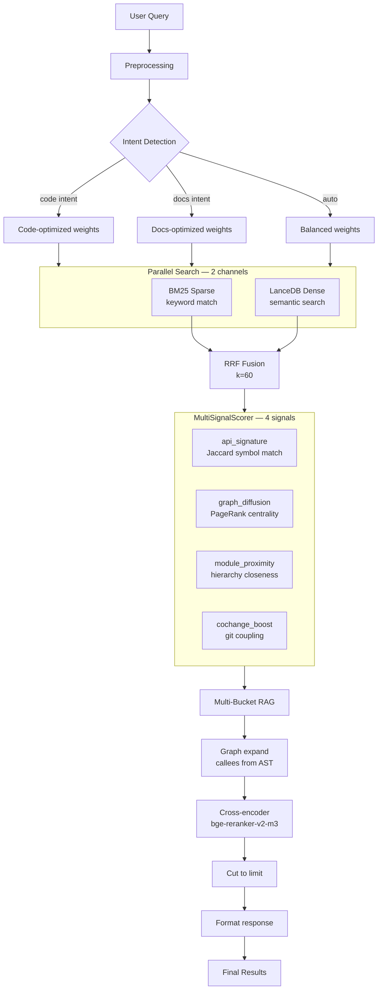
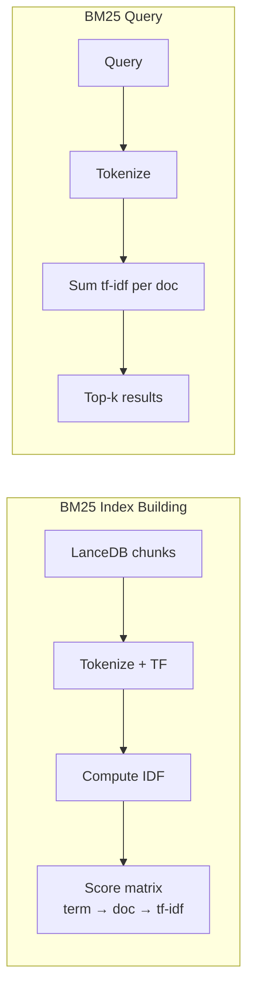
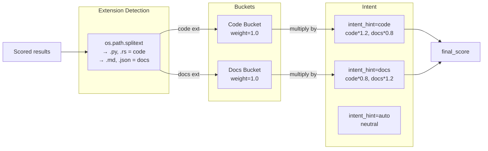
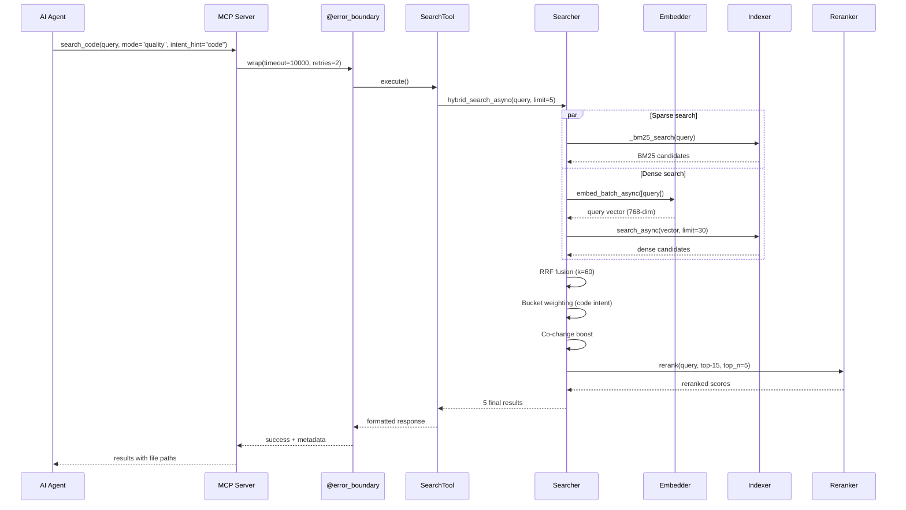

# 搜索流水线（pipeline）— 完整技术参考

> **MSCodeBase Intelligence 的一部分** | v3.0.0

## 概述

搜索流水线（pipeline）是 MSCodeBase 的核心。它结合了 **4 个检索阶段 + MultiSignalScorer** 来查找最相关的代码上下文。



## 阶段详情

### 1. 查询扩展

```python
_EXPANSION_SYNONYMS = {
    "auth": ["authentication", "login", "authorize"],
    "error": ["exception", "failure", "bug"],
    "create": ["add", "insert", "new"],
    # ... 8 more groups
}

def expand_query(query: str, max_expansions: int = 3) -> list[str]:
    """Generate synonym variants. Each variant is searched independently."""
    variants = [query]
    words = query.lower().split()
    for word in words:
        synonyms = _EXPANSION_SYNONYMS.get(word, [])
        for syn in synonyms[:max_expansions - 1]:
            variant = query.replace(word, syn, 1)
            if variant not in variants:
                variants.append(variant)
    return variants
```

### 2. BM25 搜索（稀疏）

- **目的：** 精确关键词匹配 — 查找包含特定术语的代码
- **索引：** 增量构建，基于 LanceDB 块（chunk），存储为 `Dict[doc_id, Dict[term, tf-idf]]`
- **更新：** DebounceBatch（500ms）在文件更改时，完全重建则在重新索引时
- **性能：** O(log N) 每查询



### 3. 稠密搜索（向量，LanceDB）

- **目的：** 语义相似度 — 查找概念相关的代码
- **模型：** `multilingual-e5-small-int8`（384 维）
- **提供者（provider）：** ONNX INT8 进程内（主要）/ LM Studio（回退 fallback）
- **索引：** 带 IVF-PQ 量化的 LanceDB v2

```python
async def dense_search(query_vector: list, limit: int) -> list:
    table = await ensure_async_table()
    builder = await table.search(query_vector, vector_column_name="vector")
    df = await builder.limit(limit).to_pandas()
    return [{"text": row["text"], "metadata": {...}} for _, row in df.iterrows()]
```

### 4. RRF 融合（倒数排序融合 Reciprocal Rank Fusion）

> ⚠️ **重要：** 排名**分别**为每个通道计算，从 1 开始。
> 使用合并的 `enumerate(bm25 + dense)` 会得出不正确的分数。

```python
def rrf_fusion(bm25: list, dense: list, k: int = 60) -> list:
    """Merge BM25 + dense results using RRF formula.
    
    Ранги считаются отдельно для каждого канала (начиная с 1),
    как того требует математически корректная RRF.
    """
    scores = {}
    results_map = {}
    
    # BM25 ранги (отдельный enumerate с start=1)
    for rank, doc in enumerate(bm25, 1):
        key = f"{doc['metadata']['file']}:{doc['metadata']['chunk_index']}"
        scores[key] = scores.get(key, 0.0) + 1.0 / (k + rank)
        if key not in results_map:
            results_map[key] = {
                **doc,
                "bm25_score": 1.0 / (k + rank),
                "dense_score": 0.0,
            }
        else:
            results_map[key]["bm25_score"] = 1.0 / (k + rank)
    
    # Dense ранги (отдельный enumerate с start=1)
    for rank, doc in enumerate(dense, 1):
        key = f"{doc['metadata']['file']}:{doc['metadata']['chunk_index']}"
        scores[key] = scores.get(key, 0.0) + 1.0 / (k + rank)
        if key not in results_map:
            results_map[key] = {
                **doc,
                "bm25_score": 0.0,
                "dense_score": 1.0 / (k + rank),
            }
        else:
            results_map[key]["dense_score"] = 1.0 / (k + rank)
    
    for key in results_map:
        results_map[key]["final_score"] = (
            results_map[key]["bm25_score"] + results_map[key]["dense_score"]
        )
    
    return sorted(results_map.values(), key=lambda x: x["final_score"], reverse=True)
```

### 5. 多桶 RAG（Multi-Bucket RAG）



### 6. 协同变更提升（Co-change Boost）

使用 git 历史提升历史上一起变更的文件：

```python
def apply_co_change_boost(chunks: list) -> list:
    """Boost files coupled with top-3 results via git history."""
    top_files = {c["metadata"]["file"] for c in chunks[:3]}
    matrix = commit_memory.compute_co_change_matrix()
    
    for chunk in chunks:
        file = chunk["metadata"]["file"]
        partners = matrix.get(file, {})
        if partners and any(tf in partners for tf in top_files):
            best = max(partners.get(tf, 0) for tf in top_files)
            chunk["final_score"] *= (1.0 + best * 0.3)
    return chunks
```

### 7. 交叉编码器重排序（Cross-encoder Reranker）

**模型：** `bge-reranker-v2-m3`（通过 LM Studio / Ollama）

> **注意：** 重排序器（reranker）的可视化假设使用 LM Studio（GPU）。使用 ONNX Runtime 回退（fallback）时，重排序器通过 ONNX Runtime（CPU）使用相同的 `bge-reranker-v2-m3` 模型，吞吐量降低。

- 独立评估每个（查询，块（chunk））对 — **比向量余弦更准确**
- 仅对前 30 个候选进行重排序（由 `MAX_RERANKER_INPUT` 控制）
- 如果 LM Studio 不可用，优雅降级

```python
async def rerank(query: str, candidates: list, top_n: int = 5) -> list:
    """Single-stage reranker: query + chunk → relevance score."""
    if not candidates:
        return candidates
    scores = await multi_reranker.rerank(query, candidates)
    for i, chunk in enumerate(candidates):
        chunk["final_score"] = scores[i] if i < len(scores) else 0
    return sorted(candidates, key=lambda x: x["final_score"], reverse=True)[:top_n]
```

## 完整序列图



## 性能基准测试

| 阶段 | 时间 | 累积 |
|-------|:----:|:----------:|
| 查询扩展 | <1ms | <1ms |
| BM25 搜索 | ~150ms | ~150ms |
| 嵌入查询 | ~800ms | ~950ms |
| LanceDB ANN | ~400ms | ~1350ms |
| RRF 融合 | <1ms | ~1350ms |
| 桶加权 | <1ms | ~1350ms |
| 协同变更提升 | ~50ms | ~1400ms |
| 重排序器（reranker）（5 个候选） | ~1200ms | ~2600ms |
| **总计（质量模式）** | **~5600ms** | |
| **总计（快速模式，仅 BM25）** | **~2300ms** | |
| **总计（深度模式，递归）** | **2-5s** | |

> *时间基于 ONNX Runtime（CPU）。LM Studio（GPU）可快 3-5 倍。*

## 配置

```ini
# .env 搜索设置
DEFAULT_SEARCH_LIMIT=6
MAX_SEARCH_RESULTS=20
QUERY_SYNONYMS_ENABLED=true
MAX_QUERY_EXPANSIONS=3
OVERFETCH_FACTOR=3
RERANKER_PROVIDERS=ollama,lm_studio

# 桶权重（1.0 = 中性）
CODE_BUCKET_WEIGHT=1.0
DOCS_BUCKET_WEIGHT=1.0
```
