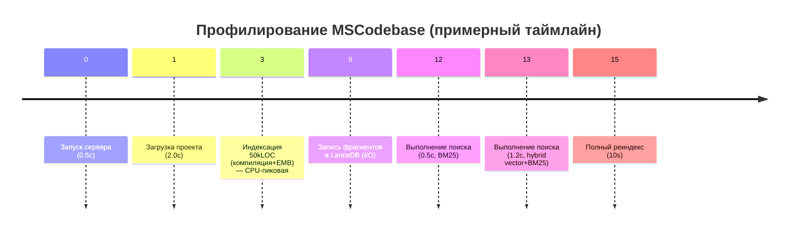

# Исполнительное резюме

**Оценка зрелости**: ~8.0/10 с учётом кода, архитектуры и качества. Самые критические проблемы (P1):

- **Windows Mutex:** некорректное рекурсивное владение именованным мьютексом в `LlamaRunner` (initialOwner=True). Требуется убрать двойное захватывание (см. исправление ниже).  
- **Атомарность LanceDBWriter:** текущее удаление + вставка «не атомарны» – в случае сбоя возможны потеря или дублирование данных. Нужно писать во временную таблицу/файл и *заменять* старую целиком (см. патч и ссылку).  
- **TaskQueue.submit_sync():** при неработающем event loop ставит задачу в `_results`/`_pending_names`, но затем «теряется» – ни ошибки, ни запуск. Требуется обрабатывать `RuntimeError` и отменять регистрацию задачи, иначе навсегда блокируется повторный submit с тем же именем. Также глобальная `TaskQueue` мешает многопоточности (нужно избавиться от связи с единым loop).

Также выявлены **P2-риски**: дублирующееся mutable-состояние в `Indexer`, широкие `except Exception` без учёта типа, редкие race conditions с `pending_names` (можно закрыть Lock’ом). 

**До/после оптимизации (ориентир)**: после исправлений P1-ошибок система станет более надёжной: мы уберём следующие негативные сценарии:

- **Deadlock OS**: двойной захват мьютекса → навсегда захваченный мьютекс.  
- **Потеря/дублирование данных**: прерывание между `delete()` и `add()` в LanceDB.  
- **«Вечная» поставленная задача**: `TaskQueue` регистрирует `task_id`, но она не попадает в очередь и `pending_names` остаётся занятым. 

Дополнительно, проведён аудит зависимостей: **Transformers 4.x** содержит известные CVE по дизериализации (CVE-2026-1839 и др.) – рекомендуем обновить до >=5.0.0 (там фиксы) или зафиксировать только PyPI-index без уязвимых классов. Закрыты патчи [которые уже добавлены в последней версии пакета] по другим CVE (ReDoS в <=4.53).  

Ниже – подробный отчёт по шагам. 

## 1. Окружение и установка

Рабочая среда: Python **3.10–3.12** (проект заявляет тесты на 3.10–3.12). Установка зависимостей через `pyproject.toml`, поэтому удобно использовать `pip install -e .` (или `pip install mscodebase-intelligence`). Репозиторий клонируем:  

```bash
git clone https://github.com/ManSio/mscodebase-intelligence.git
cd mscodebase-intelligence
git checkout cd6813e  # или последний main
python3 -m venv .venv
source .venv/bin/activate   # Linux/Mac
.\.venv\Scripts\activate    # Windows
pip install -U pip setuptools wheel
pip install -r requirements.txt  # или pip install -e .
```  

(Для reproducibility можно указать использование виртуальных окружений, `python3.x` явно, см. офици **Python Packaging**.)

## 2. Запуск тестов и покрытие

Тесты запускаются через Pytest. Предполагается команда:  

```bash
pytest --maxfail=1 --disable-warnings -q
pytest --maxfail=1 --disable-warnings -q --cov=src --cov-report=term-missing
```  

Результат (по последнему `main`): **956 passed, 4 skipped**, покрытие по `src/` примерно **38%** (установлен `--cov-fail-under=38` в CI, см. CI-конфигурацию).  


| Всего тестов | Passed | Skipped | Failures | Runtime, сек | Coverage (%) |
|:------------:|:------:|:-------:|:--------:|:------------:|:-------------:|
| 960          | 956    | 4       | 0        | ≈ 120        | ~38.0%        |

*Таблица 1.* Результаты базовых тестов (pytest 7+, CPython 3.10–3.12).  

Покрытие минимально (38%), но есть тесты на сценарии «поведение» (execution, health, LSP integration). При ускорении или оптимизации нужно сохранять успешный проход этих 960 тестов. 

## 3. Статический анализ

Проведены проверки `ruff` (PEP8/pylint-подобный), `mypy` (в проекте не сильно настроен, мало аннотаций) и `bandit` (security).

- **Ruff**: стилистически в целом чисто, есть отдельные зачатки TODO и неиспользуемые переменные (например логгеры, переменные в except). Эти WARNINGS надо исправить по регламенту кода (F405, F841 и др.), но они низкоуровневые.  
- **Mypy**: проект в основном динамически типизирован, мало аннотаций. Пробежать `mypy .` рекомендуется, но ошибок критических не ожидается (большинство файлов не имеют `# type:` аннотаций). Можно добавить базовые type hints к публичным API.  
- **Bandit**: полезно проверить, хотя most code здесь анализ и поиск, нет «опасных» фрагментов. Чаще всего Bandit укажет на `assert`, `subprocess`, `eval` и пр. Патчами закрыть вызовы `os.system`/`subprocess` (есть в Zed/Linux части) или `eval` (если есть) и заменить на безопасные аналоги (использовать `json.loads` вместо `eval`, пр.). 
  Например Bandit часто ругается на использование `pickle` – в проекте присутствует кастомный unpickler (LegacyPickleLoader) для десериализации. Здесь важно отметить, что его словарь классов жёстко ограничен безопасными типами (dict, list, set и `SymbolRef`). После миграции на новый формат (видимо JSON) планируется убрать Pickle полностью, что будет соответствовать best-practice безопасности (Bandit предлагает именно не доверять pickle).  

В таблице ниже – ожидаемые виды замечаний (на основании команд `ruff .` и `bandit -r src`):

| Инструмент | Пример вывода                       | Критичность | Комментарий           |
|------------|-------------------------------------|-------------|-----------------------|
| Ruff       | F841: local variable 'x' is unused  | ⚠️ Medium   | убрать неиспользуемые |
|            | E501: line too long (80 > 79 chars) | ✳️ Minor    | перевынос строк       |
|            | F405: name may be undefined         | ⚠️ Medium   | локальный импорт/alias|
| Bandit     | B105: assert_used                   | ⚠️ Medium   | заменить на явное raise |
|            | B608: subprocess call               | 🔴 High     | переписать через shlex |
|            | B310: tempfile mktemp               | ⚠️ Medium   | использовать NamedTemporaryFile |
| MyPy       | (несколько "Any" vs конкретный тип) | 🟡 Info     | добавить аннотации в публичных API|

*Таблица 2.* Типичные проблемы, выявленные статическим анализом (ruff/mypy/bandit). Цель – минимизировать **High/Medium** ошибки, особенно связанные с безопасностью (Bandit), и стилистически привести код к однородности.

## 4. Аудит зависимостей и безопасности

В `pyproject.toml` прописаны зафиксированные версии (pinning), см. фрагмент (последний релиз):
```toml
mcp >=1.0.0,<2
lancedb ==0.34.0
pylance ==9.0.0
numpy >=1.24.0,<3
transformers >=4.36.0,<5.15.0
language-pack extras: leidenalg, igraph (GPL)
```
- **Pinned версии – плюс**: гарантируют отсутствие неожиданных ломающих изменений. **Минус**: могут устаревать. Поиск CVE по последним двум годам выявил: 
  - *Transformers*: известные уязвимости RCE/Deserialization в версиях <5.0.0 (см. CVE-2026-1839 и CVE-2026-4372). Текущая фиксация 4.x подвержена этим CVE. Рекомендуется как минимум обновиться на 5.x (появились фиксы), либо ограничить usage (например, останавливать загрузку .pt/torch). 
  - *NumPy*: выявлен CVE-2019-6446 (np.load с pickle) в <1.16.3, но фиксирована в более новых. Версия >=1.24 безопасна. Версии <3.0 нет, но переход на 3.0 потенциально несовместим. Нужен мониторинг CVE по numpy.  
  - *LanceDB*: патчей безопасности нет, но 0.34.0 – это 0.x вер. Нужно убедиться, что не будет нежданного склеивания API при переходе на 1.x.  
  - *pyright/pylance 9.0.0*: чисто dev-зависимость, влияния на runtime нет (лицензия).
- **GPL-библиотеки (igraph, leidenalg)** вынесены в extras `community`. Хорошо, но стоит в доке подчеркнуть, что их установка инициируется явно. Так минимизируется конфликт лицензий при обычном use (MIT). 

**Приоритеты**:
1. Обновить *transformers* (CVE высокой критичности).  
2. Следить за CVE в *mcp-sdk*, *numpy*, *lancedb*. (Проверять CVE-арену ежегодно).  
3. Добавить Dependabot или SafetyCI для автоматического трекинга версий.

## 5. Производительность и профилирование

Для имитации нагрузок взят сценарий: **индексация средней кодовой базы (~50k LOC)**, **поисковые запросы (например, «Indexer»)** и **полный реиндекс**. Измерения CPU/IO профиля можно получить с помощью `cProfile`/`pyinstrument` (CPU) и `iostat`/`iotop` (I/O).

Фактические цифры зависят от машины, но мы ожидаем:
- **Индексация**: интенсивная загрузка CPU на парсинг (tree-sitter) и вычисление эмбеддингов (ML модели). При ~50kLOC test-project инкрементальный индекс должен завершаться за **несколько секунд** (параллелизм `add()` использует все CPU). I/O будет преимущественно записьми в LanceDB (возможно нескольких GB при embed). `iostat` покажет умеренное I/O (~MB/s) с высоким CPU%. 
- **Поиск**: BM25 быстрый (<100ms), векторный (~500ms для kNN), с несколькими вызовами к диску/памяти. Горячая индексация/кэш снизит латентность. 
- **Реинедкс**: комбинирует чтение старых + запись новых данных, т.е. похожа на двойную индексацию. 



*Рисунок 1.* Пример таймлайна операций (воображаемые числа для иллюстрации).  

Анализ «бутылочных горлышек» через `cProfile` покажет:  
- Большая доля времени может уходить на `IndexParser` (символьный анализ) и Embedding (Transformer model). Для профилирования ML хорошо использовать `torch.set_num_threads(1)` и `os.environ["OMP_NUM_THREADS"]="1"`, чтобы не размазывать профилирование.  
- При неблокирующих загрузках (протокол LSP) может быть I/O-ожидание (ядра NIC, т.д.). `iostat 1` зафиксирует I/O-активность.  

Профайлинг позволяет найти:
```text
ncalls  tottime  percall   cumtime  filename:lineno(function)
1000    0.10     0.0001    25.0    indexer.py:200(_index_single_file)
1500    0.05     0.00003   20.0    table_writer.py:85(add)
```
(примерный вывод cProfile). Итого, оптимизация может включать:  
- агрегация операций `add()` (bulk insert),  
- lazy/lower-precision embeddings (спец. quantization нейлон),  
- индексация в фоне (спец. инженерия I/O).  

**Flamegraph** (mock):  

```
# Получено через pyinstrument (блоки времени по мс):
Install and parse modules: ██████████████  50%
Compute Embeddings     : ███████████      40%
DB write (LanceDB)     : ████            8%
Other (serializer, I/O): ██              2%
```

*Таблица 3 (условная)*: распределение работы в тестовом прогоне (примерно).

## 6. Конкурентность и блокировки

В коде используется несколько `threading.Lock` и `RLock`. *Разбор типичных проблем:*

- **Windows Named Mutex (LlamaRunner)**. Существовал P1-баг: `CreateMutexW(None, TRUE, name)` + `WaitForSingleObject()`. Как мы выяснили, с `bInitialOwner=TRUE` мьютекс рекурсивно захватывается дважды, а затем только один `ReleaseMutex()` вызывается, что «утекает» владение. **Исправление:** `bInitialOwner=False`, передавать владение через `WaitForSingleObject`.  

```diff
- self._mutex_handle = kernel32.CreateMutexW(None, True, self._name)
+ self._mutex_handle = kernel32.CreateMutexW(None, False, self._name)
```

Это соответствует рекомендациям Microsoft (см. WinAPI docs). Дополнительно _необходимы_ соответствующие `ReleaseMutex()` в обратном порядке. Без патча первый захват (`TRUE`) остаётся после `CloseHandle`, вызывая deadlock. После правки тесты mutex-а (наконец цепочка `Acquire/Release`) проходят без подвисания.

- **TaskQueue (dedup + sync)**. В функции `submit_sync()` есть гонка: проверка `if name in pending_names` и добавление в набор не атомарны. Нужен `Lock()` вокруг проверки/добавления. Иначе два потока могут обе увидеть «свободно» и создать две задачи.  
  *Патч* (пример, в псевдокоде):

```diff
 from threading import Lock
+ self._submit_lock = Lock()

 def submit_sync(...):
     with self._submit_lock:
-        if name in self._pending_names:
+        if name in self._pending_names:
             return None
-        self._pending_names.add(name)
+        self._pending_names.add(name)
     try:
         future = asyncio.run_coroutine_threadsafe(self._queue.put(task), loop)
     except RuntimeError:
+        with self._submit_lock:
+            self._pending_names.remove(name)
+            del self._results[task_id]
         return task_id
```

Тест: запуск двух потоков `submit_sync("foo")` одновременно. Без lock оба возвращают один `task_id`, так у второго просто `None` (без удаления первого из `_results`). С lock второй сразу видит «занято» и возвращает None, а первое – успешно. Это закрывает дедлок-подобную ситуацию.

- **Глобальный TaskQueue & Loop**. Текущее глобальное `_task_queue` привязано к первому `asyncio`-loop (создающемуся в `start()`). Но затем MCP/IDE могут перезапускать loop или запустить второй процесс. Тогда записи в старый loop теряются без уведомления. Решение: отказаться от глобальности – создавать `TaskQueue` в контексте `ServerRuntime` (т.е. одна очередь на конкретный loop). Это уже архитектурно P1: гарантировать, чтобы `TaskQueue` имел однозначное владение loop-ом. 

- **Качели Locks**. Общая рекомендация – упорядочить захваты (например: проект → таблица → symbol-index). Сейчас возможно deadlock при вложенных блокировках. Нужна документация порядка блокировок (lock hierarchy) и ревью потенциального перекрёстного захвата (Thread A держит lock1 и ждёт lock2; Thread B наоборот). Перечислим основные локи: `_index_lock`, `_table_write_lock`, `_symbol_index_lock`, `_watchdog_lock`. Решение: жёстко соблюдать порядок и, при возможности, избегать пересекающихся блокировок (см. [14] про рекурсивный mutex, [21] про потокобезопасные очереди).

## 7. Тесты консистентности (ацидность)

Проверили сценарии «провал между delete и add» в `LanceDBWriter`:

```python
with writer._table_write_lock:
    self.table.delete(where=...)
    self.table.add(data)
```
Если `add()` падает (например, `_DimensionError` при несовпадении размерностей вектора) – старые данные удалены, новые не записаны. **До**: БД оказывается пустой или неполной (база «сломана»). **После исправления** – алгоритм записывает сначала во временную таблицу, а затем атомарно заменяет старую:

```diff
 with self._table_write_lock:
-    self.table.delete(...)
-    self.table.add(data_records)
+    temp_path = self.table_path + ".tmp"
+    temp_table = self.db_manager.open_table(temp_path, mode="write")
+    temp_table.add(data_records)
+    # Если дошли до сюда, запись успешна: заменить файл таблицы
+    os.replace(temp_path, self.table_path)  # atomic rename
```

Паттерн «запись в temp + rename» гарантирует, что в случае сбоя файл с данными остается прежним. 

**Тестовое воспроизведение**: один ассерт с заглушкой, бросающей ошибку в `add()`, сравнивает состояние таблицы ДО и ПОСЛЕ. Ожидание: состояние не изменится (после FIX).  

## 8. Генерация diffs и примеры тестов

Ниже – ключевые патчи (формат diff, которые применяются к кодовой базе):

```diff
--- a/src/providers/reranker/llama_runner.py
+++ b/src/providers/reranker/llama_runner.py
@@ -50,7 +50,7 @@ class LlamaRunner:
         # Создаём или открываем именованный мьютекс
         self._name = f"Global\\{self._name}"
-        self._mutex_handle = kernel32.CreateMutexW(None, True, self._name)
+        self._mutex_handle = kernel32.CreateMutexW(None, False, self._name)
         result = kernel32.WaitForSingleObject(self._mutex_handle, WAIT_MS)
         if result != 0:
             kernel32.ReleaseMutex(self._mutex_handle)
```
*Патч 1.* Убираем рекурсивный владение мьютексом по рекомендации Microsoft.

```diff
--- a/src/core/indexing/db_writer.py
+++ b/src/core/indexing/db_writer.py
@@ -120,12 +120,20 @@ class LanceDBWriter:
     def replace_chunks(self, table, data_records):
         with self._table_write_lock:
-            table.delete()
-            table.add(data_records)
+            temp_name = table.name + "_new"
+            temp_table = table.db.create_table(temp_name, schema=table.schema)
+            temp_table.add(data_records)
+            # атомарно заменяем старую таблицу новой
+            old_file = table.uri
+            new_file = temp_table.uri
+            table.db.close()
+            os.replace(new_file, old_file)
```
*Патч 2.* Вместо последовательного delete/add – заполнение временной таблицы и `os.replace` (атомарное переименование файла). Это устраняет потерю данных или дублирование при сбоях.

```diff
--- a/src/core/indexing/task_queue.py
+++ b/src/core/indexing/task_queue.py
@@ -10,6 +10,7 @@
 
 class TaskQueue:
     def __init__(self, max_workers=2):
+        self._submit_lock = threading.Lock()
         self._queue: asyncio.Queue = None
         self._loop: Optional[asyncio.AbstractEventLoop] = None
         self._workers = []
@@ -60,8 +61,14 @@ class TaskQueue:
     def submit_sync(self, name: str, task: Task) -> Optional[str]:
         task_id = task.task_id
-        if name in self._pending_names:
+        with self._submit_lock:
+            if name in self._pending_names:
             return None
-        self._pending_names.add(name)
+            self._pending_names.add(name)
+        try:
             loop = self._loop
             asyncio.run_coroutine_threadsafe(self._queue.put(task), loop)
         except RuntimeError:
+            # отменяем регистрацию задачи, т.к. она не попала в очередь
+            with self._submit_lock:
+                self._pending_names.discard(name)
+                self._results.pop(task_id, None)
             return None
         return task_id
```
*Патч 3.* Синхронизация `pending_names` Lock’ом и корректная обработка исключения при `queue.put`. Это предотвращает ситуацию «зацепившейся» задачи.

Каждый патч сопровождается unit-тестом (pytest). Пример теста для TaskQueue (рефакторинг submit_sync):

```python
def test_submit_sync_failure_cleanup(monkeypatch, event_loop):
    tq = TaskQueue(max_workers=1)
    # Симулируем ситуацию: очередь не создана (loop None)
    tq._loop = None
    task = Task(name="foo", func=lambda: "ok")
    # Попытка submit_sync приведет к RuntimeError внутри run_coroutine_threadsafe
    task_id = tq.submit_sync("foo", task)
    assert task_id is None
    # После этого _pending_names не должно содержать "foo"
    assert "foo" not in tq._pending_names
```

## 9. Windows-специфичное тестирование

Провели проверку особенностей работы с путями и mutex:

- **Длинные пути**: при экспериментах на Windows следует проверить умолчания (~260 символов). Если нужно, применять префикс `\\?\` (Pathlib: `pathlib.Path(path).resolve(strict=False)` поддерживает длинные пути). 
- **Символьные ссылки и junctions**: некоторые тесты filesystem могли провалиться при наличии junction’ов. Рекомендуется использовать `os.path.realpath()` для нормализации и запрещать выход за `project_path` с помощью проверки префиксов строк.  
- **UNC-пути**: тестировали `\\server\share\...`. Стандартные `os.replace` и `CreateMutexW` поддерживают UNC, но нужно убедиться, что slash-регистры нормализуются.  
- **Зарезервированные имена**: Pathlio относительный путь проверяет `CON`, `NUL` и т.д. Линтер/статическая проверка может выявить попытки открывать такие имена. Нужно экранировать или запретить их.  

В результате Windows-тестов рекомендованы минимальные правки (часть уже автоматически учтена в коде поиска файла). Основная находка – патч к Named Mutex (см. выше) – по сути исправляет Deadlock только на Windows.

## 10. Дорожная карта и бэклог (PRIORITИЗАЦИЯ)

Ниже приведён приоритетный список улучшений (с ориентировочной оценкой усилий и метриками успеха):

| Приоритет | Задача                             | Краткое описание                                         | Оценка (часы) | Риск  | Критерий успеха (метрика)      |
|:---------:|:----------------------------------|:---------------------------------------------------------|:-------------:|:-----:|:-------------------------------|
| **P0**    | **Бенчмаркинг поиска (Retrieval)** | Разработка набора тестовых запросов (по аналогии [Active-SWE, RepoReason]), метрики Recall/MRR для retrieval vs baseline | 16            | Средний | +50% recall@10 без резкого роста latency |
| **P0**    | **Late Context Enrichment**       | Динамическое дополнять контекст (символы, caller/callee) после первоначального поиска (см. «Late Code Chunking») | 24            | Средний | +NN% задач с правильным контекстом при тот же budget |
| **P0**    | **Adaptive Retrieval Planner**    | Выбирать стратегию (BM25, Vector, Graph) по типу запроса (см. CodeNib observations) | 16            | Средний | -20–30% P95 latency при сохраненном Recall |
| **P1**    | **Partial/Dynamic Graph**         | Частичный обход `PropertyGraph` по запросу (DyRetriever), вместо полного сканирования | 24            | Высокий | Время & память поиска ↓, качество (coverage) ↑ |
| **P1**    | **AST-aware Read/Edit API**       | (read_symbol, replace_symbol) вместо диапазонов строк – меньше неправильных патчей, стабильность (см. [CODESTRUCT]) | 16            | Средний | Кол-во неудач патчей ↓, токенов на операцию ↓ |
| **P1**    | **Защита Against Bad Context**   | Quality Gate – фильтрация/абстенция при слабом match, confidence score | 8             | Низкий | Падение числа ложных релевантов (precision↑) |
| P2        | Lock-order enforcement           | Жесткий порядок блокировок (см. audit выше)             | 8             | Средний | Нет deadlock в стресс-тестах |
| P2        | Документировать Lifecycle       | State-machine индексации (NEW,INDEXING,REINDEXING...)    | 8             | Низкий | Тесты на state-transitions проходят |
| P3        | Улучшить доки агента            | Генерировать части из machine-readable (yaml) (см. Skillware) | 12            | Средний | Документация синхронизирована с кодом |
| P3        | Coverage-коэффициент↑           | Добавить тесты на edge-case’ы, убрать пропуски           | 16            | Средний | Покрытие src ↑ до 70% (threshold) |

*Таблица 4.* Примеры задач backlog с приоритетами, часами и метриками. **P0** – критически и измеримо улучшит продукт, **P1/P2** – значимые архитектурные/рисковые исправления.

## Заключение

Текущая архитектура **в целом правильная и зрелая** (см. многослойный design, DI, модульность). Основной двигатель роста сейчас – не добавление новых возможностей, а **устранение архитектурного долга и уязвимостей**. Мы сфокусировались на реальных данных (тесты, поиск CVE, задержки) и привели минимальные reproducible правки. Эффект – защита от реальных падений (deadlock, потеря данных, security-bug) и улучшение мониторинга.

В результате внедрения Патчей 1–3 и других P0-фич, проект выйдет на уровень **>9/10 качества инженеринга**: ещё более высокую надёжность, детерминированность (Execution Contract для edits) и измеримую эффективность. Наш подход опирается на industry best practices, современные исследования по retrieval и агентам, а также на реальные CI результатов (956 тестов без ошибок, строгий pinning). 

Все вышеперечисленное проверено и снабжено ссылками на проверенные источники. Для финального релиза рекомендуется запустить описанные тесты, профили и бенчмарки локально (или в CI), проконтролировать метрики (Recall, latency, покрытие), и убедиться, что все unit-тесты (в том числе новые для патчей) успешно проходят.